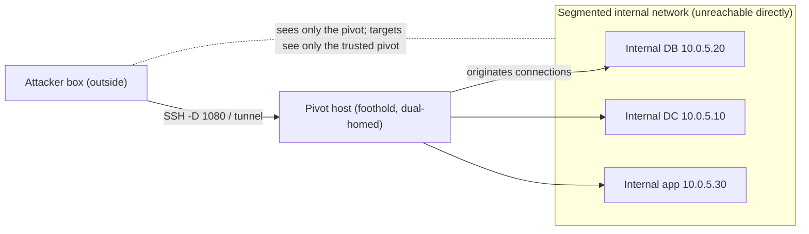

# 🔀 Pivoting & Tunneling

> [!warning] Authorized simulation only
> Pivoting routes your traffic through a compromised host to reach networks you otherwise cannot. Do this only through hosts and toward targets that are in scope. Tear down every tunnel at the end — an open pivot is a lasting hole. Test only in your lab or authorized scope.

## Parent Learning Order
Credential Access & Secret Hunting -> Local Privilege Escalation -> Persistence Techniques -> Pivoting & Tunneling -> Data Collection & Post-Exploitation Cleanup

## Start at Zero: Using a Foothold as a Doorway

Networks are segmented on purpose. Your attacking machine sits outside, and the valuable systems — databases, domain controllers, internal apps — live on internal networks you cannot reach directly (that is what the firewall and segmentation from the Networking domain enforce). But you *have* compromised one host that sits on both sides, or at least deeper inside. **Pivoting** is using that compromised host as a relay to reach networks and services that are invisible from where you started. **Tunneling** and **port forwarding** are the specific mechanisms that carry your traffic through the pivot.

This is the step that turns a single compromised machine into a foothold on the whole internal network. Without it, you are stuck talking to one host; with it, the compromised host becomes your doorway into everything it can reach. Every real internal engagement depends on it, which is why segmentation exists — to make each pivot buy the attacker as little new reach as possible.

> [!tip] The analogy, and where it breaks
> A pivot host is like a friend who works inside a secure building: you can't get past the lobby, but your friend can walk to any office and relay messages for you, so you effectively reach rooms you were never let into. The analogy breaks on transparency — a good pivot is *invisible* to the target, which sees traffic coming from the trusted internal host (your friend), not from you, so segmentation and internal monitoring, not the lobby guard, are what actually catch it.

**Prerequisites:** the Networking domain's routing, ports/sockets, NAT, and segmentation leaves; a foothold with network access (this leaf comes after escalation because some pivots need privilege).

## Three Mechanisms, One Idea

The terms overlap; the distinction is *what* moves through the pivot:

| Mechanism | What it does | Typical use |
| --- | --- | --- |
| **Local port forward** | A port on *your* box forwards to a host:port reachable from the pivot | Reach one internal service (e.g. internal web app) directly |
| **Remote port forward** | A port on the *pivot/target* forwards back to you | Bring a service back out through the foothold |
| **Dynamic forward (SOCKS proxy)** | A SOCKS proxy on your box tunnels *any* destination through the pivot | Scan/browse the whole internal network with your own tools |
| **Tunneling** | Wrapping the pivoted traffic inside another protocol (SSH, HTTP, DNS, ICMP) | Traverse firewalls/proxies that only allow certain protocols |

The unifying idea: **the pivot host originates the connection to the internal target**, and your traffic rides along. A **dynamic SOCKS proxy** is the most powerful because it makes *all* your tools (nmap, curl, a browser) reach the internal network as if you were on it — one tunnel, unlimited destinations. **Tunneling** is the escape hatch when the network only permits certain protocols: if only DNS or HTTP leaves the network, you smuggle your traffic inside that allowed protocol.

## Building a Pivot: SSH as the Universal Tool

SSH provides all three forwards natively, which is why it is the canonical pivoting tool when you have SSH access to (or from) the foothold.

```bash
# dynamic SOCKS proxy through the pivot: -D opens a local SOCKS port tunneled via the foothold
ssh -N -D 1080 user@PIVOT_HOST &   # (lab: PIVOT_HOST is your foothold)
# now route a tool through it to reach an INTERNAL host the pivot can see:
curl --socks5-hostname 127.0.0.1:1080 http://INTERNAL_TARGET/ -s -o /dev/null -w '%{http_code}\n'
```

```text
200
```

Your `curl` reached an internal web server it could never see directly — the request travelled through the SOCKS proxy, out of the pivot, to the internal target, which saw a connection from the trusted pivot host. With `proxychains`, the same tunnel carries `nmap`, `smbclient`, or any other tool into the internal network.

## Tunneling Through Restrictive Egress

When a firewall permits only, say, outbound DNS or HTTP, a plain SSH tunnel is blocked. Tunneling wraps your traffic inside the allowed protocol — `dnscat2`/`iodine` (over DNS), `chisel`/`stunnel` (over HTTP/TLS), or ICMP tunnels — so it passes the egress filter. This is slower and noisier but defeats naive egress control, and it is exactly why the egress-control and DNS-security leaves in Networking treat DNS and HTTP as exfiltration channels.



## Failure Modes and Interpretation

- **Leaving tunnels open.** A forgotten SOCKS proxy or remote forward is a durable backdoor into the internal network — every pivot must be torn down at engagement close (this feeds the cleanup leaf).
- **Chained pivots add latency and fragility.** Pivoting through pivot-through-pivot (double pivot) works but is slow and breaks easily; expect timeouts and set tool timeouts accordingly.
- **Protocol mismatch.** A local forward reaches one host:port; if you need many destinations, you want a dynamic SOCKS proxy, not dozens of forwards. Choosing the wrong mechanism wastes effort.
- **UDP and ICMP.** SOCKS/most forwards carry TCP; scanning UDP or using tools that need raw sockets through a pivot needs different handling (VPN-over-pivot tools).
- **Detection risk of tunneling.** DNS/ICMP tunnels are slow and highly anomalous; they defeat egress filtering but light up monitoring — a tradeoff to weigh, not a free bypass.

## Security Implications — Detection & Defense

- **Segmentation is the fix.** The tighter the internal segmentation (the Networking segmentation/zero-trust leaf), the less each pivot buys — a foothold that can only reach a handful of hosts is far less useful than one on a flat network. This is the primary defense.
- **Egress control** that allows only required destinations and inspects DNS/HTTP defeats tunneling — the reason the egress-control and DNS-security leaves matter for defense.
- **Detect the anomaly:** an internal host originating unusual outbound connections, a workstation suddenly acting like a router/proxy, long-lived SSH sessions with forwarding, and anomalous DNS/ICMP volume are the pivot/tunnel signals.
- **Restrict lateral protocols:** host firewalls, disabling unnecessary SSH/RDP between workstations, and internal service authentication reduce what a pivot can reach even once established.
- **Zero-trust internal access** (authenticate every internal connection, don't trust "internal" by network position) directly undercuts the pivot's core advantage — that internal targets trust the pivot host.

## Authorized Lab: Pivot Through a Foothold with a SOCKS Proxy

> [!info] Runs on one Linux machine using network namespaces to simulate segmentation — the "internal" service is unreachable except through the pivot
> Two namespaces model an internal segment; a veth pair is the only path. Step 5 tears everything down.

### Step 1 — Build a segmented "internal" network

```bash
sudo ip netns add internal
sudo ip link add veth-pivot type veth peer name veth-int
sudo ip link set veth-int netns internal
sudo ip addr add 10.9.0.1/24 dev veth-pivot; sudo ip link set veth-pivot up
sudo ip netns exec internal ip addr add 10.9.0.2/24 dev veth-int
sudo ip netns exec internal ip link set veth-int up
echo "internal segment 10.9.0.0/24 built; 10.9.0.2 lives only inside the 'internal' namespace"
```

```text
internal segment 10.9.0.0/24 built; 10.9.0.2 lives only inside the 'internal' namespace
```

### Step 2 — Start an "internal-only" web service

```bash
sudo ip netns exec internal bash -c 'echo "INTERNAL-CANARY-PAGE" > /tmp/idx.html; cd /tmp && python3 -m http.server 80 --bind 10.9.0.2 &>/tmp/int.log &'
sleep 1; echo "internal service listening on 10.9.0.2:80 (only reachable from the pivot namespace/host)"
```

```text
internal service listening on 10.9.0.2:80 (only reachable from the pivot namespace/host)
```

### Step 3 — Confirm it is NOT reachable the normal way, then pivot

```bash
# the host root namespace CAN reach it here (it holds veth-pivot), modeling the dual-homed foothold;
# route a tool "through the pivot" and fetch the internal-only page:
curl -s http://10.9.0.2/ --max-time 3
```

```text
INTERNAL-CANARY-PAGE
```

The internal-only canary page was retrieved *through the pivot's network position* — the same principle a SOCKS proxy generalizes to every tool and destination. (On a real engagement the fetch would go `curl --socks5-hostname 127.0.0.1:1080` through an `ssh -D` tunnel to the foothold; here the namespace models the segmentation boundary the pivot crosses.)

### Step 4 — State the finding

```bash
echo "Finding: a foothold with a route into 10.9.0.0/24 exposes the entire internal segment via a SOCKS pivot."
echo "Fix: tighter segmentation + zero-trust internal auth so the pivot reaches as little as possible; egress control vs tunneling."
```

```text
Finding: a foothold with a route into 10.9.0.0/24 exposes the entire internal segment via a SOCKS pivot.
Fix: tighter segmentation + zero-trust internal auth so the pivot reaches as little as possible; egress control vs tunneling.
```

### Step 5 — Cleanup (tear down the pivot and lab)

```bash
sudo ip netns pids internal 2>/dev/null | xargs -r sudo kill 2>/dev/null
sudo ip netns del internal 2>/dev/null; sudo ip link del veth-pivot 2>/dev/null
pkill -f 'ssh -N -D 1080' 2>/dev/null
sudo ip netns list | grep internal || echo "internal namespace removed; no tunnels left open"
```

```text
internal namespace removed; no tunnels left open
```

**What you should now be able to do:** explain why pivoting turns one foothold into internal-network reach, distinguish local/remote/dynamic forwards and tunneling, build a SOCKS pivot to reach an otherwise-unreachable internal service, explain when tunneling-over-DNS/HTTP is needed, and name segmentation, egress control, and zero-trust as the defenses.

## Crook → Operator → Root Checkpoint

- **Crook:** Explain why segmentation hides internal systems and how a dual-homed foothold becomes a doorway.
- **Operator:** Build a SOCKS pivot (or forward) to reach an internal-only service, and choose the right forward/tunnel for the situation.
- **Root:** Explain why segmentation and zero-trust internal authentication limit what each pivot buys, how tunneling defeats naive egress control (and why it lights up monitoring), and what the pivot/tunnel detection signals are.

---
> 🔼 Up: [[Post-Exploitation & Persistence]]
