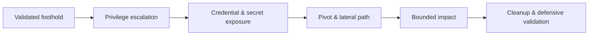

# Post-Exploitation & Persistence

> [!warning] Bounded impact only
> Stop when agreed impact is proven. Persistence, credential access, and collection require explicit RoE authorization and complete artifact tracking.

## 🗺️ Zero-to-Mastery Learning Path

1. [[Credential Access & Secret Hunting]]
2. [[Local Privilege Escalation]]
3. [[Persistence Techniques]]
4. [[Pivoting & Tunneling]]
5. [[Data Collection & Post-Exploitation Cleanup]]

---
> 🔼 Up: [[Penetration Testing]]
