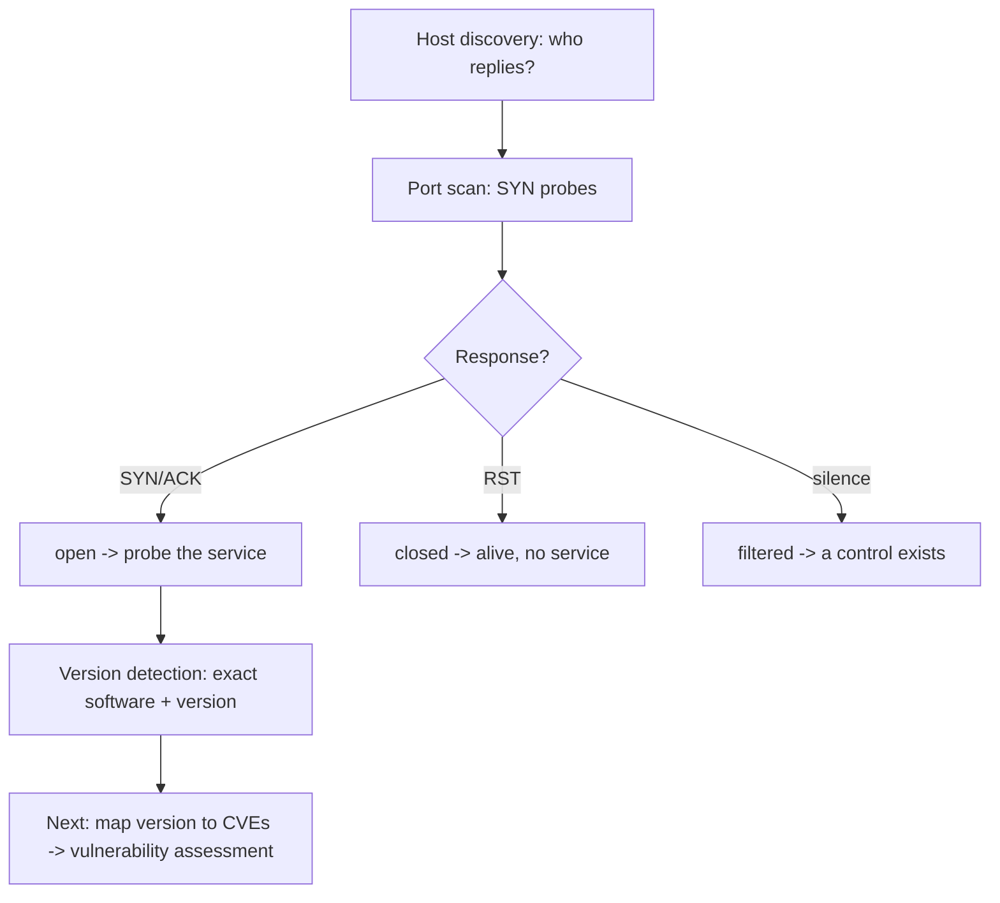

# 📡 Active Reconnaissance & Port Scanning

> [!warning] Authorized simulation only
> Active recon sends packets to the target and is fully observable and logged. Scan only hosts within an explicit written scope. Every technique below is demonstrated against a lab target you build yourself, never a third party.

## Parent Learning Order
Passive Reconnaissance & OSINT -> DNS & Subdomain Reconnaissance -> Active Reconnaissance & Port Scanning -> Cloud & Internet Exposure Discovery

## Now You Touch the Target

Passive recon told you what exists; **active recon** confirms what is *alive* and *listening*. The moment you send a packet to the target, you cross a line: the activity is observable, logged, and — outside an authorized scope — potentially illegal. Everything here trades stealth for certainty.

Active recon answers three questions in order: **which hosts are up** (host discovery), **which ports are open** (port scanning), and **what is running on them** (service and version detection). Each is a probe-and-interpret exercise: send a crafted packet, read the response, infer state.

> [!tip] The analogy, and where it breaks
> Port scanning is like walking down a corridor trying every door handle — locked, open, or no response. The analogy breaks on the third case: a real door you can see, but a *filtered* port gives no reply at all, so you cannot distinguish "no service" from "a firewall silently ate your knock." That ambiguity — open vs. closed vs. filtered — is the entire subtlety of scanning.

**Prerequisites:** TCP's three-way handshake and connection states, ports and the five-tuple, and ICMP.

## Host Discovery: Who Is Alive

Before scanning ports, find live hosts. The naive approach — ping — fails often because hosts drop ICMP:

```bash
nmap -sn 10.10.20.0/24
```

```text
Nmap scan report for 10.10.20.30
Host is up (0.00042s latency).
Nmap done: 256 IP addresses (1 host up) scanned in 2.35 seconds
```

`-sn` is "ping scan, no port scan." But "1 host up" does **not** mean one host exists — it means one *replied*. A host firewalled against discovery appears dead. This is the recurring lesson from the networking domain: silence is not absence. On a local segment, ARP discovery (`nmap -PR`) is far harder to evade because a host that ignores ARP cannot receive traffic at all.

## Port Scanning: What Is Listening

The core scan interprets TCP handshake responses:

| Probe result | Meaning | nmap state |
| --- | --- | --- |
| SYN → SYN/ACK | A service accepted the opening | **open** |
| SYN → RST | Host alive, nothing listening | **closed** |
| SYN → (nothing) | A firewall silently dropped it | **filtered** |

The **SYN scan** (`-sS`) sends SYN and, on SYN/ACK, replies RST instead of completing — learning "open" without a full connection, which is slightly stealthier and does not always appear in application logs. The **connect scan** (`-sT`) completes the handshake and is more visible.

```bash
sudo nmap -sS -p 22,80,443,3306 10.10.20.30
```

```text
PORT     STATE  SERVICE
22/tcp   open   ssh
80/tcp   open   http
443/tcp  closed https
3306/tcp filtered mysql
```

Three different facts: `open` (test it), `closed` (host alive, no service — useful negative), `filtered` (a control exists; true state unknown). Reporting `filtered` as `closed` conflates "there is a firewall" with "there is nothing there" — a meaningful error.

## Service & Version Detection: What It Actually Is

An open port is a starting point; the *service and version* is what maps to vulnerabilities:

```bash
sudo nmap -sV -p 22,80 10.10.20.30
```

```text
PORT   STATE SERVICE VERSION
22/tcp open  ssh     OpenSSH 8.2p1 Ubuntu 4ubuntu0.5
80/tcp open  http    Apache httpd 2.4.41 ((Ubuntu))
```

`OpenSSH 8.2p1` and `Apache 2.4.41` are the pivot to vulnerability research — a specific version maps to specific CVEs. Version detection works by matching the service's response banner and behavior against a signature database; it is a probe, so a service can lie about its banner, which is why version detection is a strong hint, not proof.



## The Speed / Stealth / Accuracy Triangle

Every scanning decision trades three things. **Timing** (`-T0` paranoid to `-T5` insane) trades speed for stealth and accuracy: fast scans miss ports under packet loss and trigger rate-based detection; slow scans evade detection but take hours. **Port breadth** (`-F` top-100 vs `-p-` all 65,535) trades coverage for time. **Probe aggressiveness** (`-sV --version-intensity`, `-A`) trades certainty for noise.

There is no universally correct setting — an internal authorized scan wants speed and completeness (`-T4 -p-`), while a red-team engagement wants stealth (`-T1`, few ports, spread over time). Choosing deliberately, and stating the choice in the report, is the skill.

## Filtered is not closed, and other misreads

- **Filtered ≠ closed.** The single most common misread. A firewall dropping probes makes ports appear filtered; the service behind may be wide open to permitted sources.
- **Rate limiting distorts results.** A target that rate-limits RST responses makes closed ports intermittently appear filtered. Slow down and rescan to confirm.
- **Load balancers and CDNs.** One IP may front many backends, or many IPs one service. Scan the hostname's intent, not just the address.
- **Version banners lie.** A hardened server may present a false or blank banner. Corroborate with behavior, and never report a CVE as confirmed on banner alone.
- **You are loud.** Every scan is logged at the target. A default `nmap` scan is unmistakable in IDS logs — there is no such thing as a stealthy full scan.

## Security Implications — Detection & Defense

Active recon is the most detectable phase, which makes it a defender's opportunity.

- **Scans have a distinctive signature:** many connection attempts across sequential ports from one source in a short window. IDS/IPS and connection-rate monitoring detect this readily — the behavioral detection covered in the networking domain.
- **The defense is minimizing exposed surface**, not detecting the scan. A host with two open ports gives a scanner almost nothing; default-deny firewalling makes most ports `filtered`, forcing the attacker to guess.
- **Slow scans evade thresholds**, so correlation windows must be long — a scan spread over days defeats a one-minute rate threshold, which is why patient enumeration is a real red-team tactic.
- **Deception** (honeypot ports, tarpits) turns scanning against the attacker: a port that accepts every connection and delays responses wastes the scanner's time and flags the source.
- **The results are only as good as the scope.** A defender's own authorized scan of their perimeter — seeing what an attacker's scan would see — is the highest-value use of these exact tools.

## Summary

You should now be able to:

- Explain the line active recon crosses, name the three questions it answers, and state what open/closed/filtered each mean.
- Run host discovery and a SYN scan, interpret all three port states, use version detection, and choose timing/breadth deliberately for the engagement type.
- Explain why filtered≠closed and how a firewall masks true state; describe the scan's detection signature and why minimizing exposed surface — not detecting the scan — is the real defense.

---
> 🔼 Up: [[Reconnaissance & Attack Surface]]
