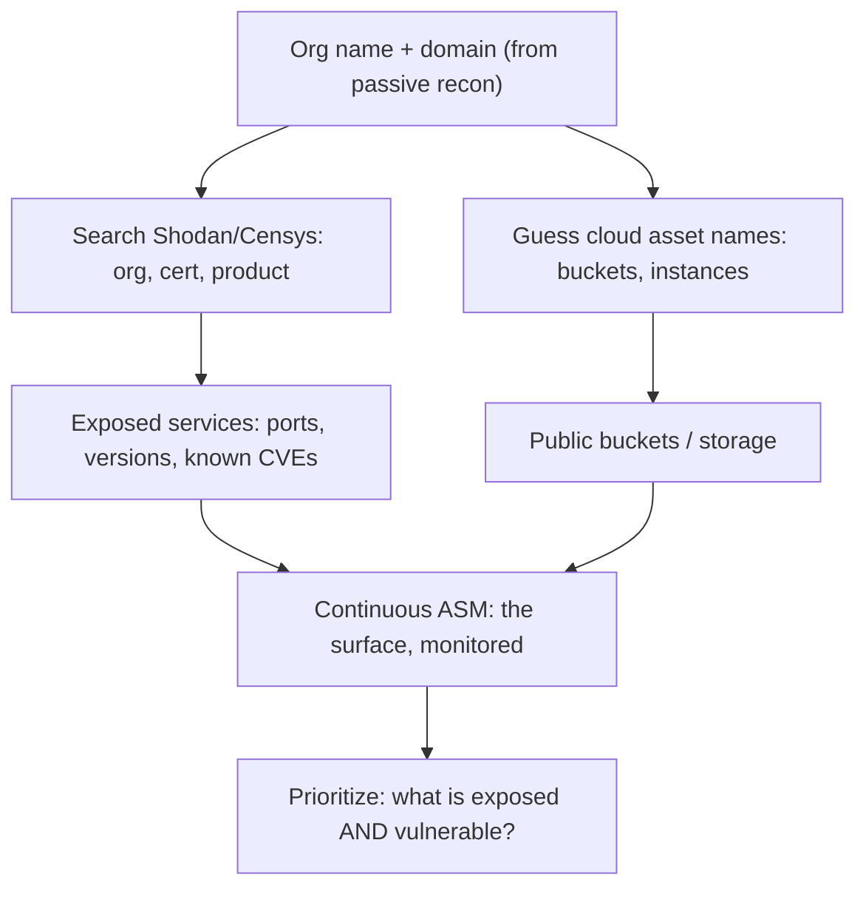

# ☁️ Cloud & Internet Exposure Discovery

> [!warning] Authorized simulation only
> Internet-wide scan databases (Shodan, Censys) let you read what *others* already scanned — passive with respect to the target. But confirming a finding by connecting to it is active recon requiring scope. Never access an exposed asset (an open bucket, a database) beyond confirming it exists.

## Parent Learning Order
Passive Reconnaissance & OSINT -> DNS & Subdomain Reconnaissance -> Active Reconnaissance & Port Scanning -> Cloud & Internet Exposure Discovery

## Start at Zero: Someone Already Scanned the Internet

You do not need to scan the whole Internet to find a target's exposed assets — **someone already did**. Services like **Shodan** and **Censys** continuously scan every routable address, fingerprint what they find, and make it searchable. Querying them is *passive* with respect to your target: the packets came from the scanner, not you. This is the cloud-era evolution of recon, because the modern attack surface is not a tidy perimeter — it is a sprawl of cloud instances, storage buckets, forgotten VMs, and SaaS integrations that no firewall fully contains.

The discipline of finding all of it — continuously — is **Attack Surface Management (ASM)**. Offensively it finds the way in; defensively it is how an organization discovers the asset it forgot it owned.

> [!tip] The analogy, and where it breaks
> Shodan is like a real-estate database that already photographed every building's exterior, so you search "buildings with an unlocked side door in this city" instead of walking every street. The analogy breaks because the photos are *live and specific* — Shodan returns the actual software version and open ports of a specific host, not a generic image, so a search can surface a specific vulnerable device directly.

**Prerequisites:** ports and services, passive recon, and basic cloud concepts (public IP ranges, object storage).

## The Modern Surface: Why the Perimeter Dissolved

Traditional recon assumed a perimeter — a block of the organization's IPs behind a firewall. Cloud broke that model:

| Old surface | Cloud surface |
| --- | --- |
| Owned IP ranges | Ephemeral cloud IPs from shared provider pools |
| Servers in a data center | Instances spun up and forgotten by any team |
| Files on internal shares | Object-storage buckets, public by misconfiguration |
| Known applications | SaaS integrations, each its own login and surface |

The consequence: an organization often does not know its own attack surface, because any engineer with a cloud account can create an exposed asset in minutes. This is why **discovery** — not just scanning a known range — is the core skill.

## Internet-Wide Search: Reading Others' Scans

Shodan and Censys index the Internet by service fingerprint. The queries are precise:

```text
# Shodan query examples (run in the Shodan web UI or API):
org:"Example Corp"                        # assets attributed to an org
ssl.cert.subject.cn:"example.com"         # hosts serving a cert for the domain
http.title:"Dashboard" org:"Example Corp" # exposed admin dashboards
product:MongoDB "example.com"             # exposed databases
```

The API is queryable read-only:

```bash
# host lookup for a public IP (read-only; reveals what Shodan already saw)
curl -s "https://internetdb.shodan.io/93.184.216.34"
```

```text
{"cpes":[],"hostnames":["example.com"],"ip":"93.184.216.34","ports":[80,443],"tags":[],"vulns":[]}
```

`internetdb.shodan.io` is a free, unauthenticated endpoint returning ports, hostnames, and known CVEs Shodan already observed for an IP — all without you scanning anything. `"ports":[80,443]` and an empty `"vulns"` is the clean result; a real finding would list open management ports and CVE identifiers.

## Cloud Asset Discovery: Buckets and Beyond

**Object storage** (S3, Azure Blob, GCS) is the most common cloud exposure. Buckets are often named predictably (`example-backups`, `example-prod-data`), and a public-read bucket lists its contents to anyone. The *discovery* is guessing names and checking existence — the *finding* is a public bucket:

```bash
# check whether a bucket name exists and its access (read-only HEAD)
curl -s -o /dev/null -w "%{http_code}\n" "https://example-assets.s3.amazonaws.com/"
```

```text
403
```

`403` means the bucket exists but is not public-listable — the safe result. `404` means no such bucket; `200` means **public listing enabled**, a finding. Note you confirmed existence without accessing contents; enumerating or downloading objects is a line you do not cross without explicit authorization.



## Failure Modes and Interpretation

- **Attribution is hard in the cloud.** A cloud IP is drawn from a shared provider pool — today it is the target's, next week someone else's. Confirm ownership (via certificate CN, hostname, or content) before attributing, or you will test a stranger's asset.
- **Stale index data.** Shodan's data is as old as its last scan of that host — a listed port may be closed now, and a closed one may have opened since. Treat it as a lead, confirm liveness within scope.
- **Buckets: existence vs. access.** A `403` (exists, private) is not a finding; only a `200` listing or readable objects is. Reporting the mere existence of a bucket as a vulnerability is a false positive.
- **The surface changes hourly.** Cloud assets are ephemeral, so a one-time discovery is stale immediately. This is why ASM must be *continuous*, not a single scan.

## Security Implications — Detection & Defense

- **You cannot detect the Shodan query**, because the target was scanned by a third party, not you — the same undetectable-collection problem as passive recon. The defense is again *reducing exposure*, not detecting the search.
- **Continuous self-ASM is the primary control.** An organization must run these exact discovery techniques against itself, continuously, to find the forgotten instance or public bucket before an attacker does. "We don't know what we have exposed" is the root failure.
- **Cloud guardrails prevent the exposure at creation:** organization-wide policies blocking public buckets, service control policies restricting public IP assignment, and mandatory tagging so every asset has an owner. These stop the misconfiguration rather than hunting it later.
- **Certificate and DNS hygiene** (from earlier leaves) limits how easily assets are attributed to the organization in the first place.
- **The asymmetry favors the attacker** — they need one exposed asset; the defender must find all of them — which is exactly why automated, continuous ASM exists.

## Authorized Lab: Discover an Exposure Pattern Safely

> [!info] Runs on any machine with `curl` — queries only public scan databases and your own test bucket name
> Nothing here accesses a private asset. The bucket check confirms existence only.

### Step 1 — Read what the Internet's scanners already know about a public IP

```bash
curl -s "https://internetdb.shodan.io/1.1.1.1" | python3 -m json.tool | grep -E 'ports|hostnames|vulns' | head -3
```

```text
    "hostnames": [ "one.one.one.one" ],
    "ports": [ 53, 80, 443 ],
    "vulns": [],
```

You obtained the open ports and hostnames of a public resolver from a database — no scanning. This is internet-wide recon reduced to one read-only request.

### Step 2 — Distinguish the three bucket outcomes

```bash
for b in aws-lab-does-not-exist-9x7 example-assets; do
  code=$(curl -s -o /dev/null -w "%{http_code}" "https://$b.s3.amazonaws.com/")
  echo "$b -> HTTP $code"
done
```

```text
aws-lab-does-not-exist-9x7 -> HTTP 404
example-assets -> HTTP 403
```

`404` = no such bucket (nothing to see); `403` = bucket exists but is private (exists, but **not** a finding). Only a `200` with a listing would be the exposure. Interpreting these three codes correctly is the whole skill — and stops you reporting a private bucket as vulnerable.

### Step 3 — Attribute before you conclude

```bash
curl -s "https://internetdb.shodan.io/93.184.216.34" | python3 -c "import sys,json;d=json.load(sys.stdin);print('hostnames:',d['hostnames'])"
```

```text
hostnames: ['example.com']
```

The hostname confirms this IP belongs to the intended target — the attribution step that prevents testing a stranger's asset on a shared cloud IP.

### Step 4 — Turn a known CVE list into a priority

```bash
# does the internet-scan data already flag known vulnerabilities for a host?
curl -s "https://internetdb.shodan.io/1.1.1.1" | \
  python3 -c "import sys,json;d=json.load(sys.stdin);v=d['vulns'];print(f'{len(v)} known CVEs flagged: {v if v else \"none\"}')"
```

```text
0 known CVEs flagged: none
```

`none` is the clean result. When this list is non-empty, you have exposure *and* a named weakness in one query — the highest-priority finding, because the attacker's research is already done for them. Prioritizing "exposed **and** vulnerable" over merely "exposed" is what turns a discovery list into an action plan.

**Cleanup:** none — every step read public databases or checked existence only, creating and accessing nothing.

**What you should now be able to do:** query internet-wide scan data without touching a target, distinguish a public bucket from a private one by HTTP status, attribute a cloud IP before acting on it, and explain why continuous self-ASM is the only defense against undetectable exposure discovery.

## Crook → Operator → Root Checkpoint

- **Crook:** Explain why you don't need to scan the Internet yourself, why the cloud dissolved the traditional perimeter, and what Attack Surface Management is.
- **Operator:** Query Shodan's data for a host's ports and known CVEs, check a bucket's exposure by HTTP status, and attribute a cloud IP to the correct owner before acting.
- **Root:** Explain why the Shodan query is undetectable at the target and why continuous self-ASM plus cloud guardrails — not scan detection — are the defense; describe the attacker/defender asymmetry that makes automated discovery necessary.

---
> 🔼 Up: [[Reconnaissance & Attack Surface]]
