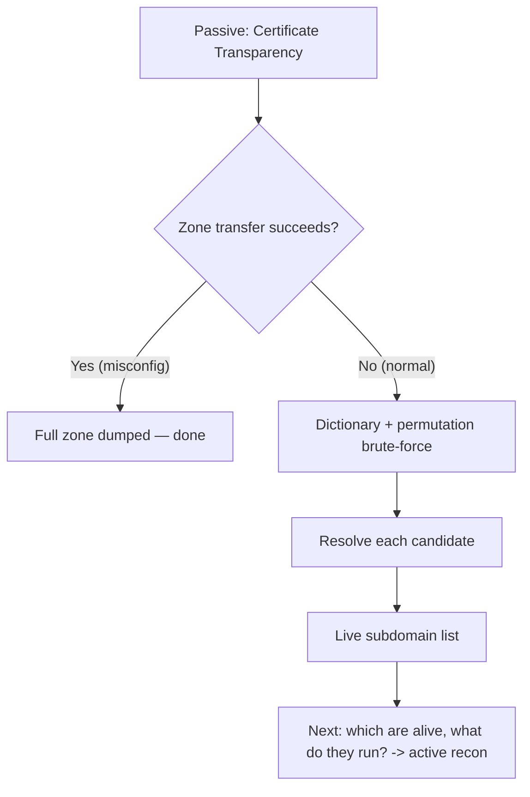

# 🌐 DNS & Subdomain Reconnaissance

> [!warning] Authorized simulation only
> DNS queries against public records are lawful and routine, but enumerating a specific organization's namespace is reconnaissance and must be in scope. Zone-transfer attempts and brute-force enumeration touch the target's servers and are observable — treat them as active recon requiring authorization.

## Parent Learning Order
Passive Reconnaissance & OSINT -> DNS & Subdomain Reconnaissance -> Active Reconnaissance & Port Scanning -> Cloud & Internet Exposure Discovery

## The Namespace Is a Map

Every organization publishes a **DNS namespace** — the tree of names under its domain — and that tree is a map of its infrastructure. `mail.example.com` names a mail server, `vpn.example.com` a remote-access gateway, `dev.example.com` a system nobody meant to expose. Enumerating that tree is often the highest-yield recon an attacker performs, because each name is a candidate target and the forgotten ones are the softest.

This note covers three progressively more intrusive techniques: reading DNS *records* (what the organization deliberately published), attempting *zone transfers* (a misconfiguration that dumps everything), and *subdomain enumeration* (discovering names that are not meant to be found).

> [!tip] The analogy, and where it breaks
> A domain is like a company's phone directory: the main number is published, and extensions map to departments. The analogy breaks because a phone directory is curated, whereas DNS accumulates — old extensions are never removed, so `legacy-vpn.example.com` still resolves years after everyone forgot it. Attackers hunt exactly those stale entries, which a tidy directory would never contain.

**Prerequisites:** the DNS resolution hierarchy and record types (A, CNAME, MX, NS, TXT), and passive recon via Certificate Transparency.

## Reading What Was Published: DNS Records

The record types each leak something:

| Record | Reveals |
| --- | --- |
| **A / AAAA** | Host → IP; the actual infrastructure |
| **MX** | Mail servers, often naming a provider (Google, Microsoft) |
| **NS** | Authoritative nameservers, and whether DNS is self-hosted or outsourced |
| **TXT** | SPF (permitted senders), DKIM, domain-verification tokens for SaaS the org uses |
| **CNAME** | Aliases — and dangling CNAMEs to decommissioned cloud resources (takeover risk) |

```bash
dig example.com MX +short
dig example.com TXT +short | head -3
dig example.com NS +short
```

```text
0 .
"v=spf1 -all"
a.iana-servers.net.
b.iana-servers.net.
```

The `TXT` SPF record is quietly valuable: `v=spf1 include:_spf.google.com` would reveal the organization uses Google Workspace; verification tokens (`facebook-domain-verification=…`, `atlassian-domain-verification=…`) enumerate the SaaS products in use — each a separate attack surface and phishing pretext.

## The Zone Transfer: A Misconfiguration That Dumps Everything

A **zone transfer (AXFR)** is the mechanism a nameserver uses to replicate its full zone to a secondary. If a nameserver answers AXFR to *anyone*, it hands over every record — the complete internal map — in one request:

```bash
dig AXFR example.com @a.iana-servers.net
```

```text
; <<>> DiG 9.18 <<>> AXFR example.com @a.iana-servers.net
; Transfer failed.
```

`Transfer failed` is the **correctly configured** result — the server refused. A misconfigured server would instead dump hundreds of records. This is a legacy misconfiguration, rarer than it once was, but still found, and its payoff is total: no enumeration needed, the target simply gives you the map. It is also *observable* — the attempt hits the target's nameserver and is logged — so it belongs to active recon.

## Subdomain Enumeration: Finding the Unpublished

When zone transfer fails (usually), subdomains are discovered three ways, in increasing intrusiveness:

**1. Passive (from the previous leaf):** Certificate Transparency logs name subdomains without touching the target. Always start here — it is free and silent.

**2. Dictionary brute-force:** guess common names and check which resolve. This queries DNS, so it is active:

```bash
for sub in www mail dev staging vpn api admin test; do
  ip=$(dig +short "$sub.example.com" | head -1)
  [ -n "$ip" ] && echo "$sub.example.com -> $ip"
done
```

```text
www.example.com -> 203.0.113.20
```

Only `www` resolves for the reserved documentation domain; against a real target this list would grow. A serious enumeration uses a large wordlist and a dedicated tool, but the mechanism is exactly this loop — resolve each candidate, keep the hits.

**3. Permutation and DNS brute-force with wordlists** extend the dictionary with patterns (`dev-1`, `dev-api`, `useast-dev`). The tradeoff: more candidates find more hosts but generate more query volume, making the enumeration louder and more detectable.



**The deliberate break:** a DNS record pointing at something that no longer exists looks like the most harmless kind of mess — a dead link. Nobody is there, so nothing can happen.

The opposite is true, and it is one of the highest-impact findings in recon. When `shop.example.test` still CNAMEs to a cloud provider hostname whose resource was deleted, that name is **claimable**: anyone who registers the provider resource with the right identifier now serves content at your subdomain. And because it *is* your subdomain, they inherit everything the browser grants it — cookies scoped to the parent domain, your CORS allowances, your SSO redirect allowlist, and often a valid certificate the provider issues automatically. A dangling record is not a dead link, it is an unclaimed key to your origin.

**How you'd spot it:** resolve the name and follow the CNAME. If the final target is a provider hostname returning that provider's "no such application" or "bucket does not exist" page rather than an NXDOMAIN, the record is dangling and the resource is very likely claimable.

## The Subdomain Takeover: When a Name Outlives Its Target

A **CNAME** pointing at a decommissioned cloud resource is a serious finding. If `blog.example.com` is a CNAME to `example.github.io` and the GitHub Pages site was deleted, an attacker who claims that GitHub name now controls content served at `blog.example.com` — inheriting the domain's trust, cookies scoped to `.example.com`, and reputation. Detect it by resolving each CNAME and checking whether the target still exists:

```bash
dig blog.example.com CNAME +short
```

```text
```

Empty output here (no dangling CNAME). A takeover-vulnerable result would show a CNAME to a cloud service returning a "no such site" page — the signature of an abandoned resource waiting to be claimed.

## How wildcard DNS makes brute-force meaningless

- **Wildcard DNS defeats naive brute-force.** If `*.example.com` resolves to one IP, *every* guess "resolves" and the enumeration is meaningless. Detect wildcards by resolving a random name (`asdf1234.example.com`) first — if it resolves, filter results against that wildcard IP.
- **CDN and cloud IPs mislead.** Many subdomains resolve to the same CDN address; that shared IP is not a single server to attack. Group by hostname, not IP.
- **Rate limiting and detection.** Aggressive brute-force triggers DNS-server rate limits and appears in query logs — the louder the enumeration, the more likely it is noticed. Passive-first minimizes this.
- **Scope creep.** A discovered subdomain may point to third-party infrastructure (a SaaS, a partner). Resolving it is fine; *testing* it is out of scope.

## Security Implications — Detection & Defense

- **Zone transfers must be restricted** to designated secondary nameservers. An open AXFR is a total map disclosure and a basic, high-severity misconfiguration.
- **DNS query logs detect active enumeration.** A burst of `NXDOMAIN` responses for hundreds of nonexistent names is the signature of dictionary brute-force — one of the few DNS-recon activities a defender *can* see, precisely because it is active.
- **Record hygiene is the durable control.** Removing DNS entries for decommissioned resources prevents subdomain takeover; the flaw is a configuration-management failure, not a protocol weakness.
- **Wildcard DNS is a double-edged control** — it frustrates brute-force enumeration but can mask which subdomains genuinely exist, complicating your own asset inventory.
- **You cannot hide CT-visible names**, so internal-only services should not appear in publicly-trusted certificates at all.

## Summary

You should now be able to:

- Explain what a DNS namespace reveals about infrastructure, name the high-value record types, and state why a refused zone transfer is the secure result.
- Enumerate subdomains passively (CT) then actively (brute-force), detect and filter wildcard DNS, and read SPF/verification TXT records to enumerate an organization's SaaS.
- Explain how a dangling CNAME enables subdomain takeover and why record hygiene is the fix; describe which enumeration steps are observable and how a defender detects brute-force from NXDOMAIN bursts.

---
> 🔼 Up: [[Reconnaissance & Attack Surface]]
