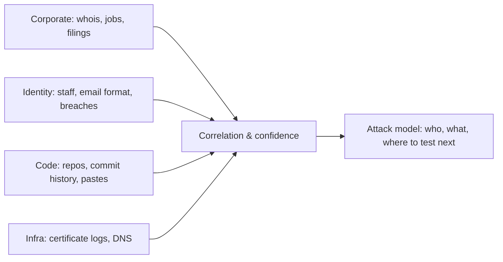

# 🔭 Passive Reconnaissance & OSINT

> [!warning] Authorized simulation only
> Everything here reads *public* sources — no packet ever touches the target. That keeps it lawful and undetectable, but the findings are still sensitive. Use only against a scope you are authorized to assess, store results securely, and never act on collected personal data beyond the engagement.

## Parent Learning Order
Passive Reconnaissance & OSINT -> DNS & Subdomain Reconnaissance -> Active Reconnaissance & Port Scanning -> Cloud & Internet Exposure Discovery

## Learning Without Touching

**Reconnaissance** is building a model of a target before testing it. It splits cleanly in two: **passive** recon reads sources the target does not control and cannot see you reading — search engines, public records, certificate logs, code repositories, breach data — while **active** recon sends packets to the target and is therefore observable. This note is entirely passive, which is why it comes first: it is free, silent, and legal against public data, and it shapes everything active recon does next.

**OSINT (Open-Source Intelligence)** is the discipline of turning public data into an attack model. The mindset shift for a beginner: you are not "hacking" anything here. You are reading what the organization already published, and assembling scattered facts into a picture they never intended to present as a whole.

> [!tip] The analogy, and where it breaks
> OSINT is like researching a company before a job interview — public filings, staff on LinkedIn, the tech on their careers page. The analogy breaks on *aggregation*: an interviewer reads a few pages, whereas an attacker correlates a leaked employee email format, a subdomain in a certificate log, and a password from an old breach into a working login. Each fact is harmless; the *combination* is the exposure.

**Prerequisites:** basic DNS and HTTP, and comfort at a command line.

## The Four Passive Targets

Passive recon gathers four categories, each answering a different question.

| Category | Question | Public sources |
| --- | --- | --- |
| **Corporate** | What does the organization look like? | Website, filings, job posts, news, `whois` |
| **Identity** | Who works there and how are they addressed? | LinkedIn, email-format leaks, breach corpora |
| **Code exposure** | What did developers accidentally publish? | GitHub, GitLab, npm, Docker Hub, paste sites |
| **Infrastructure** | What assets and technology exist? | Certificate logs, DNS, `Shodan`/`Censys` (covered in the cloud-exposure leaf) |

### Corporate footprint

The goal is the organization's shape: business units, acquisitions, physical sites, technology, and third-party relationships. `whois` on the registered domain reveals registrar, registration dates, and sometimes contact data:

```bash
whois example.com | grep -Ei 'Registrar:|Creation|Registrant|Name Server' | head -6
```

```text
Registrar: Example Registrar, Inc.
Creation Date: 2009-03-14T00:00:00Z
Registrant Organization: Example Corp
Name Server: NS1.EXAMPLE.COM
```

Job postings are an underrated goldmine: a listing for a "Senior Splunk Engineer with CrowdStrike experience" tells an attacker the SIEM and EDR in use before a single packet is sent. Defensively, this is why security-tooling names in public job posts are a real leak.

### Identity footprint

People are the softest target, so their **email address format** is a prize. If one address is known (`jane.doe@example.com`), the format `first.last@` is inferred, and a staff list from LinkedIn becomes a login list. **Breach-data correlation** goes further — checking whether collected addresses appear in known public breach corpora reveals reused passwords, the root cause behind credential-stuffing:

```bash
# check an address you own against public breach records (read-only API)
curl -s "https://haveibeenpwned.com/unifiedsearch/you%40example.com" -H 'User-Agent: recon-lab' -o /dev/null -w '%{http_code}\n'
```

```text
404
```

`404` means "not found in any indexed breach" — the safe result. A `200` would list the breaches. Only ever query addresses you own or are authorized to check; querying arbitrary personal addresses is an ethics and privacy line.

### Code exposure

Developers leak secrets to public repositories constantly — API keys, internal hostnames, credentials in commit history. A targeted search:

```bash
# GitHub code search API, read-only, for a domain string in public code
curl -s "https://api.github.com/search/code?q=example.com+in:file" \
  -H 'Accept: application/vnd.github+json' | grep -c '"path"'
```

```text
0
```

(An unauthenticated call is rate-limited; `0` here reflects that. With a token, results list files mentioning the domain.) The high-value finds are in **commit history** — a secret deleted from the current file often survives in an earlier commit, which is why "we removed the key" is not remediation without a key rotation.

## Certificate Transparency: Passive Infrastructure Mapping

The single most productive passive infrastructure source is **Certificate Transparency (CT)** logs — public, append-only records of every TLS certificate issued. Because a certificate names its hostnames, CT logs leak subdomains *without touching the target's DNS*:

```bash
curl -s "https://crt.sh/?q=%25.example.com&output=json" | \
  python3 -c "import sys,json; d=json.load(sys.stdin); print('\n'.join(sorted({n for e in d for n in e['name_value'].split(chr(10))})))" | head -8
```

```text
*.example.com
api.example.com
dev.example.com
mail.example.com
staging.example.com
vpn.example.com
www.example.com
```

Read this as a map of forgotten assets: `dev`, `staging`, and `vpn` are exactly the hosts an organization forgets to harden. And it was obtained by reading a public log, invisible to the target — the reason CT is the passive recon workhorse.



## Findings that describe a decommissioned asset

- **Stale data.** `whois` privacy services and old CT entries mean a finding may describe a decommissioned asset. Passive data is *historical* — confirm liveness later with (authorized) active recon, never assume it.
- **Attribution errors.** A shared hosting IP or a third-party SaaS subdomain (`example.zendesk.com`) is *not* the target's infrastructure. Testing it is out of scope and possibly illegal.
- **Over-collection.** Harvesting personal data beyond the engagement's need is an ethics and often a legal violation (GDPR and similar). Collect the minimum that answers the intelligence requirement.
- **False confidence.** An inferred email format is a hypothesis until one address is confirmed. Mark inferences as inferences in the report.

## Security Implications — Detection & Defense

Passive recon is, by definition, **undetectable at the target** — no logs are generated because no packets arrive. This asymmetry defines the defense: you cannot detect the collection, so you must **reduce what is collectible**.

- **Certificate Transparency is unavoidable but manageable.** You cannot opt out of CT, but you can avoid naming internal hosts in public certificates — use a private CA for internal services, and avoid descriptive names like `jenkins-prod` in public certs.
- **Code exposure is preventable.** Secret-scanning in CI, pre-commit hooks, and *rotating* any secret that ever touched a public repo (not just deleting it) close this channel.
- **Identity exposure is a training and policy matter.** A predictable email format cannot be hidden, but MFA and breach-password screening neutralize the credential-reuse that makes harvested identities dangerous.
- **Monitoring the collectible surface** — running the same CT, breach, and code searches against yourself, continuously — is the one active defense: you see what an attacker sees and fix it first. This is "attack-surface management," and it is passive recon turned inward.

## Summary

You should now be able to:

- Explain the difference between passive and active recon, name the four passive target categories, and state why passive collection is invisible to the target.
- Enumerate subdomains from Certificate Transparency, extract a corporate anchor from `whois`, and correlate an email format with breach data — all without touching the target.
- Explain why the only defense against undetectable collection is reducing the collectible surface; describe how CT logs, commit history, and email-format inference each create exposure, and why "we deleted the secret" is not remediation without rotation.

---
> 🔼 Up: [[Reconnaissance & Attack Surface]]
