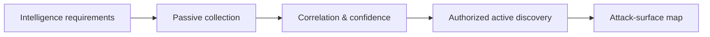

# Reconnaissance & Attack Surface

> [!abstract] Lifecycle branch
> Build an evidence-based model of organizations, domains, networks, identities, applications, cloud assets, and exposed services before testing weaknesses.

## 🗺️ Zero-to-Mastery Learning Path

1. [[Passive Reconnaissance & OSINT]]
2. [[DNS & Subdomain Reconnaissance]]
3. [[Active Reconnaissance & Port Scanning]]
4. [[Cloud & Internet Exposure Discovery]]

---
> 🔼 Up: [[Penetration Testing]]
