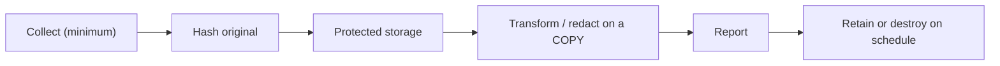

# 📊 Evidence & Risk Prioritization

> [!warning] Handle evidence as sensitive data
> The evidence you collect often contains the client's most sensitive material. Collect the minimum that proves each finding, protect and hash it, and destroy it on schedule. Prioritization decides what the client fixes first — get it wrong and real risk sits unaddressed while noise gets patched.

## Parent Learning Order
Evidence & Risk Prioritization -> Finding & Report Writing -> Purple Team Exercise Design -> Retesting, Closure & Lessons Learned

## From Raw Proof to a Ranked Risk List

> *You proved cross-tenant access. Do you screenshot one record or export the table?*
>
> Hold your answer — the section below is the response.

A report is only as good as its two foundations: **evidence** (defensible proof that each finding is real and reproducible) and **prioritization** (a defensible order in which to fix them). This note covers both, because they are the raw material of every deliverable — the technical and executive write-ups (next leaf) are just *presentation* of well-collected evidence and well-reasoned priority. Get evidence wrong and findings can be disputed or aren't reproducible; get prioritization wrong and the client burns limited remediation budget on the wrong things.

The core skill of prioritization is knowing that **technical severity is not business priority.** A CVSS 9.8 isolated behind strong controls on a throwaway host can matter *less* than a "medium" authorization flaw that exposes every customer's data — and only *you*, who saw the environment, can make that call.

> [!tip] The analogy, and where it breaks
> Evidence handling is like a crime-lab chain of custody — bag it, label it, hash it, and log every hand it passes through, so the proof holds up under challenge. Prioritization is then the triage nurse deciding who is treated first. The analogy breaks on context: a triage nurse uses universal vital signs, whereas security priority is *organization-specific* — the same vulnerability is an emergency at one company and a paper-cut at another, so a generic severity score can never be the final answer.

**Prerequisites:** **Rules of Engagement & Scoping** (evidence governance/chain-of-custody lifecycle) and **Vulnerability Intelligence & Scoring** (how CVSS/EPSS are computed) — this note applies both to the *reporting* stage.

**The deliberate break:** more evidence is safer evidence. Screenshot everything, dump the table, keep the whole capture — you can always trim it later.

Over-collection is a **liability you created**, not a safety margin. Every extra record you copied is client data you now hold, transported and stored under your control, in a report that will be emailed and filed. If a single canary row proves cross-tenant access, dumping ten thousand real ones proves the same finding and manufactures a data-protection incident on top of it. The standard is *sufficient, minimal, reproducible* — and minimal is a security control, not a convenience.

**How you'd spot the line:** ask what the evidence must prove, then whether one more record would change that. If the answer is no, you are collecting for comfort rather than for proof.

## Evidence: Sufficient, Minimal, Reproducible, Protected, Traceable

Good evidence meets five tests: it is **sufficient** (proves the finding), **minimal** (no over-collection of real data), **reproducible** (another operator can repeat it), **protected** (encrypted, access-controlled), and **traceable** (hashed original + full custody record).



Record for every artifact: an evidence ID, source, collector, UTC time, acquisition method, **original hash**, working-copy hash, classification, storage location, access list, retention, and destruction date. **Preserve the original read-only; analyze a verified copy.** Screenshots add context but never *replace* raw requests, logs, config exports, or packet evidence. The common evidence-weakeners: clock drift, missing build identifiers, copy-paste transformations, and unrecorded analyst edits.

## Prioritization: Use Each Model for the Question It Answers

Three inputs answer three *different* questions — the mistake is treating any one as the whole answer:

| Input | Question it answers | What it does NOT know |
|---|---|---|
| **CVSS** | How technically severe, under stated metric assumptions? | Your assets, exposure, or controls |
| **EPSS** | How likely is this to be exploited in the wild soon? | Your business impact |
| **Business context** | What does it cost *this* org if exploited? | The technical mechanics |

```text
Priority = technical impact (CVSS) × exploit likelihood (EPSS/known-exploited)
           × business exposure (asset role, data, reachability)
           adjusted by compensating controls and remediation urgency
```

Record the **CVSS vector + version + rationale** (not just a number), the **EPSS date** (model output changes over time), and whether the issue was manually verified, reachable from the relevant trust zone, exposed to untrusted users, on a crown-jewel path, or already detected. A lower-scoring authorization flaw affecting *every tenant* routinely outranks a high base score isolated behind strong controls. Every **risk acceptance** must name an owner, rationale, compensating control, expiration, and review trigger.

## Over-collection as a liability you created

- **Over-collection.** Dumping a real table when a single canary record proves the finding creates a data-protection liability and can constitute a breach *you* caused.
- **Unhashed / untraceable evidence.** Without an original hash and custody record, a finding can be challenged as tampered — worthless in a dispute (the RoE chain-of-custody lab proves the mechanic).
- **Scoring theatre.** Reporting only a CVSS number, with no environmental rationale, hides the reasoning the client needs — and often inverts the true priority.
- **Averaging or counting severities.** "We found 3 highs and 12 mediums" is not a posture; risk is about *paths and consequences*, not tallies.
- **Stale EPSS / CVSS.** Both change; a priority list without dates rots silently.

## Security Implications — the Defender's View

- **Evidence discipline is a control:** hashed, encrypted, scheduled-for-destruction evidence means a lost laptop or compromised tester does not become the client's breach.
- **Environmental scoring drives real risk reduction:** a defender who receives priorities adjusted for *their* asset criticality and exposure fixes the things that actually threaten the business first — and can feed the ranking straight into their risk register and SLAs.
- **Known-exploited + reachable = act now:** combining EPSS/known-exploitation with your reachability finding is the strongest signal for emergency patching, far better than base severity alone.
- **Risk acceptance with expiry** keeps deferred risks from being forgotten — the review trigger forces a re-decision.

## Summary

You should now be able to:

- Explain the five properties of good evidence and why technical severity is not business priority.
- Hash and register evidence with a custody record, and rank findings using CVSS, EPSS, and business exposure — not CVSS alone.
- Justify a priority order that inverts CVSS using environmental context, explain why EPSS/CVSS need dates and rationale, and how risk acceptance with expiry keeps deferred risk visible.

---
> 🔼 Up: [[Reporting & Purple Teaming]]
