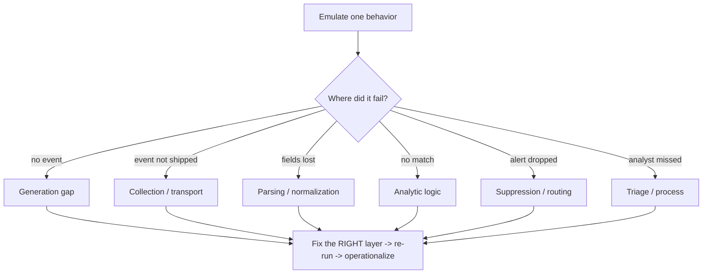

# 🧪 Purple Team Exercise Design

> [!warning] Collaborative validation, not competition
> A purple-team exercise executes known, benign attacker behaviors so red and blue can measure and improve detection *together*. Use canary assets, define safety and cleanup up front, and treat a gap as an engineering task — never a scoreboard.

## Parent Learning Order
Evidence & Risk Prioritization -> Finding & Report Writing -> Purple Team Exercise Design -> Retesting, Closure & Lessons Learned

## Designing a Test That Improves Detection

> *You execute a known attacker behaviour and no alert fires. Which part of the detection pipeline failed?*
>
> Hold your answer — the section below is the response.

The **Guided Red Team & Purple Team Operation** leaf showed *running* a purple loop end-to-end. This note is the design *craft* underneath it: how to build a repeatable **test card** for a single attacker behavior so that a failure can be localized and fixed. Purple teaming is collaborative behavior validation — execute a known behavior, observe whether it is prevented / collected / alerted / triaged / contained, close the gap, and re-run. Its output is not a report of "we evaded you," it is **durable, owned, monitored detections**.

The defining design principle: **one behavior per test card.** If a card bundles several behaviors, a failure can't be pinned to a layer, and you end up tuning the wrong thing.

> [!tip] The analogy, and where it breaks
> A test card is like a single fire-alarm test point: you set off *one* known smoke source in *one* room and check that this specific detector, this wiring, this panel, and this response all work — so if nothing happens you know exactly which link failed. The analogy breaks on tuning: a smoke detector is pass/fail, whereas a detection has to *also* stay quiet for benign smoke (cooking), so every card needs a negative control, and "it alarmed once" is not the same as "it works reliably in production."

**Prerequisites:** **Threat Modeling & MITRE ATT&CK** (behaviors are chosen and named as techniques) and **Guided Red Team & Purple Team Operation** (the full loop this designs cards for).

## The Test Card: One Behavior, Fully Specified

Each card defines a behavior in **platform-neutral language** plus everything needed to validate it:

| Field | Purpose |
|---|---|
| **Behavior + ATT&CK ID** | What is emulated, in technique terms |
| **Threat rationale** | Why this matters for *this* org |
| **Preconditions** | State required before execution |
| **Canary assets** | The synthetic file/account/host used |
| **Expected data sources + fields** | What telemetry *should* exist |
| **Prevention expectation** | Should a control block it? |
| **Analytic logic** | The detection that should fire |
| **Triage steps** | How an analyst investigates the alert |
| **Negative control** | Benign activity that must NOT alert |
| **Cleanup + pass criteria** | Teardown and the measurable success bar |

```text
Behavior: unusual remote-management logon to a canary server (T1021)
Expected: identity event + network flow + destination process telemetry
Alert:    source identity, source host, destination, protocol, process lineage
Negative control: approved administration from the management subnet
Pass:     correlated alert within 2 minutes; playbook identifies canary context
```

## The Validation Loop and Gap Taxonomy

Run baseline → emulate → compare the operator and defender timelines → **classify the gap by layer** → tune → re-run. Pinning the failure to a layer is the whole value:



**Never tune a rule when the underlying event is absent or malformed** — that produces a rule that can never fire. Tune with the **negative control** around *stable semantics* (behavior), not filenames or easily-changed strings.

## Design errors that make a failure impossible to localise

- **Multiple behaviors per card.** You lose the ability to localize a failure — the single most common design error.
- **Tuning before verifying the event exists.** Adjusting analytic logic when the raw telemetry is missing or malformed wastes effort and creates false confidence.
- **Excluding on unstable strings.** A negative control that filters by filename or a mutable token creates brittle rules attackers trivially evade.
- **"It alerted once" = done.** Without ownership, health monitoring, and recurring re-execution, a detection silently rots as data sources change.
- **Tool-first design.** Naming Atomic Red Team / Caldera in the card conflates *methodology* (here) with *tooling* (Tooling domain); design the behavior first, pick the executor second.

## Security Implications — the Defender's View

- **Purple teaming is the detection-engineering engine:** each validated card becomes a versioned analytic with a data-dependency list, an owner, investigation guidance, and a recurring test — turning ad-hoc alerting into measurable, maintained coverage.
- **Layer classification directs effort:** knowing a gap is *collection* vs *analytic* vs *triage* tells the defender exactly which team fixes it — no guesswork.
- **Negative controls protect the SOC:** validating that benign activity stays quiet keeps false-positive volume low, which is what actually keeps detections switched on in production.
- **ATT&CK mapping builds a coverage heatmap:** cards accumulate into a measurable picture of which techniques the org can and cannot see.

## Summary

You should now be able to:

- Explain why purple teaming is collaborative behavior validation and why each card covers exactly one behavior.
- Write a complete test card (behavior + ATT&CK + expected telemetry + analytic + negative control + pass criteria) and run the validation loop.
- Classify detection gaps by layer and fix the correct one, explain why negative controls and stable-semantic exclusions matter, and why operationalization (owner + health + recurring test) is what makes a detection real.

---
> 🔼 Up: [[Reporting & Purple Teaming]]
