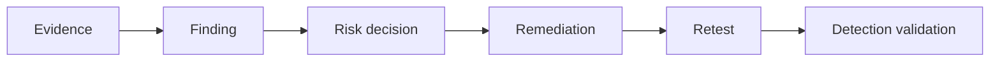

# Reporting & Purple Teaming

> [!abstract] Lifecycle branch
> Turn technical observations into reproducible findings, business decisions, defensive improvements, and verified remediation.

## 🗺️ Zero-to-Mastery Learning Path

1. [[Evidence & Risk Prioritization]]
2. [[Finding & Report Writing]]
3. [[Purple Team Exercise Design]]
4. [[Retesting, Closure & Lessons Learned]]

---
> 🔼 Up: [[Penetration Testing]]
