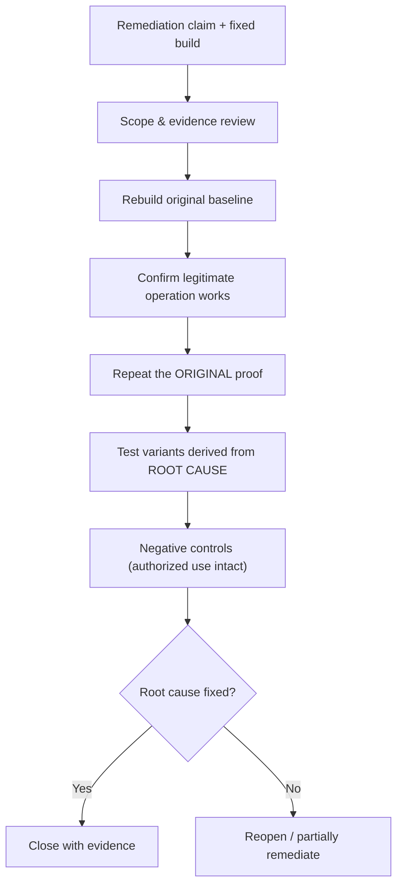

# 🔁 Retesting, Closure & Lessons Learned

> [!warning] "Closed" is a high bar
> A finding is closed only when the root cause is durably remediated, the original proof no longer works, realistic variants are controlled, legitimate functionality still works, and evidence supports the conclusion. A changed status code or a blocked payload is not closure.

## Parent Learning Order
Evidence & Risk Prioritization -> Finding & Report Writing -> Purple Team Exercise Design -> Retesting, Closure & Lessons Learned

## Start at Zero: Proving a Fix Is Real

The engagement ends where remediation begins — but a fix *claimed* is not a fix *verified*. **Retesting** is the discipline of proving that a remediation actually closed the finding, at its root, without breaking legitimate use. **Closure** is the formal decision (with evidence) that the finding is resolved. **Lessons learned** feeds systemic root causes back into the organization so the *whole class* of defect becomes less likely. This note is the closure *craft*; the **Guided Retest & Closure** leaf is the step-by-step walkthrough.

The defining trap this note exists to prevent: the **superficial fix**. Blocking one payload string, or changing an error message, can make a naive retest "pass" while the underlying vulnerability class remains wide open on a variant. Real closure proves the *root cause* is gone.

> [!tip] The analogy, and where it breaks
> A retest is like an inspector returning after a plumber "fixed the leak": a good inspector doesn't just see that *this* drip stopped — they run the water hard, check the neighboring joints, and confirm the sink still drains. The analogy breaks on generalization: a pipe is physically fixed or not, whereas a software fix can seal one crack while an identical crack gapes one function over, so "the exact original test now passes" is necessary but never sufficient — you must attack the *class*.

**Prerequisites:** **Finding & Report Writing** (the finding defines the root cause and retest criteria) and **Rules of Engagement & Scoping** (closure evidence and cleanup governance).

## The Retest Workflow



**Validate readiness first:** confirm the fixed build actually reached the affected asset (never retest a stale environment), and the exact finding version. Then reconstruct the original condition with *synthetic* data, verify the legitimate operation still works, repeat the original unauthorized variant, and derive **root-cause variants** (alternate verbs, legacy versions, batch/export paths, encoded identifiers, other services sharing the vulnerable component). The purpose is not endless fuzzing — it is proving the control is **centralized and complete**.

## Classify the Result Honestly

| Status | Meaning |
|---|---|
| **Remediated** | Original + meaningful variants blocked; business flow intact |
| **Partially remediated** | Some assets/variants still vulnerable |
| **Not remediated** | Original proof still succeeds |
| **Risk accepted** | Authorized owner accepts documented residual risk (with expiry) |
| **Unable to verify** | Required environment, identity, or evidence unavailable |

If only some paths are fixed, **preserve the original finding** and state the residual scope — do not silently downgrade.

## Closure and the Lessons-Learned Loop

Closure includes artifact reconciliation, credential/certificate rotation for anything exposed, evidence retention per contract, a final access review, and a retrospective. Then the highest-value step: **lessons learned** asks *why the defect entered, why it escaped review, why it stayed exposed, and why it was (or wasn't) detected* — and converts the answers into reusable design standards, tests, CI policy, detection content, inventory improvements, and ownership changes. A successful retest should reduce the probability of the **entire vulnerability class**, not just one recurrence.

## Failure Modes and Interpretation

- **The superficial fix passes a naive retest.** Repeating only the exact original request misses a fix that blocked one string but not the class — always test root-cause variants (the lab proves this).
- **Retesting a stale environment.** If the fix hasn't reached the affected asset/build, a "pass" or "fail" is meaningless — verify deployment first.
- **Status code as proof.** A changed code (or error string) can hide the same side effect in the body, headers, timing, cache, logs, or async exports — confirm no protected data leaks by any channel.
- **Silent downgrade on partial fixes.** Closing a finding when only some paths are fixed hides residual risk; preserve it and scope the remainder.
- **No negative control.** A fix that also breaks legitimate use creates pressure for an unsafe rollback — confirm authorized workflows still work.

## Security Implications — the Defender's View

- **Lessons learned is where risk actually drops:** converting a finding's root cause into a CI check, a secure-design standard, and a detection means the *class* stops recurring — far more valuable than closing one ticket.
- **Centralized-fix verification** (testing variants across services and versions) confirms the defender fixed the control once, everywhere — not patched a symptom.
- **Closure hygiene is a control:** rotating exposed credentials/certs and reconciling artifacts ensures the *test itself* left no residual exposure.
- **Honest classification feeds the risk register:** "partially remediated, residual scope X" keeps the real remaining risk visible and owned, rather than a false "closed."

## Authorized Lab: Superficial Fix vs. Root-Cause Fix

> [!info] Runs on one machine with Python — retest a "fixed" injection two ways; the superficial fix passes the naive retest but fails the variant, the root-cause fix holds
> Benign canary oracle only. Step 5 cleans up.

### Step 1 — A search endpoint with an injection oracle, plus two "fixes"

```bash
mkdir -p /tmp/retest-lab && cat > /tmp/retest-lab/app.py <<'PY'
import sys
MODE=sys.argv[1]  # 'vuln' | 'superficial' | 'rootcause'
SECRET="CANARY-SECRET"
def handle(q):
    # superficial fix: block the literal string "' OR '1'='1"
    if MODE=="superficial" and q=="' OR '1'='1": return "blocked"
    # rootcause fix: treat input as data (parameterized) - never interpret it
    if MODE=="rootcause": return "no results"
    # vuln + superficial: naive interpretation - any tautology leaks
    if "OR" in q.upper() and "=" in q: return SECRET   # injection succeeds
    return "no results"
for probe in ["' OR '1'='1", "' OR 'a'='a"]:
    print(f"{MODE:11} | probe={probe!r:16} -> {handle(probe)}")
PY
echo "app ready with 3 modes: vuln, superficial, rootcause"
```

```text
app ready with 3 modes: vuln, superficial, rootcause
```

### Step 2 — Confirm the original vulnerability (baseline)

```bash
python3 /tmp/retest-lab/app.py vuln
```

```text
vuln        | probe="' OR '1'='1"  -> CANARY-SECRET
vuln        | probe="' OR 'a'='a"  -> CANARY-SECRET
```

### Step 3 — Naive retest of the "superficial fix" — LOOKS fixed

```bash
python3 /tmp/retest-lab/app.py superficial | head -1
echo "^ original exact proof is now blocked -- a naive retest would CLOSE this. But watch the variant:"
```

```text
superficial | probe="' OR '1'='1"  -> blocked
^ original exact proof is now blocked -- a naive retest would CLOSE this. But watch the variant:
```

### Step 4 — Root-cause variant testing exposes the superficial fix; root-cause fix holds

```bash
echo "--- superficial fix, root-cause VARIANT ---"; python3 /tmp/retest-lab/app.py superficial | tail -1
echo "--- root-cause fix, original + variant ---"; python3 /tmp/retest-lab/app.py rootcause
echo "Classification: superficial = NOT remediated (variant leaks CANARY-SECRET); rootcause = remediated (class closed)."
```

```text
--- superficial fix, root-cause VARIANT ---
superficial | probe="' OR 'a'='a"  -> CANARY-SECRET
--- root-cause fix, original + variant ---
rootcause   | probe="' OR '1'='1"  -> no results
rootcause   | probe="' OR 'a'='a"  -> no results
Classification: superficial = NOT remediated (variant leaks CANARY-SECRET); rootcause = remediated (class closed).
```

The superficial fix blocked the exact original payload but a trivial variant still leaks the canary — a naive retest would have wrongly closed it. Only the root-cause fix (treat input as data) closes the whole class. **This is why retest = original proof + root-cause variants.**

### Step 5 — Cleanup

```bash
rm -rf /tmp/retest-lab; ls -d /tmp/retest-lab 2>&1 | tail -1
```

```text
ls: cannot access '/tmp/retest-lab': No such file or directory
```

**What you should now be able to do:** validate deployment readiness, retest the original proof *and* root-cause variants, run negative controls, classify results honestly (including partial/residual), and convert root causes into lessons-learned that reduce the whole vulnerability class.

## Crook → Operator → Root Checkpoint

- **Crook:** State the closure standard and explain why a blocked payload or changed status code is not proof of a fix.
- **Operator:** Verify deployment, retest original + root-cause variants with negative controls, and classify the result honestly (remediated / partial / not / risk-accepted / unable-to-verify).
- **Root:** Explain why superficial fixes pass naive retests, why partial fixes must preserve the original finding with residual scope, and how lessons-learned converts a root cause into CI checks, standards, and detections that close the whole class.

---
> 🔼 Up: [[Reporting & Purple Teaming]]
