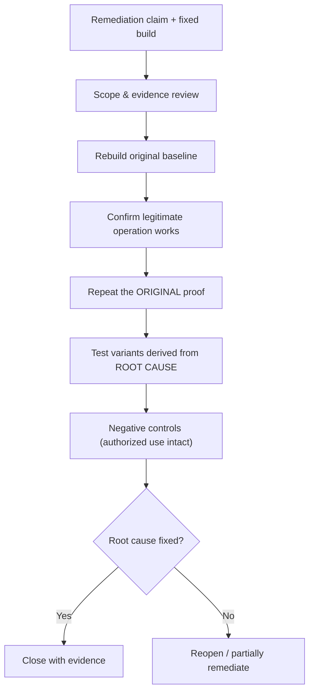

# 🔁 Retesting, Closure & Lessons Learned

> [!warning] "Closed" is a high bar
> A finding is closed only when the root cause is durably remediated, the original proof no longer works, realistic variants are controlled, legitimate functionality still works, and evidence supports the conclusion. A changed status code or a blocked payload is not closure.

## Parent Learning Order
Evidence & Risk Prioritization -> Finding & Report Writing -> Purple Team Exercise Design -> Retesting, Closure & Lessons Learned

## Proving a Fix Is Real

> *The report is delivered and the client has accepted it. Is the engagement over?*
>
> Hold your answer — the section below is the response.

The engagement ends where remediation begins — but a fix *claimed* is not a fix *verified*. **Retesting** is the discipline of proving that a remediation actually closed the finding, at its root, without breaking legitimate use. **Closure** is the formal decision (with evidence) that the finding is resolved. **Lessons learned** feeds systemic root causes back into the organization so the *whole class* of defect becomes less likely. This note is the closure *craft*; the **Guided Retest & Closure** leaf is the step-by-step walkthrough.

The defining trap this note exists to prevent: the **superficial fix**. Blocking one payload string, or changing an error message, can make a naive retest "pass" while the underlying vulnerability class remains wide open on a variant. Real closure proves the *root cause* is gone.

> [!tip] The analogy, and where it breaks
> A retest is like an inspector returning after a plumber "fixed the leak": a good inspector doesn't just see that *this* drip stopped — they run the water hard, check the neighboring joints, and confirm the sink still drains. The analogy breaks on generalization: a pipe is physically fixed or not, whereas a software fix can seal one crack while an identical crack gapes one function over, so "the exact original test now passes" is necessary but never sufficient — you must attack the *class*.

**Prerequisites:** **Finding & Report Writing** (the finding defines the root cause and retest criteria) and **Rules of Engagement & Scoping** (closure evidence and cleanup governance).

## The Retest Workflow



**Validate readiness first:** confirm the fixed build actually reached the affected asset (never retest a stale environment), and the exact finding version. Then reconstruct the original condition with *synthetic* data, verify the legitimate operation still works, repeat the original unauthorized variant, and derive **root-cause variants** (alternate verbs, legacy versions, batch/export paths, encoded identifiers, other services sharing the vulnerable component). The purpose is not endless fuzzing — it is proving the control is **centralized and complete**.

## Classify the Result Honestly

| Status | Meaning |
|---|---|
| **Remediated** | Original + meaningful variants blocked; business flow intact |
| **Partially remediated** | Some assets/variants still vulnerable |
| **Not remediated** | Original proof still succeeds |
| **Risk accepted** | Authorized owner accepts documented residual risk (with expiry) |
| **Unable to verify** | Required environment, identity, or evidence unavailable |

If only some paths are fixed, **preserve the original finding** and state the residual scope — do not silently downgrade.

## Closure and the Lessons-Learned Loop

Closure includes artifact reconciliation, credential/certificate rotation for anything exposed, evidence retention per contract, a final access review, and a retrospective. Then the highest-value step: **lessons learned** asks *why the defect entered, why it escaped review, why it stayed exposed, and why it was (or wasn't) detected* — and converts the answers into reusable design standards, tests, CI policy, detection content, inventory improvements, and ownership changes. A successful retest should reduce the probability of the **entire vulnerability class**, not just one recurrence.

## Worked Example: When "Fixed" Is Not Fixed

A retest exists to answer one question — was the vulnerability actually
remediated — and a naive retest answers a weaker one: does the exact proof from the
report still work. The gap between those two is where superficial fixes hide. One
app with three modes — vulnerable, superficially patched, and properly patched —
shows why variant testing is the whole job.

**The original vulnerability**, confirmed as a baseline:

```shell-session
analyst@lab:~$ python3 app.py vuln
vuln        | probe="' OR '1'='1"  -> CANARY-SECRET
vuln        | probe="' OR 'a'='a"  -> CANARY-SECRET
```

Both tautologies leak the secret — a working SQL injection.

**The superficial fix, tested naively**, looks remediated:

```shell-session
analyst@lab:~$ python3 app.py superficial | head -1
superficial | probe="' OR '1'='1"  -> blocked
```

The exact string from the report is now blocked. A retest that replays only the
original proof-of-concept stops here, marks the finding closed, and is wrong.

**The same fix, tested with a variant**, exposes it:

```shell-session
analyst@lab:~$ python3 app.py superficial | tail -1
superficial | probe="' OR 'a'='a"  -> CANARY-SECRET
```

A one-character change — `'1'='1'` to `'a'='a'` — sails straight through, because
the fix blocked a *string* rather than the *behaviour*. The vulnerability class is
fully intact; only the specific payload in the report was patched. Closing this
finding would leave the client exactly as exposed as before, with a report that
says otherwise.

**The root-cause fix** holds against both:

```shell-session
analyst@lab:~$ python3 app.py rootcause
rootcause   | probe="' OR '1'='1"  -> no results
rootcause   | probe="' OR 'a'='a"  -> no results
```

Parameterisation treats input as data that is never interpreted, so neither the
original nor any variant is a query any more. The class is closed, not the payload.

This is the discipline a retest enforces: a finding is remediated when the
*vulnerability class* is closed at its root, verified with variants the original
report never listed — not when the one proof-of-concept string stops working.
Distinguishing a superficial fix from a real one is the single most valuable thing
a retest delivers, because a falsely-closed finding is more dangerous than an open
one: the client has stopped worrying about it.

## The superficial fix that passes a naive retest

- **The superficial fix passes a naive retest.** Repeating only the exact original request misses a fix that blocked one string but not the class — always test root-cause variants (the lab proves this).
- **Retesting a stale environment.** If the fix hasn't reached the affected asset/build, a "pass" or "fail" is meaningless — verify deployment first.
- **Status code as proof.** A changed code (or error string) can hide the same side effect in the body, headers, timing, cache, logs, or async exports — confirm no protected data leaks by any channel.
- **Silent downgrade on partial fixes.** Closing a finding when only some paths are fixed hides residual risk; preserve it and scope the remainder.
- **No negative control.** A fix that also breaks legitimate use creates pressure for an unsafe rollback — confirm authorized workflows still work.

**The deliberate break:** a retest reads as re-running the original proof — the payload that worked before now fails, so the finding is fixed.

That establishes the **specific instance** is gone, which is a narrower claim than the one being recorded. A fix that blocks your exact payload while leaving the underlying flaw reachable by a variant passes a naive retest cleanly, and the finding is closed against evidence that was never about the cause. This is why the method includes variants and a negative control rather than just the original reproduction.

**How you'd spot it:** test a variant alongside the original, and check the negative control — that the legitimate use of the feature still works, because a fix that broke the feature will be quietly reverted and the finding will reopen without anyone telling you. Where the root cause was systemic, ask whether the same defect exists elsewhere: closing one instance of a pattern that appears in twelve places is a partial result being reported as a complete one.

## Security Implications — the Defender's View

- **Lessons learned is where risk actually drops:** converting a finding's root cause into a CI check, a secure-design standard, and a detection means the *class* stops recurring — far more valuable than closing one ticket.
- **Centralized-fix verification** (testing variants across services and versions) confirms the defender fixed the control once, everywhere — not patched a symptom.
- **Closure hygiene is a control:** rotating exposed credentials/certs and reconciling artifacts ensures the *test itself* left no residual exposure.
- **Honest classification feeds the risk register:** "partially remediated, residual scope X" keeps the real remaining risk visible and owned, rather than a false "closed."

## Summary

You should now be able to:

- State the closure standard and explain why a blocked payload or changed status code is not proof of a fix.
- Verify deployment, retest original + root-cause variants with negative controls, and classify the result honestly (remediated / partial / not / risk-accepted / unable-to-verify).
- Explain why superficial fixes pass naive retests, why partial fixes must preserve the original finding with residual scope, and how lessons-learned converts a root cause into CI checks, standards, and detections that close the whole class.

---
> 🔼 Up: [[Reporting & Purple Teaming]]
