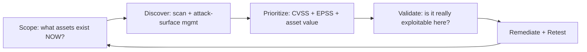

# 🔁 Continuous Exposure & Remediation Validation

> [!warning] Authorized simulation only
> Retesting reruns the original verification against the fixed system. Use the same minimal-canary discipline; a retest is not a licence to exploit further. Stay within the original scope.

## Parent Learning Order
Vulnerability Intelligence & Scoring -> Vulnerability Scanning & Automation -> Manual Vulnerability Verification -> Continuous Exposure & Remediation Validation

## Start at Zero: A Finding Is Not Fixed Until It Is Proven Fixed

The assessment lifecycle does not end at "reported." A vulnerability is only closed when someone **re-runs the exact test and it fails** — the flaw no longer reproduces. This step, **remediation validation** (retesting), is the one most often skipped, and skipping it is why "we fixed that" so often turns out to be false. A developer's "it's patched" is a claim; a passing retest is evidence.

Beyond one-time retesting, the modern practice is **continuous** exposure management: the attack surface changes daily (new assets, new CVEs, config drift), so a point-in-time assessment is stale the moment it is delivered. The discipline treats exposure as a *flow* to be continuously discovered, prioritized, validated, and re-validated — a loop, not a project.

> [!tip] The analogy, and where it breaks
> Retesting is like a re-inspection after a building repair — the inspector returns and re-runs the failed test. The analogy breaks on *drift*: a building, once fixed, stays fixed, whereas software exposure regresses constantly — a redeploy reverts the patch, a new instance ships the old flaw, a fresh CVE lands on unchanged code. So security "re-inspection" can never be one-and-done; it must be continuous.

**Prerequisites:** manual verification (you retest by re-running the original proof), and CVSS/EPSS prioritization.

## Retesting: Closing the Loop on One Finding

A retest has exactly one job: rerun the original verification and record the outcome. There are three possible results, and each means something different:

| Retest result | Meaning | Action |
| --- | --- | --- |
| **Fails to reproduce** | The fix works | Close the finding — with evidence |
| **Still reproduces** | The fix is incomplete or absent | Reopen; the fix was ineffective |
| **Reproduces differently** | Partial fix or a variant slipped through | Reopen; the developer patched the symptom, not the class |

The third case is the subtle one and the reason retesting requires judgment, not just rerunning a script. A developer who blocks `../` but not `..%2f` (URL-encoded) has fixed the *instance* you reported while leaving the *class* open. A good retest checks the original payload **and adjacent variants** — because attackers who read the same patch will try exactly those variants.

```bash
# retest a path-traversal fix: original payload AND encoded variants (against your own lab)
for p in "../../etc/passwd" "..%2f..%2fetc%2fpasswd" "....//....//etc/passwd"; do
  code=$(curl -s -o /dev/null -w "%{http_code}" "http://127.0.0.1:8082/file?name=$p")
  echo "$p -> HTTP $code"
done
```

```text
../../etc/passwd -> 403
..%2f..%2fetc%2fpasswd -> 200
....//....//etc/passwd -> 403
```

The fix blocked the literal `../` (403) but the *URL-encoded* variant still works (200) — the "reproduces differently" case. Reporting this as "fixed" because the original payload failed would be wrong; the class is still open.

## Continuous Exposure Management: The Loop

Point-in-time assessment answers "were we secure on the test date?" Continuous exposure management answers "are we secure *now*?" — a fundamentally harder question because the surface moves. The loop has five stages that repeat:



Each stage maps to a leaf you have already learned: **discover** (scanning + exposure discovery), **prioritize** (CVE/CVSS/EPSS intelligence), **validate** (manual verification), **remediate + retest** (this leaf). The innovation of "continuous" is not new techniques — it is *never stopping the loop*, so drift is caught within days rather than at the next annual test.

## Metrics That Matter

Continuous programs are judged by flow metrics, not counts:

- **Mean time to remediate (MTTR)** — how long from discovery to a passing retest. Trending this per severity shows whether the program is keeping pace.
- **Remediation rate vs. introduction rate** — are you closing findings faster than new ones appear? If not, exposure grows regardless of effort.
- **Recurrence rate** — how often a "fixed" finding returns (drift). High recurrence means the fix is not sticking (no regression test, no guardrail).
- **Exposure window** — for known-exploited flaws especially, the days between a CVE's publication and its remediation on your assets. This is the number attackers race you on.

A single scan count ("we have 4,000 vulnerabilities") is a vanity metric; the flow metrics are what tell you if the program is winning.

## Failure Modes and Interpretation

- **"Fixed" without retest** is the headline failure — a closed finding that was never actually verified fixed, discovered only when it is exploited.
- **Retesting only the reported payload** misses the variant class (the encoded-traversal case above). Retest the neighborhood, not just the point.
- **Drift regression.** A finding fixed in one deploy returns in the next because there is no automated regression test enforcing the fix. Without a test, the fix decays.
- **Stale prioritization.** A finding deferred as low-EPSS becomes urgent when exploit code publishes. Continuous programs must re-prioritize the backlog, not just triage new items.
- **Point-in-time complacency.** "We passed the pentest" is true for a date, not for today. Treating an annual test as ongoing assurance is the core misconception continuous management exists to fix.

## Security Implications — Why Continuous Wins

- **Attackers operate continuously**, so periodic defense loses by construction — the exposure window between a CVE dropping and your next scheduled scan is the attacker's opportunity. Continuous discovery shrinks that window.
- **Regression tests make fixes stick.** The durable remediation is not just the patch but an automated test that fails if the flaw returns — turning a one-time fix into a permanent guarantee. This is where security joins the CI/CD pipeline.
- **Validated exposure beats theoretical exposure.** A program that *validates* whether a flaw is truly exploitable in context (not just present) focuses remediation where it matters, echoing the manual-verification discipline at program scale.
- **The loop is the same for red and blue.** An attacker's continuous recon-and-exploit cycle and a defender's continuous discover-and-remediate cycle are mirror images; the side that iterates faster on the same attack surface wins.

## Authorized Lab: Retest a Fix and Catch the Variant

> [!info] Runs on one Linux machine — you build an app with a *partial* fix locally, then retest it
> The app binds to loopback and is removed in Step 4.

### Step 1 — Build an app whose "fix" only blocks the literal payload

```bash
cat > /tmp/retestapp.py << 'EOF'
import http.server, urllib.parse
class H(http.server.BaseHTTPRequestHandler):
    def do_GET(self):
        raw = urllib.parse.parse_qs(urllib.parse.urlparse(self.path).query).get("name",[""])[0]
        # NAIVE FIX: block the literal "../" but forget to decode first
        if "../" in raw:
            self.send_response(403); self.end_headers(); self.wfile.write(b"blocked"); return
        decoded = urllib.parse.unquote(raw)          # decode happens AFTER the check (the bug)
        if "etc/passwd" in decoded:
            self.send_response(200); self.end_headers(); self.wfile.write(b"FILE CONTENTS (canary)")
        else:
            self.send_response(404); self.end_headers(); self.wfile.write(b"not found")
    def log_message(self,*a): pass
http.server.HTTPServer(("127.0.0.1",8082),H).serve_forever()
EOF
python3 /tmp/retestapp.py &>/dev/null &
sleep 1; echo "app with naive fix up on :8082"
```

```text
app with naive fix up on :8082
```

### Step 2 — Retest the ORIGINAL reported payload

```bash
curl -s -o /dev/null -w "original payload -> HTTP %{http_code}\n" "http://127.0.0.1:8082/file?name=../../etc/passwd"
```

```text
original payload -> HTTP 403
```

Blocked. A lazy retest stops here and closes the finding — **incorrectly**.

### Step 3 — Retest the variant neighborhood (the actual skill)

```bash
for p in "..%2f..%2fetc%2fpasswd" "%2e%2e/%2e%2e/etc/passwd"; do
  echo "$p -> $(curl -s -o /dev/null -w '%{http_code}' "http://127.0.0.1:8082/file?name=$p")"
done
```

```text
..%2f..%2fetc%2fpasswd -> 200
%2e%2e/%2e%2e/etc/passwd -> 200
```

The URL-encoded variants return **200** — the flaw still works. The "fix" checked the raw string but decoded afterward, so encoding slips past it. This is "reproduces differently": the finding must be **reopened**, and a lazy retest would have missed it entirely.

### Step 4 — Cleanup

```bash
kill %1 2>/dev/null; rm -f /tmp/retestapp.py; wait 2>/dev/null
curl -s -o /dev/null -w "app gone: %{http_code}\n" --max-time 2 "http://127.0.0.1:8082/" 2>&1 | grep -o 'gone.*' || echo "app gone: connection refused"
```

```text
app gone: connection refused
```

**What you should now be able to do:** rerun a verification to validate a fix, distinguish the three retest outcomes, test the variant neighborhood to catch symptom-only fixes, and explain why continuous re-validation beats point-in-time testing against a drifting surface.

## Crook → Operator → Root Checkpoint

- **Crook:** Explain why a finding is not closed until a retest fails to reproduce it, and why point-in-time testing goes stale.
- **Operator:** Retest a fix including encoded/variant payloads, classify the outcome (fixed / still-vulnerable / reproduces-differently), and reopen a symptom-only fix.
- **Root:** Explain the continuous exposure loop and how it maps to the earlier leaves; describe why regression tests make fixes durable, and why the exposure window between CVE publication and remediation is the metric attackers race you on.

---
> 🔼 Up: [[Vulnerability Assessment]]
