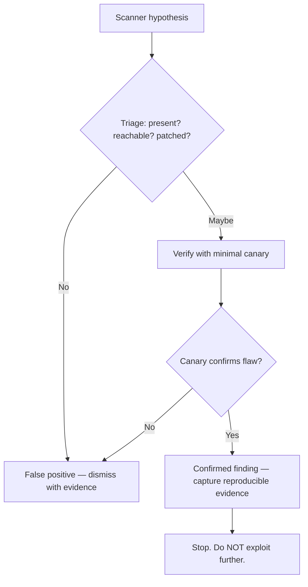

# 🔬 Manual Vulnerability Verification

> [!warning] Authorized simulation only
> Verification means safely proving a flaw exists with the *minimum* evidence — a canary, a benign marker — never full exploitation. Prove the parser is confused; do not extract data or cause harm. Everything here runs against a target you build.

## Parent Learning Order
Vulnerability Intelligence & Scoring -> Vulnerability Scanning & Automation -> Manual Vulnerability Verification -> Continuous Exposure & Remediation Validation

## Turning a Hypothesis Into a Finding

A scanner hands you hypotheses. **Manual verification** is the human step that converts each one into either a *confirmed finding* or a *dismissed false positive* — and doing this well is what separates a credible assessment from a scanner printout. Two things happen here: **triage** (deciding which hypotheses are worth investigating and killing the obvious false positives) and **verification** (safely proving the survivors are real).

The discipline has a hard ethical constraint: you prove the vulnerability with the **smallest possible evidence**. For SQL injection, that is a canary value showing the parser was confused — not a dump of the database. The proof answers "is the flaw real?" without answering "how much damage can I do?", because the second question is exploitation, and verification stops before it.

> [!tip] The analogy, and where it breaks
> Verification is like a doctor confirming a screening result before treatment — the screen (scanner) flags a risk, the confirming test proves it. The analogy breaks on restraint: a doctor runs the *definitive* test, whereas a verifier deliberately runs the *minimal* test — enough to confirm, never enough to harm. Proving you *could* extract the whole database is malpractice, not diligence.

**Prerequisites:** the scanning leaf (what a hypothesis is), and basic HTTP/SQL for the examples.

## Triage: Killing False Positives Fast

Most scanner findings are noise, so triage first. Three quick questions eliminate the majority:

1. **Is the product/version even present?** A CVE for IIS on a host running nginx is an instant false positive.
2. **Is it reachable in the tested context?** A flaw behind authentication the scanner didn't have, or on a port filtered from the tester, may be unreachable.
3. **Was it backported?** The version banner may be misleading (the scanning leaf's core trap). Check the actual patch state where possible.

```bash
# triage a version-based finding: does the banner match the real package?
# (authenticated check on a host you administer)
apache2 -v 2>/dev/null | head -1; dpkg -l apache2 2>/dev/null | awk '/^ii/{print "installed:",$3}'
```

```text
Server version: Apache/2.4.41 (Ubuntu)
installed: 2.4.41-4ubuntu3.17
```

The banner says `2.4.41` but the package is `2.4.41-4ubuntu3.17` — the `ubuntu3.17` suffix is *backported security fixes*. A scanner's CVE-for-2.4.41 finding is very likely a false positive here, dismissed in one command.

## Verification: Minimal, Safe Proof

For findings that survive triage, prove them with a canary. The gold-standard example is SQL injection: rather than extracting data, show the parser evaluated attacker-supplied logic.

```bash
# against YOUR OWN lab app: does the app treat input as SQL, not data?
# baseline vs. an always-true and an always-false condition
for p in "1" "1 AND 1=1" "1 AND 1=2"; do
  code=$(curl -s -o /dev/null -w "%{http_code}" "http://127.0.0.1:8081/item?id=$(python3 -c "import urllib.parse,sys;print(urllib.parse.quote(sys.argv[1]))" "$p")")
  echo "id='$p' -> HTTP $code"
done
```

```text
id='1' -> HTTP 200
id='1 AND 1=1' -> HTTP 200
id='1 AND 1=2' -> HTTP 404
```

Read the oracle: `1 AND 1=1` (always true) returns the item; `1 AND 1=2` (always false) returns nothing. The application *evaluated the boolean* — proof the input reached the SQL grammar. That is a confirmed finding, obtained without reading a single row of data. The canary confused the parser; it did nothing more.

## The Evidence a Finding Needs

A verified finding is only useful if it is reproducible and defensible. Capture, for each:

| Element | Why |
| --- | --- |
| Exact request/command | Reproducibility — the developer must be able to repeat it |
| Exact response/proof | The evidence the flaw is real (the boolean oracle above) |
| UTC timestamp | Correlation with defender logs |
| Identity/context used | Which user, which access level |
| Affected component + version | Scope and remediation target |
| Cleanup state | Confirmation nothing was left behind |



## Where verification turns into exploitation

- **Over-proving.** The temptation to "just confirm impact" by dumping data crosses from verification into exploitation and often breaches scope. The minimal canary is the finding; more is a violation.
- **Under-proving.** Reporting a scanner hypothesis as a confirmed finding without verification destroys credibility — the developer reproduces it, it fails, and every other finding is now doubted.
- **Confirmation bias.** Wanting a finding to be real leads to reading ambiguous responses as positive. The always-false control (`1 AND 1=2`) exists precisely to disprove the null hypothesis; without a negative control, a "confirmation" may be coincidence.
- **Context blindness.** A flaw reachable in your test may be unreachable in production (or vice versa) due to a WAF, auth, or network control. State the *conditions* under which you confirmed it.
- **Irreproducibility.** A finding you cannot reproduce on demand is not a finding — capture the exact request while you have it.

## Security Implications — What This Means for Defense

- **A verified finding drives remediation; an unverified one drives distrust.** The verification step is what makes a report actionable — developers fix what they can reproduce.
- **The negative control is the scientific core.** Proving the flaw requires *also* proving the benign case behaves differently. This is the same evidence discipline as forensics: distinguish the demonstrated fact from the plausible inference.
- **Minimal-evidence proof is safer for everyone.** It reduces the assessor's risk of causing damage, the client's risk of data exposure during testing, and the legal exposure of the engagement.
- **False-positive reduction is a force multiplier for the blue team.** Handing developers a triaged, verified list instead of a raw scan of 10,000 findings is the difference between remediation happening and the report being shelved.

## Summary

You should now be able to:

- Explain why a scanner finding is a hypothesis, and why verification uses the minimum evidence rather than full exploitation.
- Triage a finding by presence/reachability/patch-state, verify SQL injection with a boolean oracle *and its negative control*, and capture the reproducible evidence a developer needs.
- Explain why the negative control is the scientific core of a defensible finding, why over-proving breaches scope and ethics, and how triaged/verified findings drive remediation where raw scans get shelved.

---
> 🔼 Up: [[Vulnerability Assessment]]
