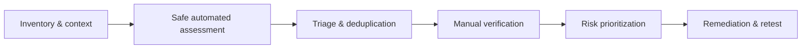

# Vulnerability Assessment

> [!abstract] Lifecycle branch
> Convert asset and service observations into verified, prioritized, reproducible security findings without treating scanner output as truth.

## 🗺️ Zero-to-Mastery Learning Path

1. [[Vulnerability Intelligence & Scoring]]
2. [[Vulnerability Scanning & Automation]]
3. [[Manual Vulnerability Verification]]
4. [[Continuous Exposure & Remediation Validation]]

---
> 🔼 Up: [[Penetration Testing]]
