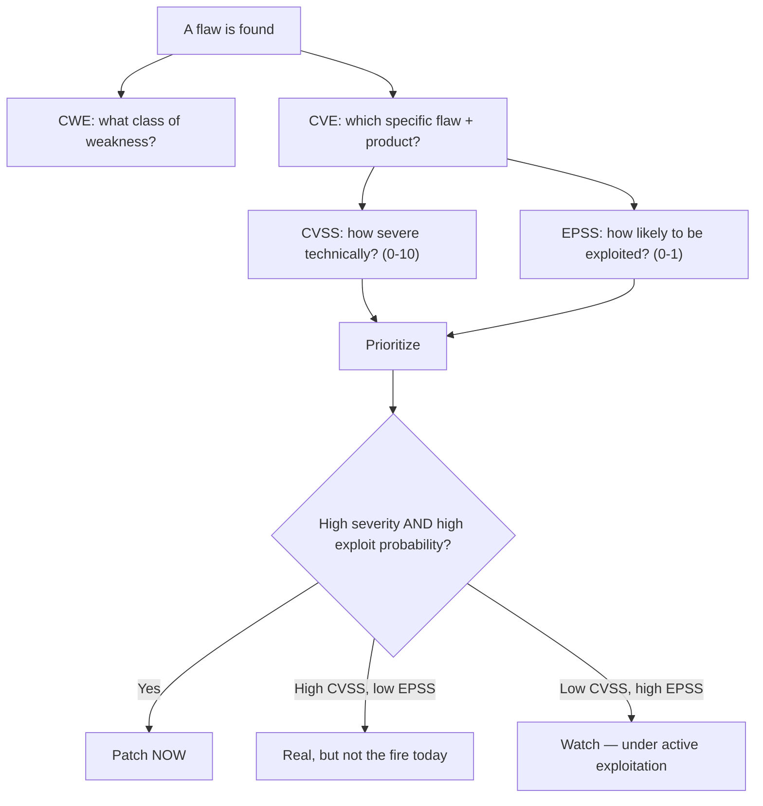

# 🏷️ Vulnerability Intelligence & Scoring

> [!warning] Authorized simulation only
> This note reads public vulnerability databases (NVD, EPSS) — no target is touched. The skill is turning identifiers and scores into a defensible *priority*, which is an analysis exercise, not an attack.

## Parent Learning Order
Vulnerability Intelligence & Scoring -> Vulnerability Scanning & Automation -> Manual Vulnerability Verification -> Continuous Exposure & Remediation Validation

## The Four Systems That Name and Rank a Flaw

> *You can patch one flaw today: a CVSS 9.8 nobody is exploiting, or a 6.5 being exploited in the wild. Which?*
>
> Hold your answer — the section below is the response.

When a vulnerability is found, four public systems describe it, and confusing them is the most common analytical error in vulnerability management. Each answers a different question:

| System | Question | Example |
| --- | --- | --- |
| **CWE** | What *kind* of weakness is this? | CWE-89: SQL Injection |
| **CVE** | *Which specific* flaw, in which product? | CVE-2021-44228 (Log4Shell) |
| **CVSS** | How *severe* is it, technically? | 10.0 Critical |
| **EPSS** | How *likely* is it to be exploited? | 0.975 (97.5%) |

The relationship: a **CWE** is the abstract weakness *class* (the taxonomy). A **CVE** is a concrete *instance* of one or more CWEs in a specific product version. **CVSS** scores the instance's technical severity. **EPSS** predicts the probability that instance will be exploited in the wild. You need all four because severity alone is a terrible prioritizer — and that is the central lesson of this note.

> [!tip] The analogy, and where it breaks
> Think of a medical diagnosis: CWE is the disease category (infection), CVE is the specific diagnosis (this patient's pneumonia), CVSS is how dangerous the condition is in principle, and EPSS is the odds this particular case actually turns severe. The analogy breaks because in security the "odds" (EPSS) can flip overnight when exploit code is published — a low-EPSS flaw becomes high the day a proof-of-concept drops, which no disease does.

**Prerequisites:** basic understanding of what a software vulnerability is, and comfort reading JSON from a command line.

## CWE: The Weakness Taxonomy

**CWE (Common Weakness Enumeration)** is a hierarchical dictionary of *weakness types* — the root causes, independent of product. CWE-89 is SQL injection *everywhere*, not in one product. It matters because it connects a specific flaw to its class of defenses: if three CVEs all map to CWE-79 (XSS), the fix is one systemic control (output encoding), not three patches. CWE is how you turn a pile of findings into a *pattern*.

## CVE: The Universal Identifier

**CVE (Common Vulnerabilities and Exposures)** assigns a unique ID to each publicly disclosed flaw — `CVE-YYYY-NNNNN`. Its entire purpose is to be a shared reference: your scanner, the vendor advisory, the exploit database, and the patch note all cite the same CVE, so everyone knows they mean the same flaw. A CVE record names the affected products and versions and links to the CWE(s) it instantiates.

```bash
# read a CVE record from the public NVD API (read-only)
curl -s "https://services.nvd.nist.gov/rest/json/cves/2.0?cveId=CVE-2021-44228" | \
  python3 -c "import sys,json;d=json.load(sys.stdin)['vulnerabilities'][0]['cve'];print('ID:',d['id']);print('CWE:',d['weaknesses'][0]['description'][0]['value']);print('Desc:',d['descriptions'][0]['value'][:90])"
```

```text
ID: CVE-2021-44228
CWE: CWE-502
Desc: Apache Log4j2 <=2.14.1 JNDI features used in configuration, log messages, and paramete
```

Log4Shell maps to CWE-502 (deserialization of untrusted data) — the *class* of weakness. That mapping is what tells you the same defensive lesson applies to every deserialization flaw, not just this one.

## CVSS: Technical Severity (and Its Limits)

**CVSS (Common Vulnerability Scoring System)** produces a 0-10 severity score from a *vector* of technical characteristics — attack vector, complexity, privileges required, user interaction, and impact to confidentiality/integrity/availability.

```text
CVSS:3.1/AV:N/AC:L/PR:N/UI:N/S:C/C:H/I:H/A:H  =  10.0 Critical
         │    │    │    │    │   │  └── full impact to C, I, A
         │    │    │    │    │   └── scope changed (breaks out of its context)
         │    │    │    └────┴── no privileges, no user interaction needed
         │    └── low attack complexity
         └── network-accessible (remote)
```

The vector is more useful than the number: `AV:N/PR:N/UI:N` (remote, no auth, no interaction) is the profile of a wormable flaw regardless of the final digit. **But CVSS has a critical limitation** that defines this whole note: it measures *technical severity in isolation*, not *real-world risk*. A 9.8 in a product you do not run, or one nobody is exploiting, is not your top priority — yet organizations that patch by CVSS alone chase thousands of high scores while the actually-exploited flaw waits. Severity is a property of the flaw; risk is a property of the flaw *in your environment under current attacker behavior*.

**The deliberate break:** CVSS produces a number out of ten, so it reads as an answer to "how urgent is this". It answers a different question: **how bad would this be if it were exploited** — and says nothing whatsoever about whether anyone will.

Severity and likelihood are separate axes, and only a small fraction of published CVEs are ever exploited in the wild. That is why a queue sorted by CVSS is a queue sorted by *worst case*, not by *what is happening*, and why teams patching diligently by score still get hit by something they had ranked below the line. **EPSS** exists precisely to supply the missing axis: a probability of exploitation, updated as the world changes.

The two together are what make prioritisation possible — a 9.8 that nobody is exploiting can genuinely wait behind a 6.5 that is being exploited today, and that sentence is professional judgement rather than negligence only because two different measurements support it.

**How you'd spot a broken prioritisation:** the remediation queue is sorted by one number. If nothing in the process distinguishes *severe* from *likely*, the team is working the worst case in perpetuity and the exploited flaw is somewhere further down the list.

## EPSS: The Probability That Fixes Prioritization

**EPSS (Exploit Prediction Scoring System)** fills CVSS's gap. It is a model that outputs, for each CVE, the probability (0-1) that it will be exploited in the wild in the next 30 days, trained on real exploitation data. This is the number that turns a list of 5,000 "critical" CVEs into a ranked action plan.

```bash
# EPSS score for two CVEs from the public FIRST.org API (read-only)
curl -s "https://api.first.org/data/v1/epss?cve=CVE-2021-44228,CVE-2015-1234" | \
  python3 -c "import sys,json;[print(f\"{r['cve']}: EPSS {float(r['epss']):.3f} (percentile {float(r['percentile']):.2f})\") for r in json.load(sys.stdin)['data']]"
```

```text
CVE-2021-44228: EPSS 0.944 (percentile 1.00)
```

Log4Shell's 0.944 EPSS at the 100th percentile says: this is among the most-exploited flaws in existence — patch it *now*. A CVSS 9.8 with an EPSS of 0.001, by contrast, is a flaw that is severe in theory but that essentially nobody is exploiting — real, but not the fire to fight first.



## Drowning in criticals while the exploited flaw waits

- **Patching by CVSS alone** is the classic failure: you drown in "criticals" while the exploited flaw with a moderate score is ignored. EPSS + asset context is the fix.
- **EPSS is a probability, not a certainty.** A 0.02 EPSS is not "safe" — it is "2% in 30 days," which for a critical asset may still warrant action. EPSS *ranks*; it does not *decide*.
- **Score without context is meaningless.** A CVE for a product you do not run is not your problem; a moderate CVE on your internet-facing crown-jewel may be your top priority. Neither CVSS nor EPSS knows your environment — you supply that.
- **Stale scores.** EPSS updates daily and can jump when exploit code publishes. A score read last week may understate today's risk. Re-query for anything you are deferring.
- **CVE gaps.** Not every flaw has a CVE (unpatched zero-days, vendor-disputed issues), so "no CVE" is not "no vulnerability."

## Security Implications — Using This as a Defender

- **Risk-based prioritization** — CVSS *for severity*, EPSS *for likelihood*, asset value *for impact*, combined — is the modern standard, and it dramatically reduces patching workload by focusing effort where exploitation is actually probable. Regulators and frameworks (e.g. exploited-vulnerability catalogs) increasingly mandate it.
- **CWE clustering** turns findings into systemic fixes: if your scan is full of one CWE, you have a *class* problem (a missing control in a framework) that one architectural change solves better than a hundred patches.
- **The KEV concept** — a catalog of *known-exploited* vulnerabilities — is the sharpest signal: a CVE on such a list is being used against real organizations *now* and overrides any score. Treat "known exploited" as an emergency regardless of CVSS.
- **This intelligence is dual-use**: attackers use the same EPSS/CVE/exploit-DB data to pick the flaw most likely to work, so the defender who prioritizes by exploitation probability is literally racing the attacker on the same scoreboard.

## Summary

You should now be able to:

- State what each of CWE, CVE, CVSS, and EPSS describes, and why a high CVSS score is not automatically a top priority.
- Read a CVE record for its CWE and CVSS vector, pull its EPSS score, and rank a small set of CVEs by exploitation probability rather than severity.
- Explain why CVSS measures severity-in-isolation while risk requires EPSS plus asset context; describe how CWE clustering converts findings into systemic fixes, and why a known-exploited flaw overrides any score.

---
> 🔼 Up: [[Vulnerability Assessment]]
