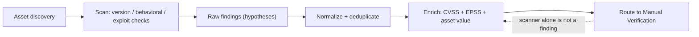

# 🔎 Vulnerability Scanning & Automation

> [!warning] Authorized simulation only
> A scanner sends real probes and can crash fragile services. Scan only hosts in an explicit scope, and only with the intrusiveness the rules of engagement permit. The lab here scans a target you build yourself.

## Parent Learning Order
Vulnerability Intelligence & Scoring -> Vulnerability Scanning & Automation -> Manual Vulnerability Verification -> Continuous Exposure & Remediation Validation

## A Scanner Is Pattern-Matching, Not Understanding

A **vulnerability scanner** automates the tedious first pass: it fingerprints services, compares what it finds against a database of known-vulnerable versions and misconfigurations, and reports candidates. It is coverage at scale — thousands of checks across hundreds of hosts in minutes — and that is its whole value. What it is *not* is judgment. A scanner reports what *matches a signature*, which is why its output is a list of *hypotheses*, not confirmed findings. Believing the scanner is the single most common mistake in vulnerability assessment.

> [!tip] The analogy, and where it breaks
> A scanner is like a spell-checker: it flags every word that isn't in its dictionary, fast and tireless. The analogy breaks because a spell-checker's dictionary is complete, whereas a scanner only knows the signatures it was given — it misses novel flaws entirely (false negatives) and flags things that look wrong but aren't (false positives). It cannot understand context, only match patterns.

**Prerequisites:** service and version detection (port scanning), and the CVE/CVSS/EPSS intelligence from the previous leaf.

**The deliberate break:** "the scan found 400 vulnerabilities" is how scan results are always described, and it treats the output as a list of facts.

A scanner produces **hypotheses**. Most of what it reports is inference from a version banner — it read `OpenSSH 7.4`, looked up which CVEs affect 7.4, and reported them. It did not test whether this host is vulnerable, and on any enterprise Linux distribution it is very likely wrong, because Red Hat, Debian and Ubuntu **backport security fixes without changing the version string**. The banner says 7.4 and the binary is patched.

That is not a flaw to work around, it is what the tool is for: a scanner narrows an enormous space to a reviewable one. The error is treating the narrowing as the finding. Every line it produces is a claim awaiting verification, which is the entire job of the note after this one.

**How you'd spot an unverified finding:** it cites a version and nothing else. A finding that survives review names the *behaviour* observed — the response, the artifact, the state — not the banner that suggested it.

## How a Scanner Decides Something Is Vulnerable

Three detection strategies, in increasing intrusiveness and confidence:

| Strategy | How | Confidence | Risk |
| --- | --- | --- | --- |
| **Version-based** | Banner says "Apache 2.4.41" → look up its CVEs | Low (banner may lie or be patched) | None |
| **Behavioral** | Send a probe, observe a vulnerable response | Medium | Low |
| **Exploitation** | Actually trigger the flaw safely | High | Can disrupt |

Most scanning is **version-based**, which is why scanners produce so many false positives: a backported security patch keeps the old version banner while fixing the flaw, so the scanner reports a CVE the system does not actually have. This is the defining limitation — the scanner sees `2.4.41` and reports every CVE for `2.4.41`, unaware the distro backported the fix.

## Authenticated vs. Unauthenticated Scanning

The single biggest quality lever is **credentials**. An *unauthenticated* scan sees a host as an attacker does — from outside, guessing from banners. An *authenticated* scan logs in and reads actual package versions, configuration, and patch state:

```bash
# unauthenticated: version-guess via nmap's vuln scripts
sudo nmap -sV --script vuln -p 80 10.10.20.30 2>/dev/null | grep -A1 -E 'VULNERABLE|CVE|Server' | head -4
```

```text
| http-server-header: Apache/2.4.41 (Ubuntu)
|_http-vuln-cve2017-15710: Couldn't find a proper response
```

Unauthenticated, the scanner can only guess from the banner. An authenticated scan would instead read the installed package version directly (`dpkg -l apache2`), eliminating the backport false-positive. The tradeoff: authenticated scans are far more accurate but require credentials and touch more of the system — so the rules of engagement decide which you run.

## Automation: Scanning as a Pipeline

At scale, scanning is not a one-off command but a pipeline: discover assets → scan → normalize results → deduplicate → enrich with intelligence (CVSS/EPSS) → route to owners. Modern scanners are scriptable, and a template-based scanner turns detection into version-controlled, shareable rules:

```bash
# nuclei-style templated scanning against a local target (illustrative)
nuclei -u http://10.10.20.30 -t http/technologies/ -silent 2>/dev/null | head -3 || echo "nuclei not installed; nmap NSE above is the equivalent"
```

```text
[apache-detect] [http] [info] http://10.10.20.30 [Apache/2.4.41]
```

The value of automation is *consistency and coverage*, not intelligence — the same checks run identically every time, which is exactly what you want for the tedious 80% so human attention goes to the 20% that needs judgment.



## Every scanner finding is a hypothesis

- **False positives** dominate version-based scanning (backports, false version detection). Every scanner finding is a hypothesis until verified — the next leaf's entire job.
- **False negatives** are the dangerous ones: the scanner has no signature for a novel or logic flaw, so it reports "clean" for a vulnerable host. "The scan was clean" never means "there are no vulnerabilities."
- **Fragile-service crashes.** Aggressive checks can hang or crash old devices, printers, and ICS equipment. Match intrusiveness to the target's fragility, and exclude fragile assets from active checks.
- **Scan scope errors.** A misconfigured target range scans out-of-scope hosts — a serious authorization breach. Verify the scope before every scan.
- **Volume overwhelm.** A raw scan of a large estate returns tens of thousands of findings; without enrichment and prioritization (previous leaf) it is unactionable noise.

## Security Implications — Detection & Defense

- **Scanning is loud and detectable.** A scanner's probe pattern is unmistakable in IDS logs — many connection attempts, version probes, and known-exploit signatures from one source. Authorized scans should be coordinated so the blue team does not chase them as an incident.
- **Defenders run the same scanners inward.** The single most valuable defensive use is continuous authenticated scanning of your own estate — you find the missing patch before an attacker's unauthenticated scan does.
- **Credentialed scanning is a trust decision.** The scanner's credentials are powerful (they read config across the estate), so the scanning infrastructure is a high-value target that must itself be hardened.
- **A clean scan is not a clean bill of health.** Because scanners miss what they lack signatures for, scanning must be paired with manual testing for anything that matters — automation covers the known, humans cover the novel.

## Summary

You should now be able to:

- Explain what a scanner does and does not understand, and why its output is a list of hypotheses rather than findings.
- Run version and behavioral scans, explain the backport false-positive, and choose authenticated vs. unauthenticated scanning for the engagement.
- Explain why false negatives are more dangerous than false positives, why "clean scan" ≠ "no vulnerabilities," and how automation's real value is consistent coverage that frees human judgment for the novel 20%.

---
> 🔼 Up: [[Vulnerability Assessment]]
