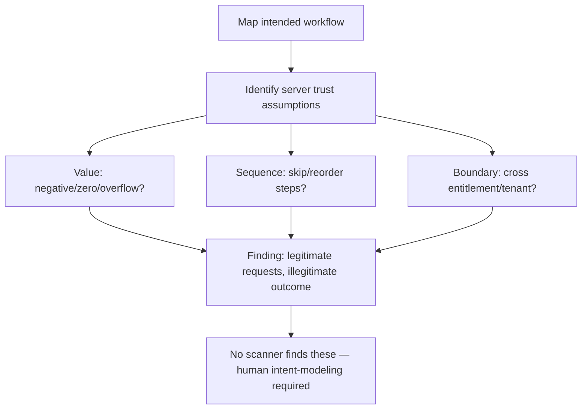

# 🧩 Business Logic Testing

> [!warning] Authorized simulation only
> Business-logic abuse manipulates real workflows — payments, entitlements, tenant boundaries. Prove flaws against synthetic accounts and canary values (a $0 order, a test tenant), never real money or another customer's real data. Test only in-scope applications.

## Parent Learning Order
Business Logic Testing -> Race Condition & Concurrency Testing

## The Bugs No Scanner Can Find

Most vulnerabilities are *implementation* flaws — a missing check, an unescaped input. **Business-logic flaws** are different: the code works exactly as written, but the *workflow itself* can be abused in ways the designer never anticipated. There is no malformed input, no injection, no signature — just a legitimate sequence of legitimate requests that produces an illegitimate outcome. A scanner cannot find these, because a scanner has no concept of what the application is *supposed* to do; only a human who understands the intended workflow can spot its abuse.

This is why business-logic testing is the most intellectually demanding web testing: you must model the application's intent, then ask "what happens if I do this out of order, with an impossible value, or in a way the UI would never allow?"

> [!tip] The analogy, and where it breaks
> A business-logic flaw is like a self-checkout that lets you scan a cheap item's barcode while bagging an expensive one — every individual step is valid, but the *combination* cheats the system. The analogy breaks because software abuse is *scriptable and instant*: a human does this once, but an attacker automates ten thousand variations per second, turning a clever trick into a systematic exploit no cashier could match.

**Prerequisites:** HTTP requests, authentication/authorization, and the API business-logic concept.

**The deliberate break:** run a good scanner, review its findings, fix them, and the application is tested. That reasoning holds for whole classes of flaw and fails completely here.

A scanner detects **malformed input producing anomalous behaviour**. A business-logic flaw has no malformed input. Every request is well-formed, correctly typed, properly authenticated and individually valid — the flaw is that this *sequence*, or this *value*, was never meant to be possible. A quantity of `-1` is a perfectly valid integer. Applying the discount code twice is two legitimate requests. Skipping from step two to step four is a normal navigation. There is no signature to match and no payload to flag, which is precisely why logic flaws survive years of automated testing and are the highest-value findings a human brings.

You cannot find them by looking for something wrong with a request. You find them by knowing **what the application is supposed to guarantee**, and then testing whether it actually does.

**How you'd spot the candidates:** model the workflow as steps and ask three questions of each — can it be **skipped**, **repeated**, or **reordered**? Then ask of every numeric field whether the code assumed it would be positive. Nearly every logic finding in this note's families answers yes to one of those.

## The Common Business-Logic Flaw Families

Three families cover most real findings, and this note absorbs the workflow-specific concerns (entitlements, multi-tenancy, payments) as instances of them:

| Family | The abuse | Example |
| --- | --- | --- |
| **Value manipulation** | Impossible or negative values | Negative quantity refunds money; $0.01 price |
| **Sequence/state abuse** | Skipping or reordering steps | Apply discount *after* validation; reach checkout without payment |
| **Boundary bypass** | Crossing an entitlement or tenant line | Access another tenant's data; use a feature you didn't pay for |

**Entitlement flaws** are boundary bypasses: a user accesses a feature or resource their subscription/role does not grant, because the check happens in the UI (which hides the button) but not the server (which still honors the request). **Multi-tenant isolation flaws** are the same at the tenant level: one customer's account reaches another's data because the tenant boundary is not enforced server-side. **Payment workflow flaws** are value + sequence abuse against money: manipulating price, quantity, currency, or the order of pay/validate steps.

The unifying root cause: **the server trusts the client to follow the intended workflow and stay within its entitlements, instead of enforcing both itself.**

## The Testing Method: Model, Then Break

Business-logic testing has no payload list. The method:

1. **Map the intended workflow** — what steps, in what order, with what constraints, produce the legitimate outcome?
2. **Identify the trust assumptions** — where does the server assume the client behaved correctly (order, value, entitlement)?
3. **Violate each assumption** — reorder steps, send impossible values, cross a boundary, and observe whether the server catches it.

```bash
# value manipulation: does the server accept a negative quantity? (your own lab shop)
curl -s -X POST -H "Content-Type: application/json" \
  -d '{"item":"widget","qty":-5,"price":10}' "http://127.0.0.1:8106/checkout"
```

```text
{"total":-50,"status":"accepted"}
```

A negative quantity produced a **negative total** — the server would *credit* the attacker money. No injection, no malformed input; just a value the workflow never expected, accepted because the server did not validate `qty > 0`. That is a business-logic finding.



## Proving a money bug without moving money

- **Proving with real value.** A negative-quantity refund or a cross-tenant read must be proven with synthetic accounts and canary amounts — never actually move money or read a real customer's data.
- **These resist automation.** A scanner reports "no issues" on a business-logic flaw because there is nothing malformed to detect. Concluding "clean" from an automated scan misses this entire class.
- **Requires domain understanding.** You cannot test what you do not understand — spotting that "a discount should apply once" requires knowing the business rule. Time spent understanding the app is the investment that finds these.
- **Multi-step complexity.** Sequence abuses may need a precise chain of requests; reproduce the exact sequence, and note that state may need resetting between attempts.
- **Entitlement vs. authz.** An entitlement flaw (paid feature accessed for free) and an authorization flaw (BOLA) can look similar; classify by whether the boundary is *commercial* (entitlement) or *ownership* (authz) — the fix differs.

## Security Implications — Detection & Defense

- **Enforce every rule server-side.** The definitive fix: the server must validate values (positive, in-range), enforce sequence and one-time-ness, and check entitlements/tenant boundaries on *every* request — never trusting that the client followed the workflow or stayed in its lane.
- **The UI is not a control.** Hiding a button or greying out a feature is presentation, not security; the server must reject the request regardless of what the UI showed.
- **Multi-tenancy needs a tenant check on every query** — every data access must be scoped to the authenticated tenant, ideally enforced structurally (row-level security) not just in application code.
- **Detection is behavioral and rule-based:** impossible values (negative amounts), impossible sequences, and cross-tenant access patterns are the signals — anomaly detection tuned to the business rules, since there is no malicious *payload* to signature.
- **Threat-model the workflow** during design — asking "how could each step be abused?" is cheaper than finding it in a pentest, and it is the only way to catch logic flaws before they ship.

## Summary

You should now be able to:

- Explain why business-logic flaws have no malicious payload and why a scanner cannot find them.
- Model a workflow, test value manipulation (negative amounts), entitlement bypass, and tenant-boundary crossing with synthetic accounts, and classify each family.
- Explain why every value/sequence/entitlement/tenant rule must be enforced server-side (the UI is not a control), why multi-tenancy needs a per-query tenant scope, and why threat-modeling the workflow at design time is the only pre-ship defense.

---
> 🔼 Up: [[Business Logic & Workflow Security]]
