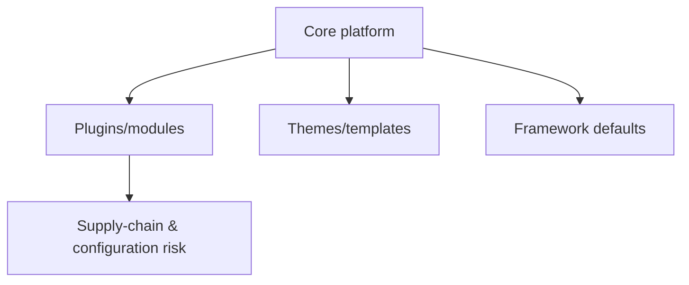

# CMS & Framework Security Testing

## 🗺️ Zero-to-Mastery Learning Path

1. [[Framework & CMS Testing Methodology]]
2. [[WordPress Security Testing]]
3. [[Dependency Confusion & Supply-Chain Attacks]]

---
> 🔼 Up: [[Web Application Penetration Testing]]
