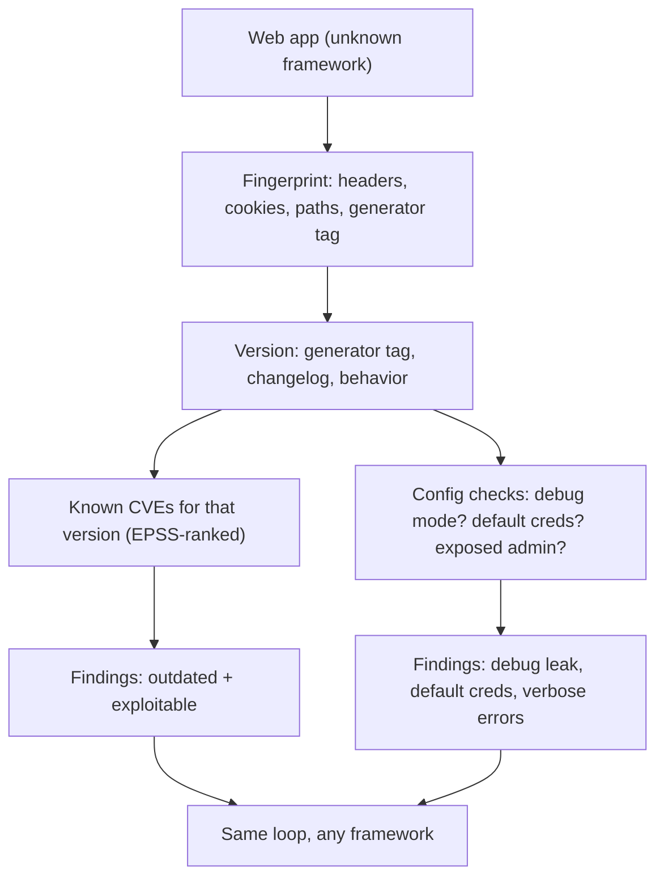

# 🧱 Framework & CMS Testing Methodology

> [!warning] Authorized simulation only
> Framework and CMS testing probes live applications and can trigger admin lockouts or plugin misbehavior. Test only in-scope applications, throttle enumeration, and stop at proof — identifying a vulnerable plugin version is a finding; exploiting it against production data is not.

## Parent Learning Order
Framework & CMS Testing Methodology -> WordPress Security Testing

## Start at Zero: You Test the Framework the Same Way, Every Time

Modern web applications are built on frameworks (Django, Laravel, Spring) and content-management systems (WordPress, Drupal, Joomla, Magento). It is tempting to think each needs its own bespoke testing knowledge — and the boilerplate that once filled this branch pretended so, with a near-identical stub per product. The truth is the opposite: **the methodology is identical across all of them.** Fingerprint the framework, pin its exact version, look up that version's known vulnerabilities, and test the handful of framework-specific misconfigurations. The product name changes; the process does not.

This is why one methodology note replaces a shelf of per-product stubs. Learn the four-step loop once and you can test any framework, including ones released after this note was written.

> [!tip] The analogy, and where it breaks
> Testing a framework is like a mechanic servicing a car: whatever the make, you read the VIN, look up that model's recalls, and check the known weak points. The analogy breaks because software "recalls" (CVEs) appear continuously and are *publicly weaponized* — the moment a framework CVE drops, exploit code circulates, so the gap between "recall issued" and "exploited" is days, not a scheduled service interval.

**Prerequisites:** HTTP fundamentals, service enumeration, and the vulnerability-intelligence leaf (CVE/CVSS/EPSS).

## The Four-Step Loop

Every framework/CMS assessment is this loop, applied to whatever product is in front of you:

| Step | Question | Method |
| --- | --- | --- |
| **1. Fingerprint** | What framework is this? | Headers, cookies, error pages, default paths, HTML artifacts |
| **2. Version** | Exactly which version? | Version strings, changelog files, asset hashes, behavior |
| **3. Known CVEs** | What is broken in that version? | Map version → CVEs (vuln-intelligence leaf) |
| **4. Config** | What is misconfigured? | Default creds, debug mode, exposed admin, verbose errors |

The highest-value findings usually come from steps 2 and 4: an **outdated version** with a known-exploited CVE, or a **misconfiguration** like debug mode left on. Neither requires framework-specific exploitation skill — just the disciplined loop.

## Step 1-2: Fingerprinting and Versioning

Frameworks leak their identity constantly. The tells:

- **HTTP headers** — `X-Powered-By: PHP`, `Server: nginx`, framework-specific headers like `X-Drupal-Cache` or `X-Generator`.
- **Cookies** — `csrftoken`/`sessionid` (Django), `laravel_session` (Laravel), `JSESSIONID` (Java/Spring), `PHPSESSID` (PHP).
- **Default paths** — `/wp-admin` (WordPress), `/user/login` (Drupal), `/administrator` (Joomla), `/admin` (Magento).
- **Error pages** — an unhandled error often reveals the framework and, in debug mode, the exact version and a stack trace.
- **HTML artifacts** — `<meta name="generator" content="WordPress 6.2">` hands you the version directly.

```bash
# fingerprint a target from its response headers and cookies (against your own lab app)
curl -sI "http://127.0.0.1:8095/" | grep -iE 'server|x-powered|x-generator|set-cookie'
```

```text
Server: Werkzeug/2.3 Python/3.11
Set-Cookie: session=eyJ...; HttpOnly; Path=/
X-Powered-By: Flask
```

`Werkzeug` + `Flask` in the headers identifies the framework in one request — and `Werkzeug/2.3` is a version to look up. This is fingerprinting: the framework announced itself.

## Step 3-4: CVEs and the Debug-Mode Jackpot

Once you have `Framework X version Y`, the vuln-intelligence loop applies directly — look up that version's CVEs, rank by EPSS, and verify the exploitable ones. But the single most common high-impact CMS/framework finding needs no CVE at all: **debug mode left enabled in production.**

Debug mode (Django `DEBUG=True`, Flask debug, Laravel `APP_DEBUG=true`, Spring dev profile) turns an error page into a full disclosure — stack traces, source code, configuration, environment variables, and sometimes database credentials or a Werkzeug/Django interactive console that executes code. It is a configuration checkbox, not a code flaw, which is why it is so common and so severe.

```bash
# trigger an error and see whether debug mode leaks internals
curl -s "http://127.0.0.1:8095/crash" | grep -iE 'traceback|debugger|line [0-9]|secret|DEBUG' | head -3
```

```text
Traceback (most recent call last):
  File "/app/main.py", line 42, in handle
    result = 1 / user_supplied_zero
```

A production stack trace exposing source paths and code is the finding — and if it includes an interactive debugger, it is remote code execution via a config setting. This is the framework jackpot, and it is a checkbox to fix.



## Failure Modes and Interpretation

- **Version-banner deception.** A hardened app hides its `X-Powered-By` and generator tag. Absence of a fingerprint is not absence of a framework — fall back to behavioral fingerprinting (default paths, cookie names, error formats).
- **Backported patches.** As everywhere, a version string may lag the actual patch state. The version is a *candidate*; verify the CVE is genuinely present.
- **Plugin/extension surface.** For CMSs especially, the core is often solid but a third-party plugin is the real hole — enumerate plugins/extensions and version them separately (the WordPress leaf develops this).
- **Admin lockout.** Enumerating users or testing the admin login can lock accounts. Throttle and separate enumeration from authentication testing.
- **Custom vs. framework code.** A finding may be in the application's own code, not the framework. Attribute correctly — "Laravel is vulnerable" is wrong if the flaw is in the app built on Laravel.

## Security Implications — Detection & Defense

- **Version hygiene is the dominant control.** Keeping frameworks, CMSs, and their plugins patched closes the largest CMS attack surface. An abandoned plugin with a known CVE is the classic CMS breach.
- **Disable debug mode in production** — the single highest-value configuration hardening, since it turns any error into full disclosure or RCE. This belongs in a deployment checklist, enforced by config, not memory.
- **Suppress fingerprints where cheap:** remove `X-Powered-By`, generator tags, and verbose error pages. This does not stop a determined tester (behavioral fingerprinting still works) but raises the effort and reduces automated mass-exploitation.
- **Change default admin paths and credentials**, and put admin interfaces behind authentication/IP restriction — the same "remove exposed management" lesson as external testing.
- **The defender runs the same loop inward:** fingerprint your own stack, inventory versions, and track CVEs against them continuously — you find the outdated Drupal before the mass-scanner does.

## Authorized Lab: Fingerprint and Find Debug Mode

> [!info] Runs on one Linux machine — builds a small framework app (Flask stands in for any framework) with debug leaks
> The app binds to loopback; Step 5 removes it. The methodology is identical for Django/Laravel/Spring/etc.

### Step 1 — Build a "framework" app that leaks its identity and debug info

```bash
cat > /tmp/fwapp.py << 'EOF'
from http.server import BaseHTTPRequestHandler, HTTPServer
class H(BaseHTTPRequestHandler):
    server_version = "Werkzeug/2.3"; sys_version = "Python/3.11"
    def do_GET(self):
        self.send_response(200)
        self.send_header("X-Powered-By","Flask")
        self.send_header("Set-Cookie","session=eyJhbGciOiJ9; HttpOnly; Path=/")
        self.send_header("Content-Type","text/html"); self.end_headers()
        if self.path == "/crash":
            self.wfile.write(b"<pre>Traceback (most recent call last):\n  File \"/app/main.py\", line 42, in handle\n    result = 1 / 0\nZeroDivisionError: division by zero\nSECRET_KEY=dev-not-for-prod</pre>")
        else:
            self.wfile.write(b'<meta name="generator" content="DemoFramework 2.3">')
    def log_message(self,*a): pass
HTTPServer(("127.0.0.1",8095),H).serve_forever()
EOF
python3 /tmp/fwapp.py &>/dev/null &
sleep 1; echo "framework app up on 127.0.0.1:8095"
```

```text
framework app up on 127.0.0.1:8095
```

### Step 2 — Fingerprint from headers and cookies

```bash
curl -sI "http://127.0.0.1:8095/" | grep -iE 'server|x-powered|set-cookie'
```

```text
Server: Werkzeug/2.3 Python/3.11
X-Powered-By: Flask
Set-Cookie: session=eyJhbGciOiJ9; HttpOnly; Path=/
```

Three independent tells (Server banner, `X-Powered-By`, cookie shape) identify the framework — step 1 done in one request.

### Step 3 — Pin the version from the generator tag

```bash
curl -s "http://127.0.0.1:8095/" | grep -oE 'content="[^"]*"'
```

```text
content="DemoFramework 2.3"
```

The generator meta-tag hands you the exact version — the input to a CVE lookup (step 2/3).

### Step 4 — Trigger an error and find the debug jackpot

```bash
curl -s "http://127.0.0.1:8095/crash" | grep -oE 'Traceback|/app/[^"< ]*|SECRET_KEY=[^< ]*'
```

```text
Traceback
/app/main.py
SECRET_KEY=dev-not-for-prod
```

The error page leaked a stack trace, a source path, **and a secret key** — debug mode in production, the highest-value config finding, needing no CVE. On a real Django/Flask/Laravel app this same probe reveals the same class of exposure.

### Step 5 — Cleanup

```bash
kill %1 2>/dev/null; rm -f /tmp/fwapp.py; wait 2>/dev/null
curl -s -o /dev/null -w "app gone: %{http_code}\n" --max-time 2 http://127.0.0.1:8095/ 2>&1 | grep -o 'gone.*' || echo "app gone: connection refused"
```

```text
app gone: connection refused
```

**What you should now be able to do:** apply the identical four-step loop (fingerprint → version → CVEs → config) to any framework or CMS, identify a framework from headers/cookies/generator tags, and recognize debug-mode-in-production as the highest-value config finding regardless of the product.

## Crook → Operator → Root Checkpoint

- **Crook:** Explain why the testing methodology is the same across Django, Laravel, WordPress, and Drupal, and name the four steps.
- **Operator:** Fingerprint a framework from headers/cookies/paths, pin its version, and find a debug-mode disclosure — the highest-value config finding.
- **Root:** Explain why version hygiene and disabling debug mode are the dominant controls, why plugin/extension surface often matters more than core, and why fingerprint suppression raises effort without stopping a determined tester.

---
> 🔼 Up: [[CMS & Framework Security Testing]]
