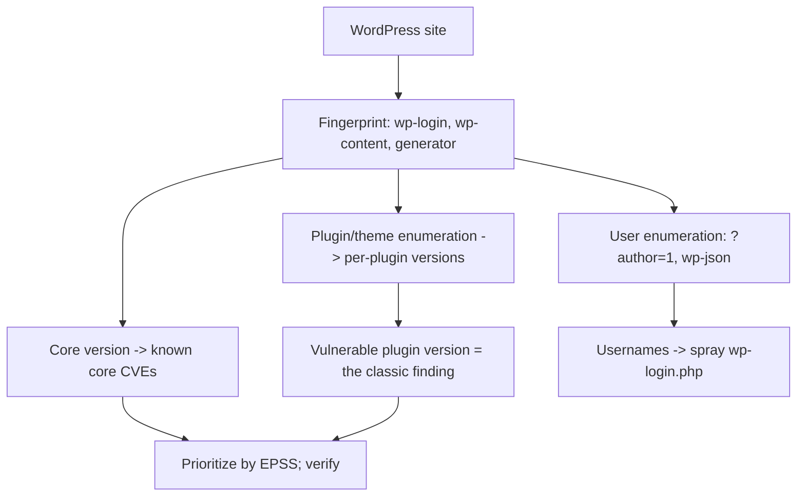

# 📝 WordPress Security Testing

> [!warning] Authorized simulation only
> WordPress powers a large share of the web, so it is heavily targeted — test only in-scope installations, throttle user enumeration to avoid lockouts, and stop at proof. This is the worked example of the framework methodology.

## Parent Learning Order
Framework & CMS Testing Methodology -> WordPress Security Testing

## Start at Zero: The World's Most-Attacked CMS

WordPress runs a huge fraction of all websites, which makes it the single most-attacked application platform on the internet. It is the concrete worked example of the **Framework & CMS Testing Methodology** — the same fingerprint → version → CVE → config loop, applied to the CMS you will meet most often. Its defining characteristic, and its defining weakness, is the **plugin ecosystem**: the WordPress core is relatively well-maintained, but the tens of thousands of third-party plugins are wildly variable in quality, and an abandoned plugin with a known vulnerability is the classic WordPress breach.

So WordPress testing is overwhelmingly *plugin and version enumeration*: what plugins are installed, what versions, and which of those versions have known-exploited flaws.

> [!tip] The analogy, and where it breaks
> A WordPress site is like a house where the frame is solid but the owner keeps adding cheap third-party extensions — a smart doorbell here, an off-brand lock there. The analogy breaks because these "extensions" run with the same privileges as the house itself: a vulnerable plugin is not a weak side-door, it is a flaw with full access to the whole application and its database.

**Prerequisites:** the Framework & CMS Testing Methodology (this is its worked example), and HTTP fundamentals.

## The WordPress-Specific Attack Surface

The methodology's four steps, specialized to WordPress:

| Step | WordPress specifics |
| --- | --- |
| **Fingerprint** | `/wp-login.php`, `/wp-admin/`, `/wp-content/`, `wp-` cookies, generator tag |
| **Version** | `<meta name="generator" content="WordPress 6.2">`, `/readme.html`, asset query strings (`?ver=6.2`) |
| **Plugins/themes** | `/wp-content/plugins/<name>/`, enumerable via HTML references and directory probing |
| **Users** | Author archives (`/?author=1`), the REST API (`/wp-json/wp/v2/users`), login error messages |
| **Config** | `xmlrpc.php` enabled, directory listing, exposed `wp-config.php` backups, weak admin creds |

Two WordPress-specific mechanisms deserve attention:

**User enumeration** is unusually easy. `/?author=1` redirects to the author's post archive, revealing the username; the REST API `/wp-json/wp/v2/users` may list all users as JSON. Usernames are half a credential, feeding password spraying against `/wp-login.php`.

**XML-RPC** (`/xmlrpc.php`) is a legacy API that enables two attacks: it can amplify brute-force by testing many credentials in one request (`system.multicall`), and it enables pingback-based SSRF/DDoS. Disabling it where unused is a standard hardening.

## Plugin Enumeration: Where the Flaws Live

The core methodology finding for WordPress is a vulnerable plugin version:

```bash
# enumerate plugins referenced in the page source and their versions (against your own lab)
curl -s "http://127.0.0.1:8096/" | grep -oE '/wp-content/plugins/[^/]+/[^"?]*\?ver=[0-9.]+' | sort -u | head -3
```

```text
/wp-content/plugins/contact-form/style.css?ver=1.2.0
/wp-content/plugins/slider-pro/slider.js?ver=3.1.4
```

Each plugin and its version comes straight from the HTML asset references — `slider-pro 3.1.4` is now a candidate for a CVE lookup. This is the WordPress version of the framework loop's step 2-3, and it is where the real findings are: a mass-scanner does exactly this across millions of sites, hunting for one vulnerable plugin version.



## Failure Modes and Interpretation

- **Plugin count overwhelm.** A site may run dozens of plugins; enumerate systematically and version each, but prioritize by exploitability (EPSS), not by listing everything.
- **User enumeration lockout.** Spraying `wp-login.php` with enumerated usernames can lock accounts (with a security plugin) or trigger a WAF. Throttle and coordinate.
- **Hidden version.** Security plugins remove the generator tag and version query strings. Fall back to `/readme.html`, asset hashes, or behavioral differences between versions.
- **Managed WordPress.** Hosted platforms patch core and sometimes plugins automatically, so a version string may be misleading. Confirm the actual patch state where possible.
- **False attribution.** A flaw may be in a custom theme's PHP, not a distributable plugin — attribute the finding to the right component so remediation targets it.

## Security Implications — Detection & Defense

- **Plugin hygiene is the whole game.** Removing unused plugins, updating the rest, and avoiding abandoned ones closes the dominant WordPress attack surface. A vulnerability-scanning schedule that includes plugins is essential.
- **Disable user enumeration and XML-RPC** where unused — both are legacy conveniences that hand attackers usernames and brute-force amplification for no business benefit.
- **Enforce MFA on wp-admin and strong admin credentials** — the login page is constantly sprayed, and MFA neutralizes the enumerated-username-plus-common-password attack.
- **WAF and login rate-limiting** blunt the automated mass-exploitation that targets WordPress specifically, buying time against the scanner.
- **The defender scans their own WordPress** with the same plugin-enumeration tooling continuously — because the internet-wide scanners never stop, the exposure window on a vulnerable plugin is measured in hours.

## Authorized Lab: Enumerate a WordPress-Style Site You Build

> [!info] Runs on one Linux machine — builds a static site mimicking WordPress's fingerprints and plugin references
> No real WordPress is installed; the mock reproduces the exact artifacts you enumerate. Step 5 removes it.

### Step 1 — Build a mock WP site with fingerprints and a vulnerable plugin reference

```bash
mkdir -p /tmp/wplab/wp-content/plugins/slider-pro
cat > /tmp/wplab/index.html << 'EOF'
<html><head>
<meta name="generator" content="WordPress 6.2">
<link rel="stylesheet" href="/wp-content/plugins/contact-form/style.css?ver=1.2.0">
<script src="/wp-content/plugins/slider-pro/slider.js?ver=3.1.4"></script>
</head><body>Hello</body></html>
EOF
echo "author-1 archive" > /tmp/wplab/wp-content/plugins/slider-pro/slider.js
cd /tmp/wplab && python3 -m http.server 8096 --bind 127.0.0.1 &>/dev/null &
sleep 1; echo "mock WordPress up on 127.0.0.1:8096"
```

```text
mock WordPress up on 127.0.0.1:8096
```

### Step 2 — Fingerprint core version

```bash
curl -s "http://127.0.0.1:8096/" | grep -oE 'content="WordPress [0-9.]+"'
```

```text
content="WordPress 6.2"
```

The generator tag pins the core version — the first CVE-lookup input.

### Step 3 — Enumerate plugins and their versions (the key finding)

```bash
curl -s "http://127.0.0.1:8096/" | grep -oE 'plugins/[^/]+/[^"?]*\?ver=[0-9.]+' | sed -E 's#plugins/([^/]+)/.*ver=(.*)#plugin: \1  version: \2#' | sort -u
```

```text
plugin: contact-form  version: 1.2.0
plugin: slider-pro  version: 3.1.4
```

Two plugins with exact versions, enumerated from the page source — precisely what an attacker's mass-scanner extracts to match against a vulnerable-plugin database.

### Step 4 — Confirm a plugin directory is browsable (a config finding)

```bash
curl -s -o /dev/null -w "plugin dir listing: HTTP %{http_code}\n" "http://127.0.0.1:8096/wp-content/plugins/slider-pro/"
```

```text
plugin dir listing: HTTP 200
```

A `200` on the plugin directory means directory listing is enabled — a misconfiguration that leaks the full plugin file structure and aids exploitation. The finding: enumerable plugins + browsable directories.

### Step 5 — Cleanup

```bash
kill %1 2>/dev/null; cd /tmp && rm -rf /tmp/wplab; wait 2>/dev/null; ls -d /tmp/wplab 2>&1
```

```text
ls: cannot access '/tmp/wplab': No such file or directory
```

**What you should now be able to do:** apply the framework loop to WordPress, enumerate core version, plugins, and users from public artifacts, recognize a vulnerable plugin version as the classic finding, and identify XML-RPC and user enumeration as WordPress-specific hardening targets.

## Crook → Operator → Root Checkpoint

- **Crook:** Explain why WordPress's plugin ecosystem is its defining weakness, and how a plugin runs with full application privileges.
- **Operator:** Fingerprint core version, enumerate plugins/themes and users, and identify a vulnerable plugin version and a browsable plugin directory as findings.
- **Root:** Explain why plugin hygiene is the dominant control, why XML-RPC and user enumeration should be disabled where unused, and why the WordPress exposure window is measured in hours because of continuous internet-wide scanning.

---
> 🔼 Up: [[CMS & Framework Security Testing]]
