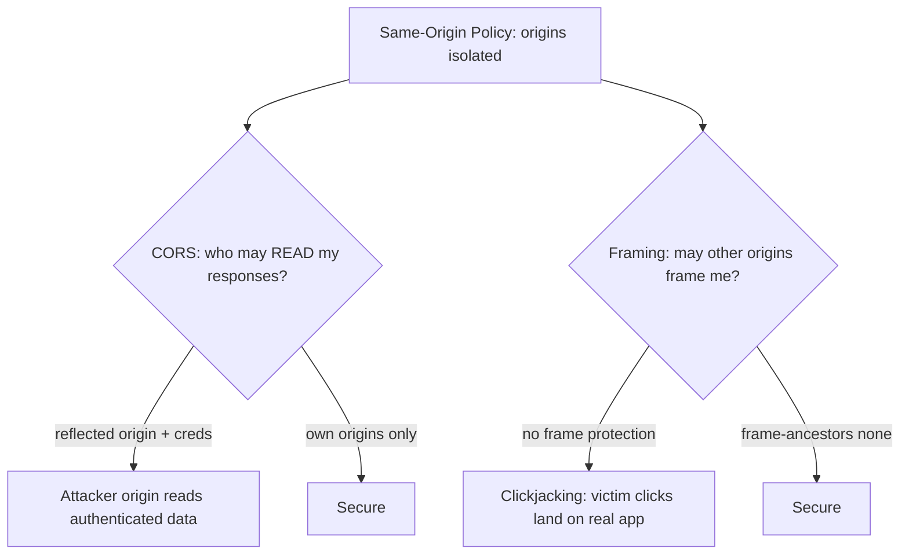

# 🪟 CORS & Clickjacking

> [!warning] Authorized simulation only
> These attacks abuse the trust between origins. Prove them with a benign proof-of-concept page you host locally against a synthetic account, never against real users. Test only in-scope applications.

## Parent Learning Order
CORS & Clickjacking -> Cross-Site Scripting -> CSRF & SameSite Testing -> Prototype Pollution & DOM Security

## Two Ways to Abuse Cross-Origin Trust

The browser's core security rule is the **Same-Origin Policy**: a page from `evil.example` cannot read data from `bank.example`. Two mechanisms deliberately relax parts of this trust boundary, and both are commonly misconfigured into vulnerabilities:

- **CORS (Cross-Origin Resource Sharing)** relaxes the *read* restriction — it lets a server say "these other origins may read my responses." Misconfigure it, and you tell the attacker's origin it may read your users' data.
- **Clickjacking** abuses the *framing* trust — it loads your real page invisibly over a decoy, so a victim's clicks land on your application without them knowing.

Both are client-side attacks that exploit the browser's cross-origin model, which is why they belong together: one leaks data *out* across origins, the other tricks clicks *in* across origins.

> [!tip] The analogy, and where it breaks
> CORS misconfiguration is like a bank posting "any courier may collect statements on a customer's behalf" — meant for one trusted courier, it now lets anyone collect. Clickjacking is like a scammer holding a clear "sign here" sheet over a real contract so you sign the contract thinking it's the sheet. The analogy breaks on invisibility: the clickjacking overlay is *perfectly transparent*, so the victim genuinely cannot see they are interacting with the real application, unlike any physical overlay.

**Prerequisites:** the Same-Origin Policy, HTTP headers, and cookies.

**The deliberate break:** CORS is described as a security feature, so a CORS policy sounds like something that protects the API. It is the opposite: **CORS exists to relax a protection you already had.**

The Same-Origin Policy is the control. It stops a page on `evil.test` reading a response from `bank.test` — for free, by default, with no configuration. CORS is the mechanism for **switching that off** for specific origins, because sometimes an application legitimately needs it. Every CORS header you add subtracts from the browser's default protection, so "we configured CORS" is not a hardening step, it is a permission grant that needs the same scrutiny as a firewall rule.

There is a second half people rely on wrongly. CORS is enforced **by the browser**, in the browser. It is not server-side access control, and a request from `curl`, a script or a mobile app ignores it entirely. If an endpoint's only protection is its CORS policy, it has no protection at all against a non-browser client.

**How you'd spot the dangerous configuration:** the server **reflects** the request's `Origin` back in `Access-Control-Allow-Origin` *and* sets `Access-Control-Allow-Credentials: true`. That pair means any origin can read authenticated responses. Either alone is usually harmless; together they are the finding.

## CORS: When "Who May Read Me" Is Too Permissive

When a page makes a cross-origin request, the browser enforces CORS: it only lets the calling origin *read* the response if the server's `Access-Control-Allow-Origin` (ACAO) header permits it. The misconfigurations:

| Misconfiguration | Why it's dangerous |
| --- | --- |
| `ACAO: *` **with credentials** | Any origin reads authenticated responses (though browsers block `*`+credentials, reflected origin achieves it) |
| **Reflected origin** — echoing the request's `Origin` | Effectively allows *every* origin, including the attacker's |
| **Weak origin validation** — `endsWith("bank.com")` | `evilbank.com` or `bank.com.evil.com` passes |
| **`null` origin allowed** | Sandboxed iframes and some contexts send `Origin: null` |

The critical case is **reflected origin with credentials**: the server echoes whatever `Origin` the request carried into ACAO and sets `Access-Control-Allow-Credentials: true`. Now the attacker's page can make a *credentialed* request to your API and *read the response* — stealing the victim's data using their own cookies.

```bash
# test whether the server reflects an arbitrary Origin (your own lab API)
curl -s -I -H "Origin: https://evil.example" "http://127.0.0.1:8108/account" | grep -i 'access-control'
```

```text
Access-Control-Allow-Origin: https://evil.example
Access-Control-Allow-Credentials: true
```

The server echoed `evil.example` and allowed credentials — the finding. Any attacker page can now read authenticated account data. A secure server would return only its own trusted origins, never the reflected attacker origin.

## Clickjacking: Stealing Clicks Through Invisible Frames

Clickjacking (UI redressing) loads your real application in an invisible iframe positioned over an attractive decoy ("Click to win!"). The victim clicks the decoy, but the click actually lands on your application's button — transferring money, changing a setting, confirming an action — while they authenticate via their existing session:

```text
Attacker page:  [ decoy button "CLAIM PRIZE" ]
Invisible iframe (opacity 0) on top:  [ your real "Delete Account" button aligned to the decoy ]
Victim clicks decoy -> click lands on "Delete Account" in the framed real app
```

The defense is a single response header telling the browser your page may not be framed by other origins — `X-Frame-Options: DENY` or, modern, `Content-Security-Policy: frame-ancestors 'none'`. A page *without* framing protection is clickjackable, and testing it is simply: can I frame it?



## The CORS finding that isn't exploitable

- **CORS `*` is not always exploitable.** Browsers block `ACAO: *` combined with credentials, so a `*` on a *public, non-credentialed* endpoint may be harmless. The dangerous case is reflected origin *with* credentials — classify precisely.
- **Proving CORS needs the credentialed read.** The finding is that an attacker origin can *read authenticated data* — demonstrate the reflected header and the credentialed read, not just the header.
- **Clickjacking needs a sensitive action.** Framing a read-only page is low impact; the finding is framing a page with a *state-changing* one-click action. Assess what a redirected click achieves.
- **Framebusting JS is weak.** Old JavaScript "framebusting" is bypassable; only the response headers (`frame-ancestors`/`X-Frame-Options`) reliably prevent framing.
- **SameSite cookies interact.** `SameSite=Lax/Strict` cookies may not be sent in a framed cross-origin context, reducing clickjacking impact — assess the cookie configuration too.

## Security Implications — Detection & Defense

- **CORS: allowlist specific trusted origins**, never reflect the request origin, never combine permissive ACAO with credentials, and validate origins by exact match (not `endsWith`). This is a server configuration fix.
- **Clickjacking: set `Content-Security-Policy: frame-ancestors 'none'`** (or a specific allowlist) on every sensitive page — the single header that defeats it. `X-Frame-Options` is the older equivalent.
- **Both are configuration flaws**, not code flaws — which means they are cheap to fix (headers) and cheap to *miss*, since nothing crashes without them. A security-header audit catches both.
- **Detection is limited** because both exploit legitimate browser behavior; the defense is prevention via headers, and a header-scanning tool (run against yourself) is the practical control.
- **Sensitive actions deserve extra friction** — a confirmation step or re-authentication for high-impact actions blunts clickjacking even if a page is framed, since a single stolen click cannot complete the action.

## Summary

You should now be able to:

- Explain the Same-Origin Policy and how CORS relaxes reads while clickjacking abuses framing.
- Test CORS for reflected-origin-with-credentials and a page for missing frame protection, and classify whether each is genuinely exploitable.
- Explain why reflected origin + credentials is the dangerous CORS case, why only response headers (not framebusting JS) reliably prevent clickjacking, and why both are cheap-to-fix, cheap-to-miss configuration flaws.

---
> 🔼 Up: [[Client-Side Web Security]]
