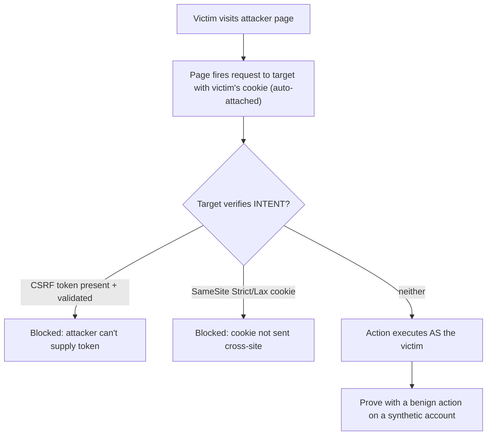

# 🎣 CSRF & SameSite Testing

> [!warning] Authorized simulation only
> CSRF makes a victim's browser perform an action they didn't intend. Prove it with a benign action against a synthetic account (a harmless setting change), never a damaging one against a real user. Test only in-scope applications.

## Parent Learning Order
CORS & Clickjacking -> Cross-Site Scripting -> CSRF & SameSite Testing -> Prototype Pollution & DOM Security

## Start at Zero: Making the Victim's Browser Act for You

**Cross-Site Request Forgery (CSRF)** exploits a simple browser behavior: when your browser makes a request to a site, it *automatically attaches that site's cookies* — including the session cookie — regardless of where the request originated. So if an attacker's page can cause your browser to send a request to `bank.example/transfer`, your browser helpfully includes your bank session cookie, and the bank processes the transfer *as you*. The attacker never sees your session; they simply cause your authenticated browser to act.

The key insight: CSRF works because the browser proves *who you are* (the cookie) automatically, but the vulnerable application does not verify *that you intended this specific request*. The fix is a token that only the legitimate site can supply — something the attacker's page cannot know.

> [!tip] The analogy, and where it breaks
> CSRF is like tricking someone into signing a document by handing them a stack where a real contract is hidden among forms they meant to sign — their signature (session cookie) is genuine, but the intent is forged. The analogy breaks because the victim never even *sees* the CSRF request: it fires invisibly from a background image or auto-submitting form, so there is no "stack of papers" they glance at — the forgery is entirely silent.

**Prerequisites:** cookies and sessions, HTTP methods, and the Same-Origin Policy.

## The Mechanism and Its Requirements

CSRF needs three conditions, and removing any one defeats it:

1. **Cookie-based session** — the app authenticates via a cookie the browser sends automatically.
2. **Predictable request** — the attacker can construct the exact request (URL, parameters) without needing a secret.
3. **No intent verification** — the app performs the action without checking a token, custom header, or re-authentication.

The classic attack is an auto-submitting form or an image tag on the attacker's page:

```text
   (GET, fires on page load)
<form action="https://bank.example/transfer" method=POST> ... auto-submit </form>
```

The victim visits the attacker's page (via phishing or a malicious ad), the request fires with their cookie attached, and the action executes. State-changing actions on `GET`, or `POST` without a CSRF token, are the vulnerable pattern.

## The Two Modern Defenses: Tokens and SameSite

**CSRF tokens** are the traditional fix: the server embeds a random, per-session (or per-request) token in its forms, and requires it on every state-changing request. The attacker's page cannot read this token (Same-Origin Policy blocks cross-origin reads), so it cannot forge a valid request. Testing checks whether the token is present, validated, and unpredictable — a token that is missing, not checked, static, or reflected is a finding.

**SameSite cookies** are the modern browser-level defense. A cookie marked `SameSite=Lax` or `SameSite=Strict` is *not sent* on cross-site requests, which removes the automatic-cookie behavior CSRF depends on:

| SameSite value | Behavior | CSRF protection |
| --- | --- | --- |
| `Strict` | Never sent cross-site | Strongest (but breaks some legit flows) |
| `Lax` | Sent only on top-level navigations (GET) | Good default; blocks cross-site POST |
| `None` | Always sent (needs `Secure`) | No CSRF protection |

`SameSite=Lax` is now a common browser default, which has reduced CSRF significantly — but it is not absolute (GET-based state changes, some navigation cases), so tokens remain the robust application-level control.

```bash
# check whether the session cookie has SameSite protection (your own lab)
curl -s -I "http://127.0.0.1:8110/login" | grep -i 'set-cookie'
```

```text
Set-Cookie: session=abc123; HttpOnly; Path=/
```

The cookie has **no `SameSite` attribute** — so the browser may send it cross-site (defaulting to Lax in modern browsers, but not Strict). Combined with a missing CSRF token, the app is CSRF-vulnerable. A hardened cookie would read `SameSite=Lax` or `Strict`.



## Failure Modes and Interpretation

- **Proving with a damaging action.** The finding is proven by a benign state change on a synthetic account (toggling a harmless setting), never a real transfer or destructive action.
- **Token theater.** A CSRF token that exists but is not *validated*, or is static/predictable, provides no protection. Test that changing/removing the token actually breaks the request.
- **SameSite is not complete.** `SameSite=Lax` still sends cookies on top-level GET navigations, so a GET-based state change can still be CSRF'd. Actions must be POST *and* token-protected.
- **JSON APIs are often safer by accident.** An API requiring `Content-Type: application/json` and a custom header resists simple form-based CSRF (forms can't set those), but this is incidental, not a designed control.
- **CSRF vs. XSS.** If the site has XSS, CSRF protections are moot (the injected script runs same-origin and can read the token). Report them together — XSS defeats CSRF defenses.

## Security Implications — Detection & Defense

- **CSRF tokens on every state-changing request** — random, per-session, validated server-side, unreadable cross-origin. This is the robust application-level fix.
- **`SameSite=Lax` (or `Strict`) on session cookies** — the browser-level defense that removes the automatic-cookie behavior CSRF exploits; `Lax` is a sensible default that breaks few legitimate flows.
- **State changes must use non-GET methods** — a `GET` that changes state is CSRF-able even with SameSite=Lax, and violates HTTP semantics (from the HTTP fundamentals leaf).
- **Custom-header requirement** for APIs (a header a cross-site form cannot set) is an effective additional control for JSON APIs.
- **Detection is limited** — a CSRF request looks like a legitimate authenticated request; the defense is prevention (tokens + SameSite), and a defender auditing their own state-changing endpoints for token validation is the practical control.

## Authorized Lab: Forge a Request Against Your Own App

> [!info] Runs on one Linux machine — builds an app with a CSRF-vulnerable action, then forges it with a session cookie
> Loopback-bound, synthetic account. The forged action is a benign setting change. Step 5 removes it.

### Step 1 — Build an app with a state-changing action and no CSRF protection

```bash
cat > /tmp/csrf.py << 'EOF'
import http.server
settings={"theme":"light"}
class H(http.server.BaseHTTPRequestHandler):
    def do_GET(self):
        if self.path=="/login":
            self.send_response(200); self.send_header("Set-Cookie","session=abc123; HttpOnly; Path=/"); self.end_headers()
            self.wfile.write(b"logged in"); return
        if self.path.startswith("/set-theme"):
            # VULNERABLE: state change on GET, only checks the cookie, NO csrf token
            cookie=self.headers.get("Cookie","")
            if "session=abc123" in cookie:
                import urllib.parse
                t=urllib.parse.parse_qs(urllib.parse.urlparse(self.path).query).get("theme",["light"])[0]
                settings["theme"]=t
                self.send_response(200); self.end_headers(); self.wfile.write(f"theme set to {t}".encode())
            else:
                self.send_response(401); self.end_headers()
            return
        self.send_response(200); self.end_headers(); self.wfile.write(f"current theme: {settings['theme']}".encode())
    def log_message(self,*a): pass
http.server.HTTPServer(("127.0.0.1",8110),H).serve_forever()
EOF
python3 /tmp/csrf.py &>/dev/null &
sleep 1; echo "app up; current theme: $(curl -s http://127.0.0.1:8110/)"
```

```text
app up; current theme: current theme: light
```

### Step 2 — Confirm the cookie lacks SameSite

```bash
curl -s -I http://127.0.0.1:8110/login | grep -i set-cookie
```

```text
Set-Cookie: session=abc123; HttpOnly; Path=/
```

No `SameSite` attribute — the browser may attach this cookie cross-site. Combined with no CSRF token, the action is forgeable.

### Step 3 — Forge the request (as the attacker's page would, with the victim's cookie)

```bash
# this simulates the victim's browser firing the attacker's crafted request, cookie auto-attached
curl -s -b "session=abc123" "http://127.0.0.1:8110/set-theme?theme=CANARY-HACKED"
echo ""
echo "state now: $(curl -s http://127.0.0.1:8110/)"
```

```text
theme set to CANARY-HACKED
state now: current theme: CANARY-HACKED
```

The forged request changed the victim's setting to a canary value — using only their session cookie, with no token required. That is CSRF: a benign action performed *as the victim*. A real attack would change an email or transfer funds; the canary proves the forgery works.

### Step 4 — Show the token would have stopped it

```bash
echo "Fix: require a per-session CSRF token on /set-theme, validated server-side, that the attacker's page cannot read (SOP)."
echo "Also: SameSite=Lax cookie would block the cross-site send; and state changes should be POST, not GET."
```

```text
Fix: require a per-session CSRF token on /set-theme, validated server-side, that the attacker's page cannot read (SOP).
Also: SameSite=Lax cookie would block the cross-site send; and state changes should be POST, not GET.
```

### Step 5 — Cleanup

```bash
kill %1 2>/dev/null; rm -f /tmp/csrf.py; wait 2>/dev/null
curl -s -o /dev/null -w "app gone: %{http_code}\n" --max-time 2 http://127.0.0.1:8110/ 2>&1 | grep -o 'gone.*' || echo "app gone: connection refused"
```

```text
app gone: connection refused
```

**What you should now be able to do:** explain why CSRF works (automatic cookie attachment + no intent check), forge a state-changing request with a session cookie, test for CSRF tokens and SameSite protection, and name the token + SameSite fixes.

## Crook → Operator → Root Checkpoint

- **Crook:** Explain why the browser's automatic cookie attachment enables CSRF, and why the attacker never sees the session.
- **Operator:** Forge a state-changing request with a session cookie, test for CSRF-token validation and SameSite attributes, and prove the flaw with a benign action.
- **Root:** Explain the three CSRF requirements and how tokens vs. SameSite each remove one; explain why GET state-changes remain CSRF-able under SameSite=Lax, and why XSS defeats CSRF defenses.

---
> 🔼 Up: [[Client-Side Web Security]]
