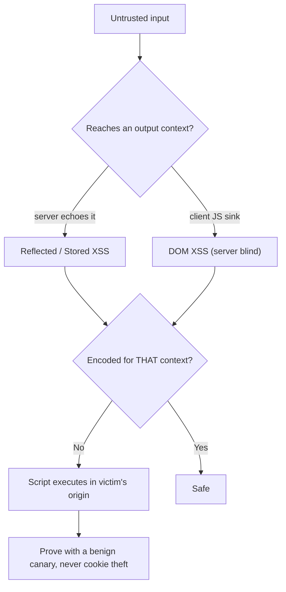

# 💉 Cross-Site Scripting

> [!warning] Authorized simulation only
> XSS executes script in another user's browser. Prove it with a benign marker (a test DOM attribute, an `alert`-free canary), never by stealing cookies or acting as the victim. Test only in-scope applications you build or are authorized to assess.

## Parent Learning Order
CORS & Clickjacking -> Cross-Site Scripting -> CSRF & SameSite Testing -> Prototype Pollution & DOM Security

## Running Your Script in Someone Else's Page

> *The application blocks `<script>` everywhere. Is XSS ruled out?*
>
> Hold your answer — the section below is the response.

**Cross-Site Scripting (XSS)** is a flaw where an application includes attacker-controlled data in a page without properly encoding it, so the browser executes it as *script* in the context of that page's origin. The consequence is severe because the script runs with the victim's session: it can read their data, act as them, and reach anything their browser can. The root cause is always the same — **untrusted input reaching an output context (HTML, attribute, JavaScript, URL) without the encoding that context requires.**

The three types are distinguished by *where the payload lives*:

| Type | Payload path | Persistence |
| --- | --- | --- |
| **Reflected** | In the request, echoed into the response | Per-request (needs a lure) |
| **Stored** | Saved server-side, served to every viewer | Persistent (hits all users) |
| **DOM-based** | Never reaches the server; client JS is the sink | Client-side only |

> [!tip] The analogy, and where it breaks
> XSS is like slipping a forged instruction into a document that a trusted assistant reads aloud and *obeys* — the assistant (browser) can't tell your inserted line from the real ones. The analogy breaks on *context*: the same inserted text is harmless in one place (plain text) and dangerous in another (inside a script tag), so XSS is entirely about *where* your input lands and what encoding that spot needs — a subtlety no spoken instruction has.

**Prerequisites:** HTML/JavaScript basics, HTTP parameters, and the Same-Origin Policy.

**The deliberate break:** XSS is about script tags, so filtering `<script>` deals with it. Every WAF ruleset and every naive sanitiser starts here.

XSS is about **context**. The identical string is inert in one position and executes in another, because the browser parses each position with a different grammar. Land inside an HTML body and you need a tag. Land inside an attribute and a quote plus an event handler is enough — no `<` required. Land inside an existing `<script>` block and you are already in JavaScript, so you only need to close a string. Land in a URL context and `javascript:` is the payload. A sanitiser that does not know **where the value will be placed** is guessing, which is why context-aware output encoding is the fix and blocklists are not.

This is the same family as the previous branch's injection notes: one component decided the value was safe, and a **different parser** — the HTML tokeniser, the JS engine, the URL parser — read it as structure. It is the **Parser Differential** pattern wearing a client-side coat.

**How you'd spot it:** put a unique harmless marker in the parameter, find every place it lands in the response, and read the characters *around* it. That surrounding context tells you what would be needed to break out — and often tells you immediately that nothing will, which saves the payload attempts.

## Context Is Everything

The single most important XSS concept: the *encoding a payload needs depends on where it lands*. The same input is safe in one context and executable in another:

| Output context | Safe encoding | A naive filter that fails |
| --- | --- | --- |
| HTML text | HTML-entity encode (`<`→`&lt;`) | Blocking `<script>` (many other tags execute) |
| HTML attribute | Attribute encode + quote | Allowing unquoted attributes |
| JavaScript string | JS-string escape | HTML-encoding (wrong context) |
| URL | URL encode + scheme allowlist | Allowing `javascript:` URLs |

This is why "we filter `<script>`" is not a fix — an event handler (``), a `javascript:` URL, or an attribute breakout all execute without the literal `<script>` tag. Correct defense encodes for the *specific* context, which is why testing probes each context separately.

## Testing With a Benign Canary

The ethical XSS proof does **not** steal cookies or pop `alert(document.cookie)` — it demonstrates *script execution* with a harmless marker. Setting a test DOM attribute proves the browser ran your code without any malicious action:

```bash
# reflect a benign payload and check whether it lands unencoded in an executable context (your own lab)
curl -s "http://127.0.0.1:8109/search?q=" | grep -o ']*>'
```

```text

```

The payload came back **unencoded** inside the HTML — a browser rendering this would run `onerror`, setting a benign `__xss_canary` flag. That reflected, unencoded output in an executable context is the finding, proven without any harmful payload. (A real attacker would run session-stealing code; the canary proves execution is possible, which is the finding.)

## DOM XSS: The Server Never Sees It

DOM-based XSS is subtler: the payload flows entirely through client-side JavaScript, from a *source* (`location.hash`, `document.referrer`) to a dangerous *sink* (`innerHTML`, `eval`, `document.write`) — the server never processes it, so server-side filtering and even a WAF are blind to it. Testing DOM XSS means reading the client JavaScript for source-to-sink flows:

```text
source: location.hash            (attacker controls the URL fragment)
sink:   element.innerHTML = ...  (writing attacker data as HTML)
proof:  # executes, server logs show nothing
```

The defense is client-side: use safe sinks (`textContent`, not `innerHTML`), and frameworks that auto-encode. This is why "the server is secure" does not mean "no XSS."



## Where proof of execution becomes the attack

- **Proving with real harm.** Popping `alert(document.cookie)` or exfiltrating a session is over-proving; a benign DOM-attribute canary demonstrates execution without acting as the victim.
- **Context confusion.** A payload that fails in HTML text may execute in an attribute or JS context — test each context, don't conclude "safe" from one.
- **Filter bypass neighborhood.** Blocking `<script>` leaves event handlers, `javascript:` URLs, SVG, and dozens of vectors — test the neighborhood, and treat a blocklist as likely-bypassable.
- **DOM XSS invisibility.** Server-side testing and WAFs miss DOM XSS entirely; you must read the client JavaScript for source-to-sink flows.
- **CSP as mitigation, not fix.** A strong Content-Security-Policy can *block* XSS execution even when the injection exists — but CSP is defense-in-depth, and a bypassable CSP (unsafe-inline, script gadgets) is not remediation. The encoding is the fix.

## Security Implications — Detection & Defense

- **Context-aware output encoding is the fix.** Encode every piece of untrusted data for the exact context it lands in — modern frameworks (React, Angular) do this automatically, which is why framework-native output is largely XSS-safe unless you opt out (`dangerouslySetInnerHTML`).
- **Content-Security-Policy** is powerful defense-in-depth: a nonce/hash-based policy blocks inline and injected scripts, containing XSS even when an injection slips through. Deploy it, but do not rely on it as the sole control.
- **Safe DOM sinks** (`textContent` over `innerHTML`) and avoiding `eval`/`document.write` close DOM XSS at the client.
- **Cookie flags** (`HttpOnly`) mean an XSS cannot read the session cookie — not a fix for XSS, but a mitigation that limits one common impact.
- **Detection** is hard because payloads are diverse; the durable defense is prevention (encoding + CSP), and a defender testing their own inputs across contexts is the practical audit.

## Summary

You should now be able to:

- Explain what XSS is, the three types, and why script running in the victim's origin is so severe.
- Prove reflected XSS with a benign canary, confirm the executable context, and explain why context-specific encoding — not `<script>` blocking — is required.
- Explain why DOM XSS is invisible to the server and WAF, how context-aware encoding and framework auto-escaping fix XSS, and why CSP is powerful defense-in-depth but not the primary fix.

---
> 🔼 Up: [[Client-Side Web Security]]
