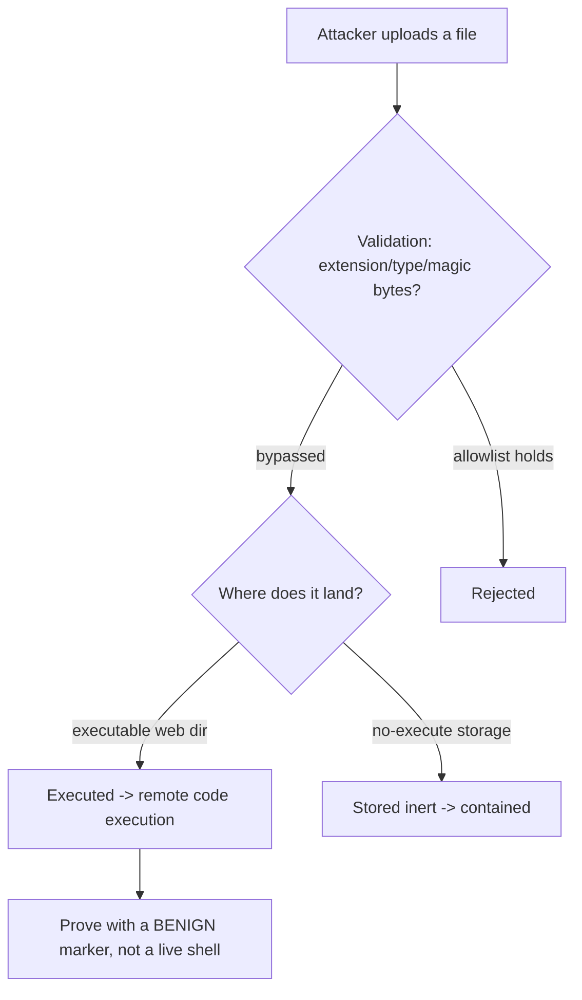

# 📤 File Upload Security Testing

> [!warning] Authorized simulation only
> A successful upload attack can plant executable code on a server. Test only in-scope applications you build or are authorized to assess, and prove the flaw with a benign marker file, never a live web shell against production.

## Parent Learning Order
File Inclusion & Path Traversal -> File Upload Security Testing -> Insecure Deserialization Testing -> XML External Entity Testing

## Letting Strangers Put Files on Your Server

Any feature that accepts an uploaded file — a profile picture, a document, a CSV import — lets an untrusted party place bytes on the server's filesystem. The security question is: *what happens to those bytes?* If the server stores them somewhere they can later be **executed** (a `.php` in a web-accessible directory), a file upload becomes remote code execution — the highest-severity web flaw. The whole discipline is about breaking the chain between "attacker uploads a file" and "that file runs."

The flaw is rarely "uploads are allowed" — it is that the server trusts the client's claims about the file (its name, its extension, its declared type) instead of controlling what it actually is and where it lands.

> [!tip] The analogy, and where it breaks
> A file upload is like a mailroom accepting packages: fine, until someone mails a package that *is* an employee who then walks around the building. The analogy breaks because a mailroom can see a person climb out of a box, whereas a server sees only bytes — a file named `photo.jpg` that is actually executable code looks identical to a real photo until the server tries to *run* it, which is exactly the mistake to prevent.

**Prerequisites:** HTTP multipart uploads, MIME types, and the path-traversal leaf (uploads often combine with traversal).

## The Checks That Fail, and How

Servers try to restrict uploads, and each naive check has a bypass:

| Check | Bypass |
| --- | --- |
| **Extension blocklist** (`.php` denied) | Alternate extensions: `.php5`, `.phtml`, `.pht`, case tricks |
| **Content-Type header** (`image/jpeg` required) | The client sets this header — just lie |
| **Magic-byte check** (must start with image bytes) | Prepend real image bytes, append code (polyglot) |
| **Filename** | Path traversal in the name (`../../shell.php`) to control location |

The robust approach is an **allowlist** of permitted extensions/types *and* — critically — ensuring the upload directory cannot execute anything. Most upload defenses fail because they blocklist (endless bypasses) instead of allowlist, or because they validate the file but store it in an executable location.

**The deliberate break:** "we validate the file type on upload." Which type, decided by whom?

At least three components each answer that question from a different signal, and they routinely disagree. The **browser** declares a `Content-Type` that the client fully controls. The **application** usually looks at the extension, or at magic bytes, or both. The **web server** decides how to *execute* the file from its own handler mapping — which may key on `.php` anywhere in the name, or on a configuration you did not write. A file is dangerous exactly when the component that **executes** it uses a different signal from the component that **validated** it, which is why `shell.php.jpg`, `shell.phtml` and a valid JPEG with PHP appended all keep working against filters that are individually reasonable.

**This is the Parser Differential pattern**, with three readers rather than two.

**The Twin — compare this with File Inclusion & Path Traversal.** Both notes are about the server deciding what to do with a file *by reading its name*, and in both the attacker's leverage is that the name is read more than once by parties that disagree. In traversal the disagreement is about **where** the name points; in upload it is about **what** the name means. The defensive shape is identical: stop deriving behaviour from an attacker-controlled string — store with a generated name, serve from a path with no execution handler.

**How you'd spot it:** the upload succeeds and the stored file is reachable under the webroot. Request it and read the response — served as `text/plain` it is inert, *executed* it is a finding. The upload was never the vulnerability; the execution mapping is.

## The Execution Chain Is the Real Flaw

A malicious file that lands where nothing executes it is harmless. The severity comes from the *combination*: an upload the server will execute. So testing asks two questions:

1. **Can I upload a file the server would execute?** (a `.php`, `.jsp`, `.aspx` depending on the stack)
2. **Where does it land, and is that location executable?**

Even a perfect content filter fails if a `.php` can be uploaded to `/uploads/` and `/uploads/` runs PHP. Conversely, a lax filter is contained if uploads go to a storage bucket served as static content with no execution. This is why "store uploads outside the web root, on a no-execute path" is the durable fix regardless of filtering.



## Worked Example: A Blocklist That Blocks One Extension

File-upload flaws are usually not "uploads are allowed" but "the *wrong* uploads
are allowed", and the gap is almost always a blocklist that enumerates bad instead
of permitting good. The specimen blocks exactly one extension:

```python
name = os.path.basename(item.filename)
if name.lower().endswith(".php"):          # NAIVE: blocks only literal .php
    return blocked(403)
open(os.path.join(UPLOAD_DIR, name), "wb").write(item.file.read())
```

**The blocked case** is what a shallow test sees and stops at:

```shell-session
analyst@lab:~$ curl -s -F "file=@shell.php" http://127.0.0.1:8103/
blocked: .php
```

`.php` is rejected. A tester who tries one payload, sees the block, and writes
"upload validation present" has missed the vulnerability entirely — the control
exists, it is just the wrong control.

**The bypass** uses an extension the blocklist never named but the server still
executes:

```shell-session
analyst@lab:~$ cp shell.php shell.phtml
analyst@lab:~$ curl -s -F "file=@shell.phtml" http://127.0.0.1:8103/
stored: shell.phtml
```

`.phtml` is a PHP extension too — as are `.php3`, `.php5`, `.phar`, and on a
mis-set server a trailing dot or a double extension like `.php.jpg`. The blocklist
knew about one spelling of the danger and admitted the rest.

**The finding** is that the stored file executes:

```shell-session
analyst@lab:~$ curl -s "http://127.0.0.1:8103/shell.phtml"
EXECUTED: CANARY-UPLOAD-4419
```

Requesting the upload ran it, and the canary came back. That is upload-to-code-
execution: two conditions together — a bypassable filter *and* an upload directory
the server will execute from. Either alone is survivable; the combination is remote
code execution. Note the restraint that keeps this a safe demonstration — the
payload was a canary string, not a working web shell, so the flaw is proven with
nothing left behind to find later.

The fix follows the same shape as every other input-validation lesson: allowlist
the handful of extensions and content types actually needed, verify the real file
type rather than trusting the name, store uploads outside the web root or on a
host that never executes them, and rename to a server-chosen identifier so the
attacker never controls the path. Blocklisting spellings of `.php` is a game with
no last move.

## A marker file, not a working web shell

- **Proving with a live shell.** The temptation is to upload a functioning web shell; the *finding* is proven by uploading a benign marker (a file that echoes a canary string when requested), demonstrating execution without leaving a backdoor.
- **Blocklist whack-a-mole.** Testing one bad extension and concluding "blocked" misses `.phtml`, `.php5`, etc. Test the neighborhood.
- **Client-controlled everything.** The extension, `Content-Type`, and even magic bytes are all attacker-influenced — never trust any client-supplied metadata about the file.
- **Location matters more than the filter.** A file that passes no filter but lands in a no-execute bucket is contained; classify the finding by the execution outcome, not just the upload.
- **Secondary effects.** Even non-executable uploads can be dangerous: an SVG with embedded script (stored XSS), a zip bomb (DoS), or a file overwriting another via traversal in the name.

## Security Implications — Detection & Defense

- **Store uploads outside the web root, on a no-execute path** — the single most durable control, because it breaks the execution chain regardless of what filtering misses.
- **Allowlist extensions and validate content**, and *rename* uploaded files to a server-generated name (removing attacker control over extension and path).
- **Serve uploads from a separate domain/bucket as static content** with no server-side execution — a common modern pattern that structurally prevents upload-to-RCE.
- **Scan uploads** for malware and dangerous content (embedded scripts in SVGs/PDFs), and cap size to prevent resource exhaustion.
- **Detection** looks for executable content in upload directories and requests to uploaded files with suspicious names — but the architectural no-execute-storage fix makes detection a backstop rather than the primary defense.

## Summary

You should now be able to:

- Explain why accepting uploads is only dangerous when the file can later be executed, and why blocklists fail.
- Bypass an extension blocklist, prove upload-to-execution with a benign canary, and classify a finding by where the file lands and whether that location executes.
- Explain why no-execute storage outside the web root is the durable fix regardless of filtering, why all client-supplied file metadata is untrustworthy, and how allowlisting plus renaming closes attacker control.

---
> 🔼 Up: [[File, Parser & Serialization Security]]
