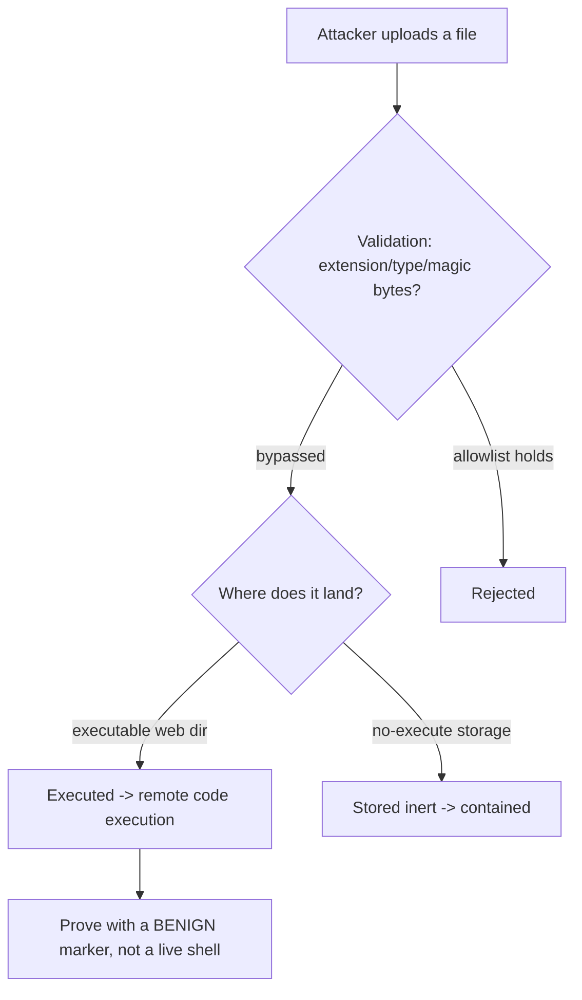

# 📤 File Upload Security Testing

> [!warning] Authorized simulation only
> A successful upload attack can plant executable code on a server. Test only in-scope applications you build or are authorized to assess, and prove the flaw with a benign marker file, never a live web shell against production.

## Parent Learning Order
File Inclusion & Path Traversal -> File Upload Security Testing -> Insecure Deserialization Testing -> XML External Entity Testing

## Start at Zero: Letting Strangers Put Files on Your Server

Any feature that accepts an uploaded file — a profile picture, a document, a CSV import — lets an untrusted party place bytes on the server's filesystem. The security question is: *what happens to those bytes?* If the server stores them somewhere they can later be **executed** (a `.php` in a web-accessible directory), a file upload becomes remote code execution — the highest-severity web flaw. The whole discipline is about breaking the chain between "attacker uploads a file" and "that file runs."

The flaw is rarely "uploads are allowed" — it is that the server trusts the client's claims about the file (its name, its extension, its declared type) instead of controlling what it actually is and where it lands.

> [!tip] The analogy, and where it breaks
> A file upload is like a mailroom accepting packages: fine, until someone mails a package that *is* an employee who then walks around the building. The analogy breaks because a mailroom can see a person climb out of a box, whereas a server sees only bytes — a file named `photo.jpg` that is actually executable code looks identical to a real photo until the server tries to *run* it, which is exactly the mistake to prevent.

**Prerequisites:** HTTP multipart uploads, MIME types, and the path-traversal leaf (uploads often combine with traversal).

## The Checks That Fail, and How

Servers try to restrict uploads, and each naive check has a bypass:

| Check | Bypass |
| --- | --- |
| **Extension blocklist** (`.php` denied) | Alternate extensions: `.php5`, `.phtml`, `.pht`, case tricks |
| **Content-Type header** (`image/jpeg` required) | The client sets this header — just lie |
| **Magic-byte check** (must start with image bytes) | Prepend real image bytes, append code (polyglot) |
| **Filename** | Path traversal in the name (`../../shell.php`) to control location |

The robust approach is an **allowlist** of permitted extensions/types *and* — critically — ensuring the upload directory cannot execute anything. Most upload defenses fail because they blocklist (endless bypasses) instead of allowlist, or because they validate the file but store it in an executable location.

## The Execution Chain Is the Real Flaw

A malicious file that lands where nothing executes it is harmless. The severity comes from the *combination*: an upload the server will execute. So testing asks two questions:

1. **Can I upload a file the server would execute?** (a `.php`, `.jsp`, `.aspx` depending on the stack)
2. **Where does it land, and is that location executable?**

Even a perfect content filter fails if a `.php` can be uploaded to `/uploads/` and `/uploads/` runs PHP. Conversely, a lax filter is contained if uploads go to a storage bucket served as static content with no execution. This is why "store uploads outside the web root, on a no-execute path" is the durable fix regardless of filtering.



## Failure Modes and Interpretation

- **Proving with a live shell.** The temptation is to upload a functioning web shell; the *finding* is proven by uploading a benign marker (a file that echoes a canary string when requested), demonstrating execution without leaving a backdoor.
- **Blocklist whack-a-mole.** Testing one bad extension and concluding "blocked" misses `.phtml`, `.php5`, etc. Test the neighborhood.
- **Client-controlled everything.** The extension, `Content-Type`, and even magic bytes are all attacker-influenced — never trust any client-supplied metadata about the file.
- **Location matters more than the filter.** A file that passes no filter but lands in a no-execute bucket is contained; classify the finding by the execution outcome, not just the upload.
- **Secondary effects.** Even non-executable uploads can be dangerous: an SVG with embedded script (stored XSS), a zip bomb (DoS), or a file overwriting another via traversal in the name.

## Security Implications — Detection & Defense

- **Store uploads outside the web root, on a no-execute path** — the single most durable control, because it breaks the execution chain regardless of what filtering misses.
- **Allowlist extensions and validate content**, and *rename* uploaded files to a server-generated name (removing attacker control over extension and path).
- **Serve uploads from a separate domain/bucket as static content** with no server-side execution — a common modern pattern that structurally prevents upload-to-RCE.
- **Scan uploads** for malware and dangerous content (embedded scripts in SVGs/PDFs), and cap size to prevent resource exhaustion.
- **Detection** looks for executable content in upload directories and requests to uploaded files with suspicious names — but the architectural no-execute-storage fix makes detection a backstop rather than the primary defense.

## Authorized Lab: Bypass an Upload Filter You Build

> [!info] Runs on one Linux machine — builds an upload endpoint with a naive extension blocklist, then bypasses it
> Loopback-bound; the "executed" file is a benign canary, not a real shell. Step 5 removes it.

### Step 1 — Build an upload app that blocklists `.php` and "executes" uploads

```bash
mkdir -p /tmp/uplab/uploads
cat > /tmp/uplab/app.py << 'EOF'
import http.server, cgi, os, re
UP="/tmp/uplab/uploads"
class H(http.server.BaseHTTPRequestHandler):
    def do_POST(self):
        form=cgi.FieldStorage(fp=self.rfile, headers=self.headers,
              environ={'REQUEST_METHOD':'POST','CONTENT_TYPE':self.headers['Content-Type']})
        item=form['file']; name=os.path.basename(item.filename)
        # NAIVE: block only the literal ".php" extension
        if name.lower().endswith(".php"):
            self.send_response(403); self.end_headers(); self.wfile.write(b"blocked: .php"); return
        open(os.path.join(UP,name),"wb").write(item.file.read())
        self.send_response(200); self.end_headers(); self.wfile.write(f"stored: {name}".encode())
    def do_GET(self):
        # simulate that .phtml/.php* files in uploads get "executed" (echo their canary)
        f=os.path.join(UP, os.path.basename(self.path.lstrip("/")))
        if os.path.exists(f) and re.search(r'\.(php\d?|phtml|pht)$', f):
            data=open(f).read()
            m=re.search(r'CANARY-[A-Z0-9]+', data)
            self.send_response(200); self.end_headers()
            self.wfile.write(f"EXECUTED: {m.group(0) if m else 'ran'}".encode())
        else:
            self.send_response(404); self.end_headers()
    def log_message(self,*a): pass
http.server.HTTPServer(("127.0.0.1",8103),H).serve_forever()
EOF
python3 /tmp/uplab/app.py &>/dev/null &
sleep 1; echo "upload app up on 127.0.0.1:8103 (blocks .php, executes .php*/.phtml in uploads)"
```

```text
upload app up on 127.0.0.1:8103 (blocks .php, executes .php*/.phtml in uploads)
```

### Step 2 — The blocked payload (baseline)

```bash
echo 'CANARY-UPLOAD-4419' > /tmp/shell.php
curl -s -F "file=@/tmp/shell.php" http://127.0.0.1:8103/
```

```text
blocked: .php
```

The literal `.php` is blocked — a lazy tester stops here and reports "upload is safe."

### Step 3 — Bypass with an alternate extension

```bash
cp /tmp/shell.php /tmp/shell.phtml
curl -s -F "file=@/tmp/shell.phtml" http://127.0.0.1:8103/
```

```text
stored: shell.phtml
```

`.phtml` slipped past the blocklist and was stored — the blocklist bypass.

### Step 4 — Trigger execution (the finding, via benign canary)

```bash
curl -s "http://127.0.0.1:8103/shell.phtml"
```

```text
EXECUTED: CANARY-UPLOAD-4419
```

Requesting the uploaded `.phtml` **executed** it, echoing the canary — proof of upload-to-code-execution. Because the payload was a benign canary (not a working shell), the flaw is demonstrated with no backdoor left behind. The finding: blocklist bypass + executable upload directory.

### Step 5 — Cleanup

```bash
kill %1 2>/dev/null; rm -rf /tmp/uplab /tmp/shell.php /tmp/shell.phtml; wait 2>/dev/null; ls -d /tmp/uplab 2>&1
```

```text
ls: cannot access '/tmp/uplab': No such file or directory
```

**What you should now be able to do:** explain why the upload flaw is the execution chain (not the upload itself), bypass an extension blocklist, prove upload-to-RCE with a benign canary, and articulate why no-execute storage is the durable fix.

## Crook → Operator → Root Checkpoint

- **Crook:** Explain why accepting uploads is only dangerous when the file can later be executed, and why blocklists fail.
- **Operator:** Bypass an extension blocklist, prove upload-to-execution with a benign canary, and classify a finding by where the file lands and whether that location executes.
- **Root:** Explain why no-execute storage outside the web root is the durable fix regardless of filtering, why all client-supplied file metadata is untrustworthy, and how allowlisting plus renaming closes attacker control.

---
> 🔼 Up: [[File, Parser & Serialization Security]]
