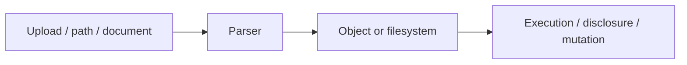

# File, Parser & Serialization Security

## 🗺️ Zero-to-Mastery Learning Path

1. [[File Inclusion & Path Traversal]]
2. [[File Upload Security Testing]]
3. [[Insecure Deserialization Testing]]
4. [[XML External Entity Testing]]

---
> 🔼 Up: [[Web Application Penetration Testing]]
