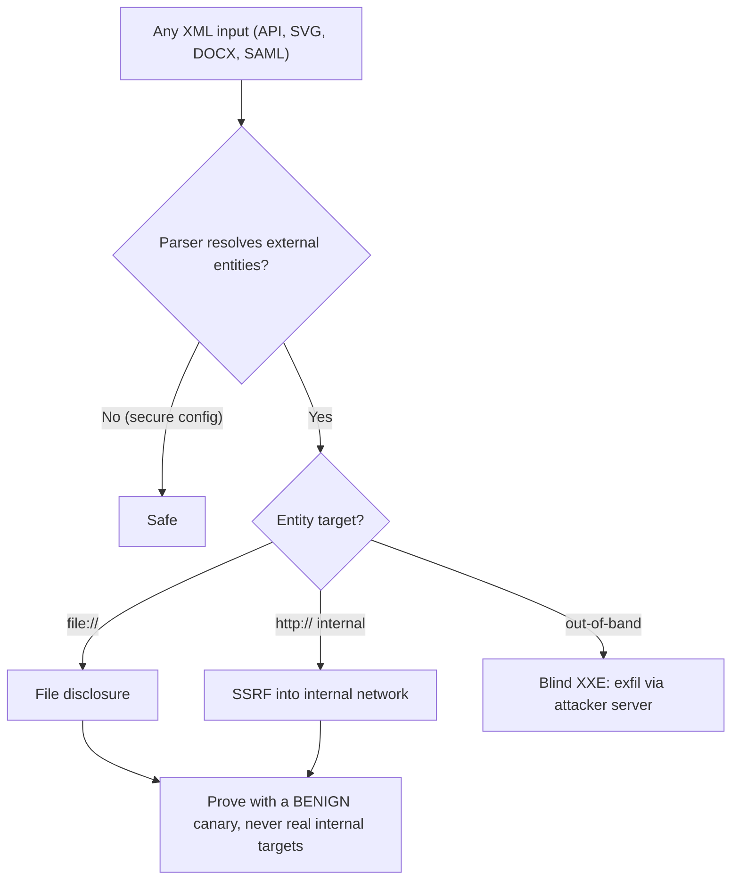

# 📃 XML External Entity Testing

> [!warning] Authorized simulation only
> XXE can read files and reach *internal* systems (SSRF). Prove it only with a benign canary file or a harmless local marker — never point an entity at a real internal service or sensitive file. Test in-scope systems you build or are authorized to assess.

## Parent Learning Order
File Inclusion & Path Traversal -> File Upload Security Testing -> Insecure Deserialization Testing -> XML External Entity Testing

## When a Parser Fetches What You Tell It

XML is more than a data format — it has a document type definition (DTD) that can declare **entities**, reusable snippets referenced with `&name;`. Most entities are harmless (`&amp;` → `&`), but XML also supports **external entities** that tell the parser to fetch content from a URI: `<!ENTITY xxe SYSTEM "file:///etc/hostname">`. When the parser resolves `&xxe;`, it *reads that file* and inserts the contents. If an application parses attacker-supplied XML with external entities enabled, the attacker declares an entity pointing at a file or URL, and its contents flow into the response — **XML External Entity (XXE) injection**.

The root cause is a powerful parser feature (external entity resolution) left enabled on untrusted input. Unlike deserialization, XXE does not usually give code execution — but it gives **file disclosure** and **server-side request forgery**, both serious, and it appears anywhere XML is parsed (SOAP, SVG uploads, document formats, config imports).

> [!tip] The analogy, and where it breaks
> XXE is like a form that says "for your address, write 'see file X on the office server' and the clerk will go fetch and copy whatever file X contains." The analogy breaks on reach: the clerk will fetch not just office files but anything the *server* can reach — including internal systems behind the firewall the attacker could never touch directly, which is why XXE-to-SSRF is so dangerous.

**Prerequisites:** XML structure and DTDs, the SSRF concept, and the file-path leaf.

## The Two Payoffs: File Read and SSRF

XXE delivers two attack outcomes from the same mechanism:

**File disclosure** — the entity points at a local file; its contents appear in the response:
```text
<!DOCTYPE r [ <!ENTITY x SYSTEM "file:///etc/hostname"> ]>
<data>&x;</data>    ->  response contains the file's contents
```

**Server-Side Request Forgery** — the entity points at an internal URL the *server* can reach but the attacker cannot:
```text
<!ENTITY x SYSTEM "http://169.254.169.254/latest/meta-data/">   (cloud metadata, internal-only)
```
The parser makes the request from inside the network, and the internal response comes back to the attacker. This turns XXE into a pivot into the internal infrastructure — the reason the warning insists on benign targets only.

**Blind XXE** handles the case where the entity content is not reflected: the payload exfiltrates data to an attacker-controlled server via an out-of-band request, detected by observing that request rather than the response. It is more complex and equally must be proven with benign markers.

## Where XXE Hides

XXE is not just in obvious XML APIs. It appears wherever XML is parsed, often unexpectedly:

- **SOAP/XML web services** (the legacy-web-services leaf's signature flaw)
- **SVG image uploads** — SVG is XML, so an "image" upload can carry an XXE payload
- **Document formats** — DOCX, XLSX, PDF (all contain XML)
- **Configuration and data imports** that accept XML
- **SAML** authentication messages (XML-based)

This breadth is why XXE testing means asking "is XML parsed here?" at every input, not just at endpoints labeled "XML API."



## Aiming an XXE probe somewhere safe

- **Pointing at real internal targets.** An XXE probe aimed at cloud metadata or an internal service could cause real disclosure or side effects. Prove with a benign canary file you placed, or a harmless local marker — never a live sensitive target.
- **Entity not reflected.** If the response does not echo the entity, the flaw may still be present as *blind* XXE — test out-of-band before concluding it is safe.
- **Parser hardening varies.** Modern libraries disable external entities by default, so a payload that fails may mean a secure parser *or* a bypass is needed (some parsers have quirks). Confirm the parser and version.
- **Unexpected XML surfaces.** Missing XXE because the input was an SVG or DOCX (not an obvious XML endpoint) is a common gap — test every place XML could be parsed.
- **Encoding and DTD tricks.** Character encodings and parameter entities can bypass naive filters; test variants as with any parser fix.

## Security Implications — Detection & Defense

- **Disable external entity and DTD processing** in every XML parser — the definitive, zero-cost fix that closes the entire class. This is a parser configuration flag, and its default-off in modern libraries is why XXE has declined.
- **Least-privilege the parsing process** and restrict its outbound network access, so even a successful XXE reaches few files and cannot pivot to internal services (defeating the SSRF payoff).
- **Validate and sanitize XML inputs**, and prefer less-powerful data formats (JSON) where XML's features are not needed.
- **Test the unexpected surfaces:** SVG uploads, document imports, and SAML flows all need the same external-entity-disabled configuration.
- **Detection** looks for the SSRF signature — the parser making unexpected outbound requests (especially to internal or metadata addresses) — and unusual file access by the parsing process, since the payload itself is valid XML.

## Summary

You should now be able to:

- Explain what an external entity is and why a parser resolving one on untrusted input causes XXE.
- Prove XXE file disclosure with a benign canary, and identify the unexpected surfaces (SVG uploads, documents, SAML) where XML is parsed.
- Explain the XXE-to-SSRF pivot into internal networks, why disabling external-entity/DTD processing closes the whole class, and how detection looks for the parser's unexpected outbound requests.

---
> 🔼 Up: [[File, Parser & Serialization Security]]
