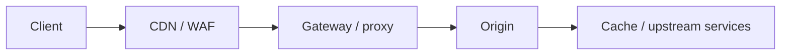

# HTTP Architecture & Advanced Web Attacks

## 🗺️ Zero-to-Mastery Learning Path

1. [[Server-Side Request Forgery]]
2. [[HTTP Request Smuggling]]
3. [[Web Cache Attacks]]
4. [[WAF Testing & Bypass Methodology]]

---
> 🔼 Up: [[Web Application Penetration Testing]]
