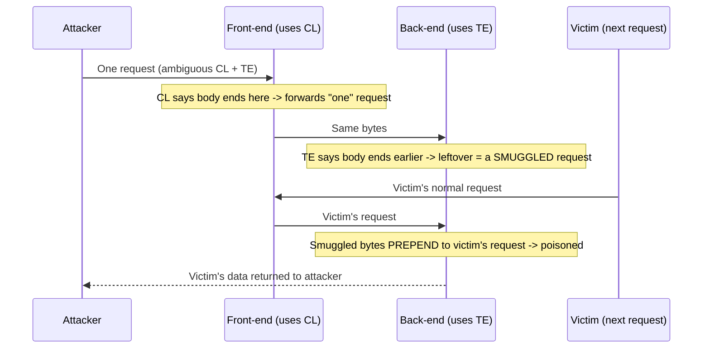

# 🚚 HTTP Request Smuggling

> [!warning] Authorized simulation only
> Smuggling poisons the request stream and can affect *other users'* requests. It is high-risk to test in production. Prove the parsing disagreement in a lab you build, and treat any production test as requiring explicit, careful authorization. Prove with benign markers only.

## Parent Learning Order
Server-Side Request Forgery -> HTTP Request Smuggling -> Web Cache Attacks -> WAF Testing & Bypass Methodology

## When Two Servers Disagree About Where a Request Ends

Modern web traffic passes through a chain: a front-end proxy (CDN, load balancer, WAF) forwards requests to a back-end server. Both must agree on where each request *ends* so they can separate one request from the next. **HTTP Request Smuggling** exploits a *disagreement* between them: if the front-end thinks a request ends in one place and the back-end thinks it ends somewhere else, an attacker can hide a second request inside the first. The front-end sees one request; the back-end sees two — and the smuggled second request gets *prepended to the next user's request*, poisoning it.

The vulnerability lives in neither server alone — it is in the *disagreement between them*. This is the web-layer version of the parser-discrepancy principle: wherever two implementations parse the same bytes differently, that gap is exploitable.

> [!tip] The analogy, and where it breaks
> Smuggling is like mailing a letter where the sorting office and the delivery office count pages differently — the sorter sees one letter, but the deliverer reads your hidden second letter as the *start of the next customer's mail*. The analogy breaks on victim selection: you cannot choose whose mail gets your smuggled page — it prepends to *whoever's request arrives next*, which is what makes smuggling both powerful and indiscriminate.

**Prerequisites:** HTTP message framing (Content-Length and Transfer-Encoding), and the proxy-chain architecture from the Networking Web Architecture leaf.

## The Root: Two Ways to Say "How Long Is the Body"

HTTP/1.1 has two ways to indicate a request body's length, and if a request contains *both*, servers must agree which wins:

- **Content-Length (CL)** — a byte count: "the body is exactly N bytes."
- **Transfer-Encoding: chunked (TE)** — the body is sent in chunks, ending with a zero-size chunk.

The RFC says `Transfer-Encoding` takes precedence, but implementations disagree, especially with malformed or ambiguous headers. The classic desync types:

| Type | Front-end uses | Back-end uses | Result |
| --- | --- | --- | --- |
| **CL.TE** | Content-Length | Transfer-Encoding | Back-end sees a smuggled request in the "extra" bytes |
| **TE.CL** | Transfer-Encoding | Content-Length | Front-end forwards more than back-end reads |
| **TE.TE** | (one ignores an obfuscated TE) | | Obfuscated `Transfer-Encoding` header desyncs them |

The attack crafts a request where the two servers parse the body boundary differently, leaving bytes that the back-end interprets as the beginning of a *new* request.

**The deliberate break:** a request is a request. You send one thing, the server receives one thing, and if a proxy sits in between it forwards what it got.

Two servers on the same connection can disagree about **where your request ended**, and when they do, the bytes after the boundary become the beginning of the *next* person's request. That is the entire attack. It needs no memory corruption and no cryptography — only `Content-Length` and `Transfer-Encoding` both being present, and the front-end and back-end following different rules about which one wins. RFC 7230 says `Transfer-Encoding` takes precedence, but implementations vary, and any pair that disagrees is exploitable.

The consequence is what makes this one different from every other flaw in this branch: **the victim is someone else**. You are not attacking your own session, you are prepending bytes to a stranger's request.

**This is the Parser Differential pattern**, in its purest form — no cleverness about the payload at all, just two parsers and one stream.

**The Twin — compare this with SQL Injection.** In SQLi the application says "this is data" and the database parser says "this is grammar." In smuggling the front-end says "this request is finished" and the back-end says "it continues." Different layer, different protocol, identical shape: **the component that validated is not the component that acted, and they disagree about where a value ends.** If SQLi already feels obvious to you, that intuition transfers here directly — and to XXE, to NoSQL operators, and to path resolution.

**How you'd spot it:** send a request whose two length headers disagree and watch the **timing**. A back-end still waiting for body bytes that the front-end already considers sent will hang until timeout. A delay where there should be none is the classic first signal, before any payload is attempted.

## What Smuggling Achieves

The smuggled request prepends to the next user's request, enabling:

- **Request hijacking** — capture another user's request (including their session cookie) by making it complete *your* smuggled request.
- **Cache poisoning** — smuggle a response that gets cached and served to others (links to the cache-attacks leaf).
- **Bypassing front-end controls** — a WAF that only inspects what *it* parses as the request misses the smuggled portion, so smuggling sneaks past front-end security.
- **Credential/response theft** — redirect another user's response to a location you control.



## Worked Example: One Request, Two Readings

Request smuggling does not live in a single server. It lives in the *disagreement*
between two — a front-end and a back-end that parse the same bytes differently.
Modelling both parsers over one crafted request makes the desync visible without a
proxy.

**The request carries two conflicting length signals at once:**

```text
POST / HTTP/1.1
Host: lab
Content-Length: 6
Transfer-Encoding: chunked

0

SMUGGLED
```

Both headers describe where the body ends, and they describe different places.
`Content-Length: 6` says the body is six bytes. `Transfer-Encoding: chunked` says
the body ends at the zero-size chunk (`0\r\n\r\n`), which comes earlier.

**Each parser, applied to those same bytes:**

```shell-session
analyst@lab:~$ python3 desync.py
front-end (Content-Length) body: b'0\r\n\r\n' | leftover: b'SMUGGLED'
back-end  (chunked)        body: b'0\r\n\r\n' | leftover: b'SMUGGLED'
```

A front-end honouring `Content-Length` consumes six bytes and considers the
request complete. A back-end honouring `Transfer-Encoding` ends at the chunk
terminator. Crucially they disagree about where *this* request stops, and so they
disagree about whether `SMUGGLED` is part of it or the start of the next one.

**Why the leftover is dangerous:**

```shell-session
analyst@lab:~$ python3 poison.py
back-end now reads: b'SMUGGLEDGET /account HTTP/1.1\r\nHost: l' ...
```

The bytes the front-end thought were surplus sit in the back-end's buffer, and the
next request to arrive — a different user's — gets prepended with them. That user's
`GET /account` becomes `SMUGGLEDGET /account`, a request neither they nor the
front-end composed. In a real attack `SMUGGLED` is a crafted request line that
redirects the victim, poisons a cache, or captures their session; here it is a
marker that proves the desync exists.

**How it is found safely.** The first probe is never the impactful payload — it is
a timing test. A `CL.TE` probe whose chunked body ends early leaves the back-end
blocking, waiting for bytes that will never arrive, and that measurable response
delay confirms the two servers disagree before any victim is involved. The fix is
categorical rather than per-payload: a server that sees both headers must reject
the request as ambiguous, which is exactly what HTTP/2's single, unambiguous
length mechanism enforces by construction.

## Why this one belongs in a lab

- **Production risk.** Smuggling affects *other users'* requests, so a careless production test can corrupt real traffic. Prove the parsing disagreement in a lab; production testing needs explicit authorization and extreme care.
- **Detection of the desync.** The core test is timing-based: a CL.TE probe that leaves the back-end waiting for more bytes causes a measurable delay. A delayed response to a crafted request is the desync signature — before attempting any impactful payload.
- **Chain-dependent.** Smuggling requires a specific front-end/back-end parsing mismatch; a chain that agrees is not vulnerable. The vulnerability is a property of the *pair*, so it must be tested against the actual chain.
- **HTTP/2 downgrade.** Even HTTP/2 front-ends can reintroduce smuggling when they downgrade to HTTP/1.1 to the back-end — test the downgrade boundary.
- **Benign proof only.** Confirm the desync with a timing probe or a benign marker prepended to your *own* follow-up request — never harvest a real user's request.

## Security Implications — Detection & Defense

- **Normalize requests at the front-end.** The definitive fix is for the front-end to reject or normalize ambiguous requests — a request with both CL and TE, or a malformed TE, should be rejected, not forwarded. Consistent parsing across the chain removes the disagreement.
- **Use HTTP/2 end-to-end** where possible — HTTP/2's framing is unambiguous about message length, eliminating the CL/TE ambiguity (though downgrades reintroduce risk).
- **Reject ambiguous framing:** a compliant server drops requests with conflicting length indicators rather than guessing — the guess is the vulnerability.
- **Detection** is difficult because the malicious request looks valid to each server individually; anomaly detection on malformed framing and the correlation of one user's data appearing in another's response are the signals.
- **This is the web version of parser-discrepancy evasion** — the same class as fragment-reassembly and XML-encoding differences: the fix is always to make the two parsers agree, or to reject ambiguity.

## Summary

You should now be able to:

- Explain why two servers must agree on where a request ends, and what happens when they disagree.
- Demonstrate a CL/TE parsing disagreement, explain how leftover bytes poison the next request, and describe timing-based desync detection.
- Explain why the vulnerability is a property of the server *pair* not either alone, why HTTP/2 end-to-end and rejecting ambiguous framing are the fixes, and how this is the web instance of the parser-discrepancy evasion class.

---
> 🔼 Up: [[HTTP Architecture & Advanced Web Attacks]]
