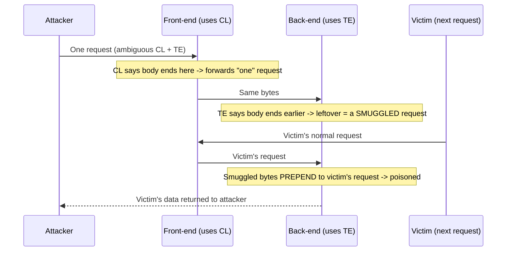

# 🚚 HTTP Request Smuggling

> [!warning] Authorized simulation only
> Smuggling poisons the request stream and can affect *other users'* requests. It is high-risk to test in production. Prove the parsing disagreement in a lab you build, and treat any production test as requiring explicit, careful authorization. Prove with benign markers only.

## Parent Learning Order
Server-Side Request Forgery -> HTTP Request Smuggling -> Web Cache Attacks -> WAF Testing & Bypass Methodology

## Start at Zero: When Two Servers Disagree About Where a Request Ends

Modern web traffic passes through a chain: a front-end proxy (CDN, load balancer, WAF) forwards requests to a back-end server. Both must agree on where each request *ends* so they can separate one request from the next. **HTTP Request Smuggling** exploits a *disagreement* between them: if the front-end thinks a request ends in one place and the back-end thinks it ends somewhere else, an attacker can hide a second request inside the first. The front-end sees one request; the back-end sees two — and the smuggled second request gets *prepended to the next user's request*, poisoning it.

The vulnerability lives in neither server alone — it is in the *disagreement between them*. This is the web-layer version of the parser-discrepancy principle: wherever two implementations parse the same bytes differently, that gap is exploitable.

> [!tip] The analogy, and where it breaks
> Smuggling is like mailing a letter where the sorting office and the delivery office count pages differently — the sorter sees one letter, but the deliverer reads your hidden second letter as the *start of the next customer's mail*. The analogy breaks on victim selection: you cannot choose whose mail gets your smuggled page — it prepends to *whoever's request arrives next*, which is what makes smuggling both powerful and indiscriminate.

**Prerequisites:** HTTP message framing (Content-Length and Transfer-Encoding), and the proxy-chain architecture from the Networking Web Architecture leaf.

## The Root: Two Ways to Say "How Long Is the Body"

HTTP/1.1 has two ways to indicate a request body's length, and if a request contains *both*, servers must agree which wins:

- **Content-Length (CL)** — a byte count: "the body is exactly N bytes."
- **Transfer-Encoding: chunked (TE)** — the body is sent in chunks, ending with a zero-size chunk.

The RFC says `Transfer-Encoding` takes precedence, but implementations disagree, especially with malformed or ambiguous headers. The classic desync types:

| Type | Front-end uses | Back-end uses | Result |
| --- | --- | --- | --- |
| **CL.TE** | Content-Length | Transfer-Encoding | Back-end sees a smuggled request in the "extra" bytes |
| **TE.CL** | Transfer-Encoding | Content-Length | Front-end forwards more than back-end reads |
| **TE.TE** | (one ignores an obfuscated TE) | | Obfuscated `Transfer-Encoding` header desyncs them |

The attack crafts a request where the two servers parse the body boundary differently, leaving bytes that the back-end interprets as the beginning of a *new* request.

## What Smuggling Achieves

The smuggled request prepends to the next user's request, enabling:

- **Request hijacking** — capture another user's request (including their session cookie) by making it complete *your* smuggled request.
- **Cache poisoning** — smuggle a response that gets cached and served to others (links to the cache-attacks leaf).
- **Bypassing front-end controls** — a WAF that only inspects what *it* parses as the request misses the smuggled portion, so smuggling sneaks past front-end security.
- **Credential/response theft** — redirect another user's response to a location you control.



## Failure Modes and Interpretation

- **Production risk.** Smuggling affects *other users'* requests, so a careless production test can corrupt real traffic. Prove the parsing disagreement in a lab; production testing needs explicit authorization and extreme care.
- **Detection of the desync.** The core test is timing-based: a CL.TE probe that leaves the back-end waiting for more bytes causes a measurable delay. A delayed response to a crafted request is the desync signature — before attempting any impactful payload.
- **Chain-dependent.** Smuggling requires a specific front-end/back-end parsing mismatch; a chain that agrees is not vulnerable. The vulnerability is a property of the *pair*, so it must be tested against the actual chain.
- **HTTP/2 downgrade.** Even HTTP/2 front-ends can reintroduce smuggling when they downgrade to HTTP/1.1 to the back-end — test the downgrade boundary.
- **Benign proof only.** Confirm the desync with a timing probe or a benign marker prepended to your *own* follow-up request — never harvest a real user's request.

## Security Implications — Detection & Defense

- **Normalize requests at the front-end.** The definitive fix is for the front-end to reject or normalize ambiguous requests — a request with both CL and TE, or a malformed TE, should be rejected, not forwarded. Consistent parsing across the chain removes the disagreement.
- **Use HTTP/2 end-to-end** where possible — HTTP/2's framing is unambiguous about message length, eliminating the CL/TE ambiguity (though downgrades reintroduce risk).
- **Reject ambiguous framing:** a compliant server drops requests with conflicting length indicators rather than guessing — the guess is the vulnerability.
- **Detection** is difficult because the malicious request looks valid to each server individually; anomaly detection on malformed framing and the correlation of one user's data appearing in another's response are the signals.
- **This is the web version of parser-discrepancy evasion** — the same class as fragment-reassembly and XML-encoding differences: the fix is always to make the two parsers agree, or to reject ambiguity.

## Authorized Lab: Prove a Parsing Disagreement

> [!info] Runs on one Linux machine — builds two parsers that disagree about a request's body boundary
> This demonstrates the *desync mechanism* (the root cause) safely in-process, not a full multi-user exploit. No cleanup needed.

### Step 1 — Two parsers, two interpretations of the same bytes

```bash
python3 - << 'EOF'
# A raw HTTP/1.1 request that contains BOTH Content-Length and Transfer-Encoding
raw = (b"POST / HTTP/1.1\r\n"
       b"Host: lab\r\n"
       b"Content-Length: 6\r\n"
       b"Transfer-Encoding: chunked\r\n"
       b"\r\n"
       b"0\r\n"          # chunked: zero-size chunk = body ends HERE (per TE)
       b"\r\n"
       b"SMUGGLED")       # these bytes are "extra" depending on interpretation

def frontend_CL(data):   # front-end honors Content-Length: 6
    headers, body = data.split(b"\r\n\r\n",1)
    cl = 6
    return body[:cl], body[cl:]

def backend_TE(data):    # back-end honors Transfer-Encoding: chunked
    headers, body = data.split(b"\r\n\r\n",1)
    # chunked ends at "0\r\n\r\n"; everything after is a NEW request
    end = body.index(b"0\r\n\r\n") + len(b"0\r\n\r\n")
    return body[:end], body[end:]

f_body, f_left = frontend_CL(raw)
b_body, b_left = backend_TE(raw)
print("front-end (CL) thinks the request body is:", f_body, "| leftover:", f_left[:20])
print("back-end  (TE) thinks the request body is:", b_body.strip(), "| leftover:", b_left)
EOF
```

```text
front-end (CL) thinks the request body is: b'0\r\n\r\nS' | leftover: b'MUGGLED'
back-end  (TE) thinks the request body is: b'0' | leftover: b'SMUGGLED'
```

The two parsers **disagree**: the front-end (Content-Length) consumes 6 bytes and considers the request done, while the back-end (Transfer-Encoding) ends the body at the zero-chunk and treats `SMUGGLED` as leftover — the start of a *new* request. That leftover is the smuggled data.

### Step 2 — Show why the leftover poisons the next request

```bash
python3 - << 'EOF'
# the back-end's leftover "SMUGGLED" prepends to whatever comes next
leftover = b"SMUGGLED"
victim_next_request = b"GET /account HTTP/1.1\r\nHost: lab\r\n\r\n"
what_backend_sees = leftover + victim_next_request
print("back-end now reads:", what_backend_sees[:40], "...")
print("-> the victim's request is now prefixed with the attacker's SMUGGLED bytes")
EOF
```

```text
back-end now reads: b'SMUGGLEDGET /account HTTP/1.1\r\nHost: l' ...
```

```text
-> the victim's request is now prefixed with the attacker's SMUGGLED bytes
```

The smuggled bytes prepend to the victim's next request — the mechanism by which one user's request is corrupted by another's. In a real exploit `SMUGGLED` would be a crafted request line that hijacks or redirects the victim; here it is a benign marker demonstrating the desync.

### Step 3 — State the timing-based detection

```bash
echo "Real-world detection: send a CL.TE probe whose TE-body ends early, leaving the back-end waiting for more bytes."
echo "A measurable RESPONSE DELAY (the back-end blocking for data that won't come) confirms the desync — before any impactful payload."
```

```text
Real-world detection: send a CL.TE probe whose TE-body ends early, leaving the back-end waiting for more bytes.
A measurable RESPONSE DELAY (the back-end blocking for data that won't come) confirms the desync — before any impactful payload.
```

### Step 4 — No cleanup needed

```bash
echo "All steps ran in short-lived python processes that have exited; nothing persists."
```

```text
All steps ran in short-lived python processes that have exited; nothing persists.
```

**What you should now be able to do:** explain that smuggling lives in the *disagreement* between front-end and back-end parsers, describe CL.TE/TE.CL desync, demonstrate how a leftover prepends to the next request, and explain the timing-based detection and the reject-ambiguity fix.

## Crook → Operator → Root Checkpoint

- **Crook:** Explain why two servers must agree on where a request ends, and what happens when they disagree.
- **Operator:** Demonstrate a CL/TE parsing disagreement, explain how leftover bytes poison the next request, and describe timing-based desync detection.
- **Root:** Explain why the vulnerability is a property of the server *pair* not either alone, why HTTP/2 end-to-end and rejecting ambiguous framing are the fixes, and how this is the web instance of the parser-discrepancy evasion class.

---
> 🔼 Up: [[HTTP Architecture & Advanced Web Attacks]]
