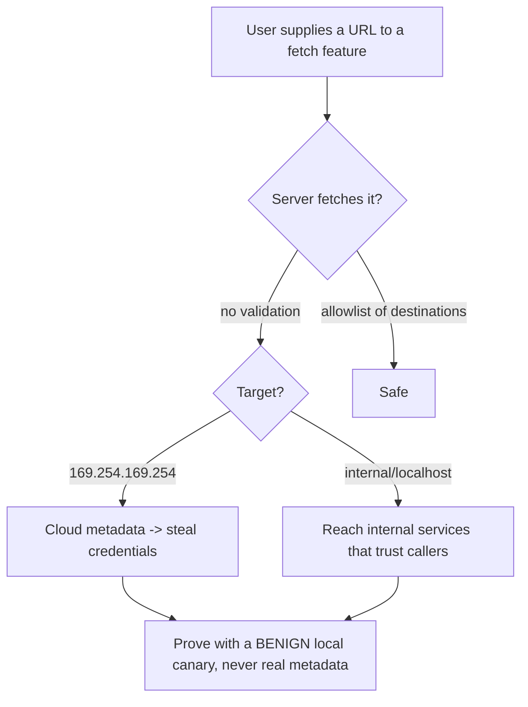

# 🎯 Server-Side Request Forgery

> [!warning] Authorized simulation only
> SSRF makes a server reach internal systems the attacker cannot. Prove it only against a benign internal marker you place (a local canary service), never a real internal system or cloud metadata endpoint. Test only in-scope applications.

## Parent Learning Order
Server-Side Request Forgery -> HTTP Request Smuggling -> Web Cache Attacks -> WAF Testing & Bypass Methodology

## Making the Server Fetch on Your Behalf

> *You make the server fetch a URL of your choosing. Why is that worse than fetching it yourself?*
>
> Hold your answer — the section below is the response.

**Server-Side Request Forgery (SSRF)** is a flaw where an attacker induces the *server* to make a request to a URL the attacker chooses. The power is *position*: the server sits inside the network, so it can reach internal services, cloud metadata endpoints, and admin interfaces that the attacker — stuck outside the firewall — cannot touch directly. SSRF turns a public web application into a proxy into the internal infrastructure.

Any feature that fetches a URL is a candidate: a "load image from URL" field, a webhook, a PDF generator that renders a page, a URL-preview feature, an import-from-URL. The root cause is the same as file inclusion — untrusted input reaches a request operation — but the target is the *network* rather than the filesystem.

> [!tip] The analogy, and where it breaks
> SSRF is like phoning a company's receptionist and saying "please call extension 4000 and read me what they say" — the receptionist (server) can reach internal extensions you cannot dial from outside. The analogy breaks on trust: internal services often *assume* any request reaching them is trusted (it came from inside), so they answer without authentication — which is exactly why SSRF into them is so damaging.

**Prerequisites:** HTTP, internal vs. external network addressing, and the cloud-metadata concept.

**The deliberate break:** SSRF sounds like a lesser flaw — you make the server fetch a URL, which is what servers do all day. Compared with code execution it reads as an inconvenience.

The severity does not come from the fetch, it comes from **where the request originates**. Your request arrives from the internet and is filtered accordingly; the server's request originates *inside* the network, from a host the internal services already trust. That turns a URL parameter into a proxy into the environment: internal admin panels with no authentication because they are "internal", databases bound to private addresses, and above all cloud metadata at `169.254.169.254`, which will hand out the instance's credentials to anything that asks from the instance.

That is why SSRF regularly escalates to full cloud-account compromise while looking, in the request, like a thumbnail generator being given a different link.

**How you'd spot it:** any parameter containing a URL, a hostname, or something that becomes one — webhook targets, PDF renderers, thumbnailers, import-from-URL, XML entities. Point one at a service you control and watch whether the *server's* address connects. That out-of-band callback is the proof, and it needs no internal target at all.

## The High-Value Targets

SSRF's severity comes from what the server can reach that you cannot:

| Target | What it yields |
| --- | --- |
| **Cloud metadata** (`169.254.169.254`) | Temporary cloud credentials — often full account compromise |
| **Internal services** (`10.x`, `192.168.x`, `localhost`) | Admin panels, databases, APIs that trust internal callers |
| **`localhost` ports** | Services bound to loopback, assumed unreachable |
| **The firewall boundary** | Any host the *server* can route to |

The cloud-metadata case is the most severe modern SSRF: the metadata endpoint returns the instance's IAM credentials, and it is reachable only from the instance itself — so SSRF that hits it can steal cloud credentials and escalate to full account takeover. This is why the warning insists on a *benign local canary* for proof, never the real metadata endpoint.

## Blind vs. Full SSRF

- **Full SSRF** — the server's response to your URL is reflected back to you, so you *read* internal responses directly.
- **Blind SSRF** — the response is not reflected, but you can confirm the request happened (timing, error differences, or an out-of-band request to a server you control). Blind SSRF is still dangerous — it can trigger internal actions and, with cloud metadata, sometimes exfiltrate via error messages.

Testing distinguishes them: does the internal response come back to me (full), or can I only *detect* that the request fired (blind)?

## Bypassing SSRF Filters

Naive SSRF defenses blocklist `localhost` and `127.0.0.1`; the bypass neighborhood is large:

- **Alternate loopback**: `127.0.0.1` → `127.1`, `0.0.0.0`, `[::1]`, `2130706433` (decimal), `0x7f000001` (hex)
- **DNS rebinding**: a hostname that resolves to an allowed IP on first check, then to `127.0.0.1` when fetched
- **Redirects**: an allowed URL that 302-redirects to an internal one
- **Alternate schemes**: `file://`, `gopher://`, `dict://` for non-HTTP internal interactions

A "fixed" SSRF must be retested against these, and the fact that so many bypasses exist is why *blocklisting is the wrong approach* — an allowlist of permitted destinations is the only robust filter.



## Worked Example: Reading an Internal Service Through a Public One

Server-side request forgery turns a server's own reachability into the attacker's.
The vulnerable feature is ordinary — an app that fetches a user-supplied URL — and
the exploit is simply pointing it inward.

**The specimen** fetches whatever URL it is handed, with no allowlist:

```python
url = request.args.get("url")
data = urllib.request.urlopen(url, timeout=2).read()   # VULNERABLE: any URL
return b"fetched: " + data
```

**Legitimate use** looks exactly as intended:

```shell-session
analyst@lab:~$ curl -s "http://127.0.0.1:8111/?url=http://example.com/" | head -c 40
fetched: <!doctype html>
```

The feature works, which is why it ships. Nothing about the happy path hints at
the problem — the app is doing precisely what it was built to do.

**The exploit** aims the same feature at a service the attacker cannot reach
directly:

```shell-session
analyst@lab:~$ curl -s "http://127.0.0.1:8111/?url=http://127.0.0.1:9001/"
fetched: INTERNAL-CANARY: secret admin panel
```

The internal service on `9001` binds to localhost and is unreachable from
outside. The attacker still read it — because the *server* reached it, and handed
the response back. That is the whole of SSRF: the request originates from the
server's network position, not the attacker's, so every trust the network places
in "traffic from this server" is now available to whoever controls the URL. On a
cloud host the highest-value target of this exact request is the instance
metadata endpoint, which hands out credentials to anything that can ask.

**Why blocklists fail**, in one line:

```shell-session
analyst@lab:~$ curl -s "http://127.0.0.1:8111/?url=http://2130706433:9001/" | head -c 30
fetched: INTERNAL-CANARY: secre
```

`2130706433` is `127.0.0.1` written as a single decimal integer, and it reaches
the same service. A filter that blocks the string `127.0.0.1` never sees it, and
the equivalents are numerous: decimal, octal, hex, IPv6-mapped, a DNS name that
resolves to a private address, a redirect from an allowed host to a blocked one.
Enumerating bad forms is a losing game, which is why the robust fix is an
*allowlist* of permitted destinations plus blocking the metadata IP outright —
deciding what the feature may reach, rather than trying to name everything it may
not.

## Canary services instead of real metadata endpoints

- **Proving against real internal targets.** Hitting real cloud metadata or an internal service could steal live credentials or cause side effects. Prove with a benign canary service you placed on loopback.
- **Blind SSRF missed.** Concluding "no SSRF" because the response isn't reflected misses blind SSRF — test for out-of-band request confirmation before deciding safe.
- **Blocklist bypass neighborhood.** A block on `localhost` is defeated by `127.1`, decimal IPs, `[::1]`, etc. Test the full neighborhood; blocklists are presumed bypassable.
- **Redirect and rebinding.** A filter that validates the initial URL but follows redirects, or re-resolves DNS at fetch time, is bypassable. Test whether redirects and DNS changes are honored.
- **Scheme surprises.** Non-HTTP schemes (`file://`, `gopher://`) may reach unexpected internal interactions — test which schemes the fetcher supports.

## Security Implications — Detection & Defense

- **Allowlist destinations, never blocklist.** The robust fix is an allowlist of permitted URLs/hosts, because the blocklist bypass space is effectively infinite. Validate the *resolved IP* against the allowlist, at fetch time, following redirects.
- **Block access to internal ranges and metadata** at the network level — the server's outbound requests should not be able to reach `169.254.169.254`, RFC 1918 ranges, or loopback unless explicitly needed.
- **Use IMDSv2 (or equivalent)** for cloud metadata — a session-token-requiring metadata service defeats the simplest SSRF-to-credential-theft, a critical cloud hardening.
- **Least-privilege the fetching service** and restrict its network egress so even a successful SSRF reaches little.
- **Detection** looks for the server making unexpected outbound requests — especially to internal or metadata addresses — the same SSRF signature as XXE-via-SSRF. Egress monitoring on the application tier catches it.

## Summary

You should now be able to:

- Explain why making the server fetch a URL is dangerous, and what internal targets SSRF can reach that an outside attacker cannot.
- Prove SSRF into a benign internal service, distinguish full from blind SSRF, and bypass a loopback blocklist with an alternate IP form.
- Explain why the cloud-metadata target makes SSRF a credential-theft path, why allowlisting resolved IPs at fetch time (following redirects) is the robust fix, and how IMDSv2 and egress restriction contain it.

---
> 🔼 Up: [[HTTP Architecture & Advanced Web Attacks]]
