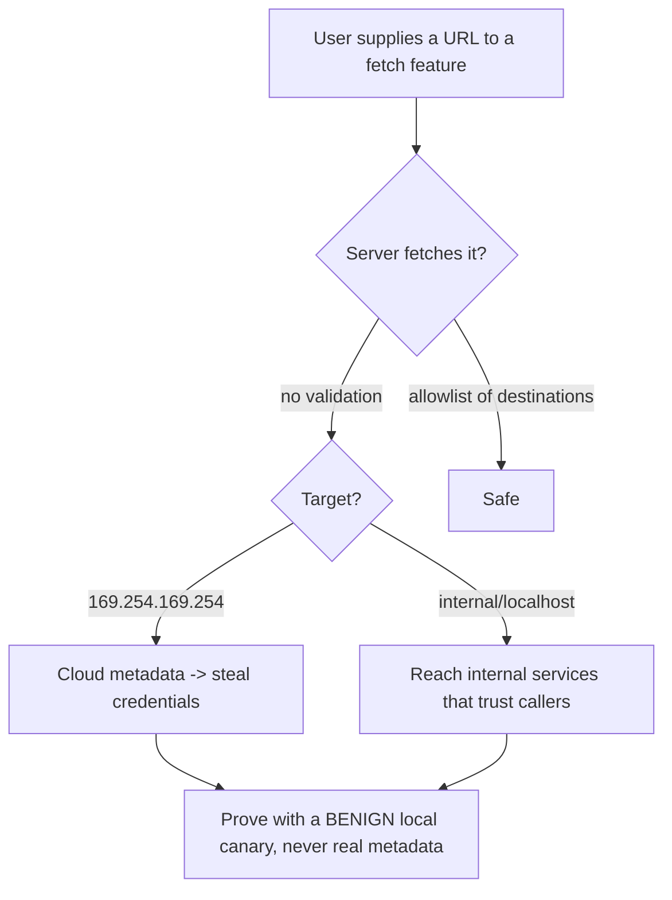

# 🎯 Server-Side Request Forgery

> [!warning] Authorized simulation only
> SSRF makes a server reach internal systems the attacker cannot. Prove it only against a benign internal marker you place (a local canary service), never a real internal system or cloud metadata endpoint. Test only in-scope applications.

## Parent Learning Order
Server-Side Request Forgery -> HTTP Request Smuggling -> Web Cache Attacks -> WAF Testing & Bypass Methodology

## Start at Zero: Making the Server Fetch on Your Behalf

**Server-Side Request Forgery (SSRF)** is a flaw where an attacker induces the *server* to make a request to a URL the attacker chooses. The power is *position*: the server sits inside the network, so it can reach internal services, cloud metadata endpoints, and admin interfaces that the attacker — stuck outside the firewall — cannot touch directly. SSRF turns a public web application into a proxy into the internal infrastructure.

Any feature that fetches a URL is a candidate: a "load image from URL" field, a webhook, a PDF generator that renders a page, a URL-preview feature, an import-from-URL. The root cause is the same as file inclusion — untrusted input reaches a request operation — but the target is the *network* rather than the filesystem.

> [!tip] The analogy, and where it breaks
> SSRF is like phoning a company's receptionist and saying "please call extension 4000 and read me what they say" — the receptionist (server) can reach internal extensions you cannot dial from outside. The analogy breaks on trust: internal services often *assume* any request reaching them is trusted (it came from inside), so they answer without authentication — which is exactly why SSRF into them is so damaging.

**Prerequisites:** HTTP, internal vs. external network addressing, and the cloud-metadata concept.

## The High-Value Targets

SSRF's severity comes from what the server can reach that you cannot:

| Target | What it yields |
| --- | --- |
| **Cloud metadata** (`169.254.169.254`) | Temporary cloud credentials — often full account compromise |
| **Internal services** (`10.x`, `192.168.x`, `localhost`) | Admin panels, databases, APIs that trust internal callers |
| **`localhost` ports** | Services bound to loopback, assumed unreachable |
| **The firewall boundary** | Any host the *server* can route to |

The cloud-metadata case is the most severe modern SSRF: the metadata endpoint returns the instance's IAM credentials, and it is reachable only from the instance itself — so SSRF that hits it can steal cloud credentials and escalate to full account takeover. This is why the warning insists on a *benign local canary* for proof, never the real metadata endpoint.

## Blind vs. Full SSRF

- **Full SSRF** — the server's response to your URL is reflected back to you, so you *read* internal responses directly.
- **Blind SSRF** — the response is not reflected, but you can confirm the request happened (timing, error differences, or an out-of-band request to a server you control). Blind SSRF is still dangerous — it can trigger internal actions and, with cloud metadata, sometimes exfiltrate via error messages.

Testing distinguishes them: does the internal response come back to me (full), or can I only *detect* that the request fired (blind)?

## Bypassing SSRF Filters

Naive SSRF defenses blocklist `localhost` and `127.0.0.1`; the bypass neighborhood is large:

- **Alternate loopback**: `127.0.0.1` → `127.1`, `0.0.0.0`, `[::1]`, `2130706433` (decimal), `0x7f000001` (hex)
- **DNS rebinding**: a hostname that resolves to an allowed IP on first check, then to `127.0.0.1` when fetched
- **Redirects**: an allowed URL that 302-redirects to an internal one
- **Alternate schemes**: `file://`, `gopher://`, `dict://` for non-HTTP internal interactions

A "fixed" SSRF must be retested against these, and the fact that so many bypasses exist is why *blocklisting is the wrong approach* — an allowlist of permitted destinations is the only robust filter.



## Failure Modes and Interpretation

- **Proving against real internal targets.** Hitting real cloud metadata or an internal service could steal live credentials or cause side effects. Prove with a benign canary service you placed on loopback.
- **Blind SSRF missed.** Concluding "no SSRF" because the response isn't reflected misses blind SSRF — test for out-of-band request confirmation before deciding safe.
- **Blocklist bypass neighborhood.** A block on `localhost` is defeated by `127.1`, decimal IPs, `[::1]`, etc. Test the full neighborhood; blocklists are presumed bypassable.
- **Redirect and rebinding.** A filter that validates the initial URL but follows redirects, or re-resolves DNS at fetch time, is bypassable. Test whether redirects and DNS changes are honored.
- **Scheme surprises.** Non-HTTP schemes (`file://`, `gopher://`) may reach unexpected internal interactions — test which schemes the fetcher supports.

## Security Implications — Detection & Defense

- **Allowlist destinations, never blocklist.** The robust fix is an allowlist of permitted URLs/hosts, because the blocklist bypass space is effectively infinite. Validate the *resolved IP* against the allowlist, at fetch time, following redirects.
- **Block access to internal ranges and metadata** at the network level — the server's outbound requests should not be able to reach `169.254.169.254`, RFC 1918 ranges, or loopback unless explicitly needed.
- **Use IMDSv2 (or equivalent)** for cloud metadata — a session-token-requiring metadata service defeats the simplest SSRF-to-credential-theft, a critical cloud hardening.
- **Least-privilege the fetching service** and restrict its network egress so even a successful SSRF reaches little.
- **Detection** looks for the server making unexpected outbound requests — especially to internal or metadata addresses — the same SSRF signature as XXE-via-SSRF. Egress monitoring on the application tier catches it.

## Authorized Lab: SSRF Into a Benign Internal Service

> [!info] Runs on one Linux machine — builds a fetch feature and a loopback-only "internal" service, then reaches it via SSRF
> All loopback; the "internal" target is a benign canary you place. Step 5 removes it.

### Step 1 — Build an "internal-only" service and a public app that fetches URLs

```bash
# the "internal" service — imagine it's only reachable from inside the network
python3 -c "
import http.server
class I(http.server.BaseHTTPRequestHandler):
    def do_GET(s): s.send_response(200); s.end_headers(); s.wfile.write(b'INTERNAL-CANARY: secret admin panel')
    def log_message(s,*a): pass
http.server.HTTPServer(('127.0.0.1',9001),I).serve_forever()" &>/dev/null &
# the public app with a vulnerable URL-fetch feature
cat > /tmp/ssrf.py << 'EOF'
import http.server, urllib.parse, urllib.request
class H(http.server.BaseHTTPRequestHandler):
    def do_GET(self):
        url = urllib.parse.parse_qs(urllib.parse.urlparse(self.path).query).get("url",[""])[0]
        try:  # VULNERABLE: fetches any user-supplied URL, no allowlist
            data = urllib.request.urlopen(url, timeout=2).read()
            self.send_response(200); self.end_headers(); self.wfile.write(b"fetched: "+data)
        except Exception as e:
            self.send_response(500); self.end_headers(); self.wfile.write(str(e).encode())
    def log_message(self,*a): pass
http.server.HTTPServer(("127.0.0.1",8111),H).serve_forever()
EOF
python3 /tmp/ssrf.py &>/dev/null &
sleep 1; echo "public app :8111 (fetch feature), internal service :9001 (loopback-only)"
```

```text
public app :8111 (fetch feature), internal service :9001 (loopback-only)
```

### Step 2 — Legitimate use (baseline)

```bash
curl -s "http://127.0.0.1:8111/?url=http://example.com/" | head -c 40
```

```text
fetched: <!doctype html>
```

The feature fetches an external URL as intended.

### Step 3 — SSRF to the internal-only service (the finding)

```bash
curl -s "http://127.0.0.1:8111/?url=http://127.0.0.1:9001/"
```

```text
fetched: INTERNAL-CANARY: secret admin panel
```

The public app fetched the **internal-only** service and returned its content — SSRF confirmed. An external attacker who cannot reach `:9001` directly just read it *through* the server. Here the target is a benign canary; on a real system this same request would hit an internal admin panel or cloud metadata.

### Step 4 — Demonstrate a filter bypass

```bash
# even if the app blocked "127.0.0.1", alternate forms reach the same target
echo "decimal IP -> $(curl -s "http://127.0.0.1:8111/?url=http://2130706433:9001/" | head -c 30)"
```

```text
decimal IP -> fetched: INTERNAL-CANARY: secre
```

`2130706433` is `127.0.0.1` in decimal — a form a naive `127.0.0.1` blocklist would miss. This is why allowlisting destinations (not blocklisting) is the only robust fix.

### Step 5 — Cleanup

```bash
kill %1 %2 2>/dev/null; rm -f /tmp/ssrf.py; wait 2>/dev/null
curl -s -o /dev/null -w "app gone: %{http_code}\n" --max-time 2 http://127.0.0.1:8111/ 2>&1 | grep -o 'gone.*' || echo "app gone: connection refused"
```

```text
app gone: connection refused
```

**What you should now be able to do:** recognize URL-fetch features as SSRF candidates, reach an internal-only service through a vulnerable server with a benign canary, bypass a naive loopback blocklist with an alternate IP form, and explain why allowlisting destinations is the only robust fix.

## Crook → Operator → Root Checkpoint

- **Crook:** Explain why making the server fetch a URL is dangerous, and what internal targets SSRF can reach that an outside attacker cannot.
- **Operator:** Prove SSRF into a benign internal service, distinguish full from blind SSRF, and bypass a loopback blocklist with an alternate IP form.
- **Root:** Explain why the cloud-metadata target makes SSRF a credential-theft path, why allowlisting resolved IPs at fetch time (following redirects) is the robust fix, and how IMDSv2 and egress restriction contain it.

---
> 🔼 Up: [[HTTP Architecture & Advanced Web Attacks]]
