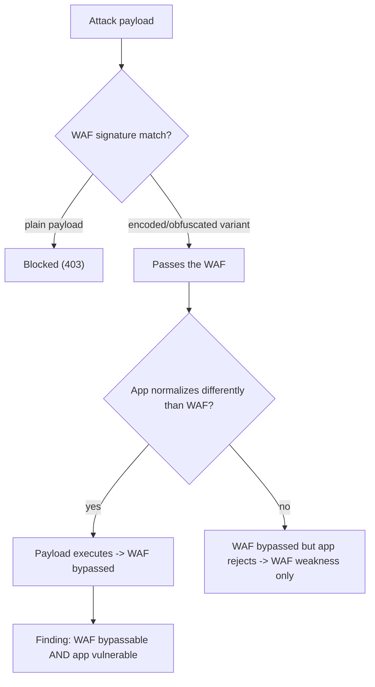

# 🧱 WAF Testing & Bypass Methodology

> [!warning] Authorized simulation only
> Testing a WAF means probing it with attack-shaped payloads. Do so only against in-scope systems, and remember: a WAF bypass is a *finding about the WAF*, not a licence to exploit the app behind it. Prove with benign markers.

## Parent Learning Order
Server-Side Request Forgery -> HTTP Request Smuggling -> Web Cache Attacks -> WAF Testing & Bypass Methodology -> GraphQL Security Testing

## Testing the Filter, Not Just the App

> *A WAF blocks SQL injection patterns all day. What does it understand about your application?*
>
> Hold your answer — the section below is the response.

A **Web Application Firewall (WAF)** sits in front of an application and inspects requests, blocking those matching attack signatures — SQL injection patterns, XSS payloads, path traversal. It is a valuable *layer*, but it is a signature-matcher, not an understanding of the application, so it has the same fundamental limitation as any signature system: it catches what it has a rule for and misses what it does not. WAF testing has two goals: verify the WAF *works* (blocks known attacks), and — critically — determine whether it can be *bypassed*, because a WAF that is trivially bypassed provides false assurance.

The essential mindset: **a WAF is defense-in-depth, never a fix.** It buys time and blocks noise, but the vulnerability behind it still exists. Reporting "the WAF blocked my payload" without testing bypasses gives the client a dangerously false sense of security.

> [!tip] The analogy, and where it breaks
> A WAF is like a bouncer with a photo list of known troublemakers — effective against those exact faces, useless against anyone in a disguise or not yet on the list. The analogy breaks because the "disguises" (encodings, obfuscations) are *infinite and automatable*: an attacker can generate thousands of payload variants per second until one slips past, which no physical bouncer faces.

**Prerequisites:** the web injection basics (SQLi, XSS), encoding, and the Networking security-architecture WAF context.

## Why WAFs Are Bypassable: The Signature Gap

A WAF matches patterns, and the same malicious *intent* can be expressed in countless *forms* the signature does not cover:

| Technique | Example |
| --- | --- |
| **Encoding** | URL-encode, double-encode, unicode, hex — `SELECT` → `%53ELECT` |
| **Case variation** | `SeLeCt`, `UnIoN` (if the rule is case-sensitive) |
| **Comments/whitespace** | `SEL/**/ECT`, tabs, newlines splitting keywords |
| **Alternate syntax** | `UNION` → `/*!UNION*/`, JSON vs form encoding |
| **Chunking/smuggling** | Splitting the payload across the request (or past the WAF via smuggling) |
| **HTTP parameter pollution** | Same parameter twice; WAF checks one, app uses the other |

The bypass exists because the WAF and the *application* may normalize input differently — the same parser-discrepancy principle as smuggling and XXE. If the WAF decodes once but the app decodes twice, a double-encoded payload passes the WAF and executes at the app.

## The Testing Methodology

1. **Fingerprint the WAF** — response codes, headers, block pages, and behavior identify the WAF product, which reveals its known bypasses.
2. **Confirm it blocks the obvious** — a plain `' OR 1=1` payload should be blocked; if not, there is no effective WAF.
3. **Test the bypass neighborhood** — systematically apply encodings, case, comments, and alternate syntax to a payload until one passes.
4. **Verify at the app** — a payload passing the WAF is only a finding if it *also* works against the app; a bypass of the WAF that the app rejects is a WAF weakness but not an exploit.

```bash
# fingerprint + confirm blocking (your own lab WAF)
echo "plain payload -> $(curl -s -o /dev/null -w '%{http_code}' "http://127.0.0.1:8113/?q=' OR 1=1--")"
echo "benign query  -> $(curl -s -o /dev/null -w '%{http_code}' "http://127.0.0.1:8113/?q=hello")"
```

```text
plain payload -> 403
benign query  -> 200
```

The WAF blocks the obvious SQLi (403) and allows benign traffic (200) — it is functioning. The real test is whether an encoded variant slips past.



## Why 'protected by WAF' is not a finding

- **WAF = fixed, the myth.** Reporting "protected by WAF" without bypass testing is the core error — the vulnerability behind the WAF is unpatched, and a bypass exposes it. Always test bypasses.
- **Bypass ≠ exploit.** A payload passing the WAF is only impactful if the app is genuinely vulnerable to it. A WAF bypass against a non-vulnerable app is a WAF weakness, not an app finding — classify precisely.
- **False confidence from blocking.** A WAF blocking your first payload does not mean it blocks all variants; the *neighborhood* test is what matters.
- **Fingerprint errors** lead to trying the wrong known-bypasses. Confirm the WAF product before applying product-specific techniques.
- **Rate/behavior triggers.** Aggressive bypass fuzzing can trigger the WAF's rate limiting or IP blocking, ending the test. Throttle.

**The deliberate break:** "protected by a WAF" reads as a mitigating control, and a finding behind one reads as lower severity.

A WAF is a signature matcher with no model of the application, so it changes how much effort exploitation takes and **nothing about whether the vulnerability exists**. Downgrading a SQL injection because the first payload was blocked reports the filter's coverage against your payload set on that day — a fact about your testing, not about the code. The vulnerable query is still there, and the next encoding is a research problem rather than a barrier.

**How you'd spot it:** report the vulnerability and the filter as two separate items: one is a defect in the application, the other a compensating control with a measurable and temporary bypass rate. The tell of a WAF-shaped assessment is a report whose severities track which payloads happened to get through rather than what the underlying code does with input.

## Security Implications — Detection & Defense

- **Fix the vulnerability, not just deploy a WAF.** The WAF is defense-in-depth; the durable control is the secure code (parameterized queries, output encoding) behind it. A WAF alone is a temporary shield over an open wound.
- **Consistent normalization** between the WAF and the application closes the parser-discrepancy bypass — the WAF should decode input the same way the app will.
- **Positive security model (allowlisting)** where feasible — a WAF that permits only known-good input shapes is far harder to bypass than one blocklisting known-bad, mirroring the blocklist-vs-allowlist lesson throughout this domain.
- **WAF tuning and updates** matter — signatures must cover the encoding neighborhood, and the WAF must be updated as bypass techniques evolve.
- **Detection**: WAF logs of blocked attacks are valuable telemetry (they show attackers probing), and a spike in near-miss encoded payloads is the signature of someone hunting a bypass — the WAF becomes a sensor even when it is the thing being tested.

## Summary

You should now be able to:

- Explain why a WAF is a signature-matcher with the same catch-the-known/miss-the-novel limit as any signature system, and why it is not a fix.
- Fingerprint a WAF, confirm it blocks the obvious, bypass it via encoding/normalization mismatch, and verify the payload also works against the app.
- Explain why the WAF/app normalization mismatch is a parser-discrepancy bypass, why fixing the underlying vulnerability (not the WAF) is the durable control, and how a positive security model resists bypass.

---
> 🔼 Up: [[HTTP Architecture & Advanced Web Attacks]]
