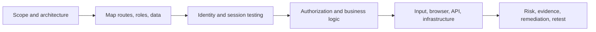
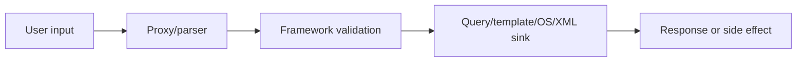

# OWASP Web Testing Methodology

> [!abstract] Enterprise methodology
> A systematic web assessment maps architecture, identities, data flows, controls, and abuse cases before testing vulnerability classes. OWASP provides coverage guidance; professional testing adapts that guidance to business context and proves root causes safely.

## Parent Learning Order
OWASP Web Testing Methodology -> Web Identity & Access Control -> Web Injection Testing -> Client-Side Web Security -> HTTP Architecture & Advanced Web Attacks -> File, Parser & Serialization Security -> Business Logic & Workflow Security -> CMS & Framework Security Testing

## Testing model

> *You tested the OWASP Top 10 and found nothing. What have you covered?*
>
> Hold your answer — the section below is the response.



## Application map

Record hosts, reverse proxies, APIs, WebSockets, file stores, identity providers, third parties, admin surfaces, mobile clients, and background workers. Build a route inventory from normal user journeys rather than brute-force alone.

```text
POST /api/orders             customer creates order
GET  /api/orders/{id}        customer reads order
POST /api/orders/{id}/refund manager approves refund
GET  /admin/export           administrator exports records
```

For each route capture method, parameters, content type, authentication, role, object ownership, state change, data classification, and expected invariants.

**The deliberate break:** the OWASP Top 10 is the list everyone knows, so "we tested the Top 10" sounds like a complete web assessment. It is not a test plan and was never meant to be one.

The Top 10 is an **awareness document**: ten broad *risk categories*, ranked by prevalence and impact across the industry, published to tell organisations where attention generally belongs. It contains no procedures. The **Web Security Testing Guide** is the document with the procedures — hundreds of individual tests with identifiers — and the two are often confused because they carry the same logo.

The difference shows up in coverage. A category like "Broken Access Control" tells you a class exists; it does not tell you to test horizontal *and* vertical authorisation, on every object, for every role, on every endpoint. And an assessment scoped to ten categories has no place at all for the flaws that belong to no category — the business-logic findings from the previous note, which are frequently the most valuable thing in the report.

**How you'd spot a Top-10-shaped assessment:** the report's contents page is ten headings long and matches the Top 10 in order. Real coverage is tracked against WSTG test identifiers and states what was *not* tested, which is the half that tells a client what they still do not know.

## OWASP-aligned coverage

| Area | Questions |
|---|---|
| Information gathering | What components, routes, files, and trust boundaries exist? |
| Configuration/deployment | Are debug behavior, headers, TLS, storage, and admin interfaces secure? |
| Identity | Can accounts be enumerated, created, recovered, or linked incorrectly? |
| Authentication | Are credentials, MFA, federation, and reauthentication robust? |
| Authorization | Are functions and objects restricted server-side? |
| Session management | Are tokens unpredictable, rotated, invalidated, and scoped? |
| Input validation | Can data cross into SQL, OS, template, XML, LDAP, or browser execution contexts? |
| Error handling | Do errors disclose internals or alter control flow? |
| Cryptography | Are keys, algorithms, secrets, and transport protections appropriate? |
| Business logic | Can valid features be sequenced or repeated to violate an invariant? |
| Client-side | Can browser trust, DOM, origins, frames, or storage be abused? |
| APIs | Are object, function, property, and resource limits enforced? |

## Baseline and differential testing

Establish a valid request, change one variable, and compare status, body structure, headers, timing, and side effects:

```http
GET /api/orders/4102 HTTP/1.1
Host: app.example.com
Authorization: Bearer <customer-A-test-token>

HTTP/1.1 200 OK
{"id":4102,"owner":"customer-a","total":125.00}
```

Then use a client-provided object owned by customer B. The safe proof is a controlled cross-account record—not real customer data.

## Input-to-sink reasoning

For every parameter identify parsing layers and eventual sink:



Test encoding and type transitions deliberately. A JSON number becoming a string, or a repeated parameter becoming an array, can bypass assumptions without any exotic payload.

## Evidence

Preserve raw request/response pairs, role and object ownership, time, account state, side effect, cleanup, and expected versus actual behavior. Avoid relying solely on screenshots.

```text
Expected: customer A receives 404 for customer B's test order
Actual:   customer A receives 200 and B's synthetic order metadata
Impact:   horizontal object-level authorization bypass
Cleanup:  test objects deleted through approved admin account
```

## Retesting

Retest the root cause across equivalent routes, methods, encodings, API versions, and roles. Confirm server-side enforcement, not merely UI hiding or one blocked payload.

## Coverage engineering

Create a traceable matrix from application component and role to test objective, request evidence, result, limitation, and retest. OWASP categories are prompts—not proof of complete coverage.

| Component | Role | Objective | Evidence | Status |
|---|---|---|---|---|
| `/api/v1/invoices/{id}` | tenant user | Cross-tenant read/update/delete | Four raw requests with test IDs | Tested |
| `/admin/export` | administrator | Server-side role enforcement | Control + downgraded role | Tested |
| WebSocket `/events` | tenant user | Channel authorization | Upgrade + subscription frames | Limited |

Map browser UI, APIs, asynchronous workers, file storage, identity provider, webhooks, caches, and administrative surfaces. Record what was not tested and why.

## Role & state testing

Authorization requires at least two peer identities and one privileged identity. Test every meaningful action across role, tenant, object ownership, HTTP method, content type, parent object, batch operation, and indirect workflow. Re-run after logout, role change, password reset, and session refresh.

## Mastery assessment

Assess a deliberately vulnerable multi-role service without starting from scanner output. Produce architecture/trust diagram, endpoint inventory, role-action matrix, session lifecycle, input-to-sink table, business-state model, manual findings, cleanup ledger, and retest evidence. A reviewer should reproduce each finding from sanitized requests alone.

## Quality failures

Common failures include testing one account, equating UI absence with authorization, reporting headers without exploitability/context, using only payload lists, missing asynchronous side effects, overlooking mobile/API surfaces, and assigning severity before business impact. Correct them through explicit models and evidence, not more automated traffic.

## Summary

You should now be able to:

- Why does a methodology start with mapping architecture, routes, and roles *before* sending any payload?
- Given the route inventory above, design the two-identity baseline/differential test that proves an object-level authorization bug with a canary rather than real data.
- OWASP categories are prompts, not proof of coverage. Explain how a traceability matrix (component × role × objective × evidence) turns "we ran the checklist" into a defensible coverage claim.

---
> 🔼 Up: [[Web Application Penetration Testing]]
