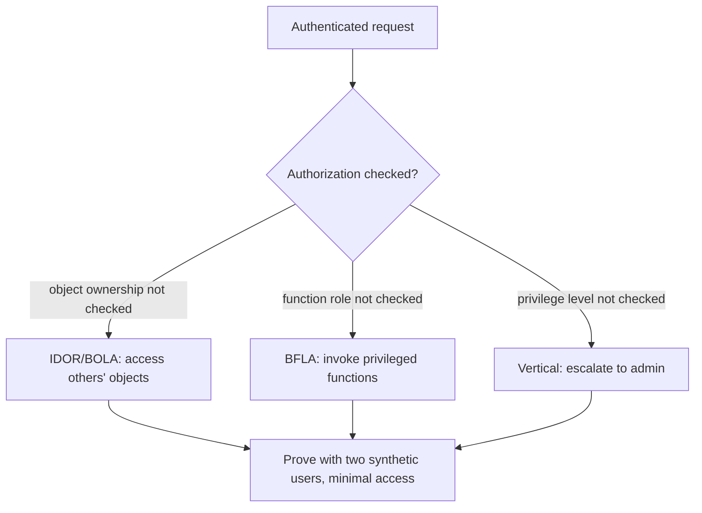

# 🚧 Broken Access Control

> [!warning] Authorized simulation only
> Access-control testing accesses resources that may belong to real users. Prove flaws with two synthetic accounts (yours and a second test user), never by reading a real customer's data. Test only in-scope applications.

## Parent Learning Order
Web Authentication Testing -> Broken Access Control -> JWT Security Testing -> Federated Identity & SSO -> MFA, Recovery & Session Bypass Testing

## Authenticated, But Not Authorized

**Authentication** proves *who you are*; **authorization** decides *what you may do*. Broken access control is the failure of the second: the application verifies you are logged in, then fails to check whether *this* user may access *this* resource or *this* function. It is consistently among the most common and most impactful web vulnerabilities, because the flaw is a *missing check* — invisible in normal use, trivial to exploit once found, and it hands an attacker other users' data or admin capabilities using their own valid session.

Three named variants describe the same root failure at different granularities:

| Variant | Missing check | Example |
| --- | --- | --- |
| **IDOR / BOLA** | Object ownership | `/invoice/42` returns *another user's* invoice |
| **BFLA** | Function/role | A regular user calls `/admin/delete` |
| **Vertical/horizontal** | Privilege level / peer | Escalate to admin; access a peer's account |

IDOR (Insecure Direct Object Reference) and BOLA (Broken Object-Level Authorization) are the same flaw — the app exposes a reference to an object (an ID in the URL) and does not verify the caller owns it. BFLA (Broken Function-Level Authorization) is the function-level equivalent: the app does not verify the caller's *role* before running a privileged action.

> [!tip] The analogy, and where it breaks
> Broken access control is like a hotel where your keycard opens the lobby (authentication works) but every room's lock only checks that *some* valid card was used, not that it's *your* room. The analogy breaks on scale: a guest tries a few doors, whereas an attacker scripts a loop through `/invoice/1..10000`, harvesting every guest's records in seconds — the "trying doors" becomes an automated mass-extraction no hotel corridor allows.

**Prerequisites:** authentication vs. authorization, HTTP requests, and sessions/tokens.

## IDOR/BOLA: The Object-Ownership Failure

The classic test: authenticate as user A, access one of A's objects, note the identifier, then change it to another user's identifier and see if the app returns it:

```bash
# access your own object, then a different ID with the SAME session (your own lab)
curl -s -H "Cookie: session=alice" "http://127.0.0.1:8114/invoice/1"   # alice's own
curl -s -H "Cookie: session=alice" "http://127.0.0.1:8114/invoice/2"   # bob's
```

```text
{"id":1,"owner":"alice","amount":50}
{"id":2,"owner":"bob","amount":90}
```

Alice's session retrieved bob's invoice — the app checked she was logged in but never checked she *owns* invoice 2. The finding is proven with two requests and two synthetic users. IDs need not be sequential; even UUIDs are IDOR-vulnerable if ownership is not checked (they are just harder to guess, which is not a control).

## BFLA: The Function-Level Failure

BFLA is the same failure for *functions* rather than objects — a low-privilege user reaching a privileged endpoint the UI hid but the server still honors:

```bash
# a regular user hits an admin-only function (your own lab)
curl -s -o /dev/null -w "user -> /admin/promote: HTTP %{http_code}\n" \
  -H "Cookie: session=alice" -X POST "http://127.0.0.1:8114/admin/promote?user=alice"
```

```text
user -> /admin/promote: HTTP 200
```

A regular user invoked an admin function — the server authenticated the session but never checked the *role*. The "admin panel is hidden from regular users" is UI, not security; the endpoint honored the request.



## One cross-user access proves it; enumeration is a breach

- **Mass extraction over-testing.** Proving IDOR needs *one* cross-user access (two synthetic accounts); enumerating every object ID to dump real data is exploitation and a privacy breach. Prove the flaw, don't harvest.
- **UUIDs are not a fix.** Unpredictable IDs make IDOR harder to *discover* but the flaw remains — if ownership isn't checked, a leaked or guessed UUID still works. Report the missing check, not "IDs are random so it's fine."
- **Hidden ≠ protected.** A BFLA endpoint hidden from the UI is still reachable; test the endpoint directly, not through the interface.
- **Layered access.** An app may check object ownership but not function role (or vice versa) — test both dimensions for every role.
- **State-changing IDOR.** IDOR on a `POST`/`DELETE` (modifying another user's object) is more severe than read; classify by the HTTP method's effect.

## Security Implications — Detection & Defense

- **Check authorization on every request, for every object and function, server-side.** The definitive fix: the server must verify the authenticated user may access *this specific* resource/function — never inferring it from the UI, the token's validity, or the ID's unpredictability.
- **Enforce ownership at the data layer** where possible — a query scoped to the authenticated user (`WHERE owner = current_user`) structurally prevents IDOR, better than an application-code check that can be forgotten.
- **Deny by default** — new endpoints and objects should require an explicit authorization grant, not be accessible until someone remembers to restrict them.
- **Detection is behavioral:** a session accessing many sequential object IDs (IDOR harvesting), or a low-privilege user hitting admin endpoints (BFLA), are valid-but-anomalous patterns monitoring catches — the same signature as the API-security leaf.
- **This is a top real-world breach cause** precisely because it is a *missing* check with no crash and no payload; systematic authorization testing per role is the only reliable way to find it.

## Summary

You should now be able to:

- Explain the difference between authentication and authorization, and why broken access control is a *missing check*.
- Prove IDOR/BOLA and BFLA with synthetic accounts, and explain why unpredictable IDs and hidden UIs do not fix the missing check.
- Explain why server-side per-request authorization (ideally enforced at the data layer with owner-scoped queries) and deny-by-default are the fixes, and how IDOR harvesting and BFLA surface as anomalous access patterns to a defender.

---
> 🔼 Up: [[Web Identity & Access Control]]
