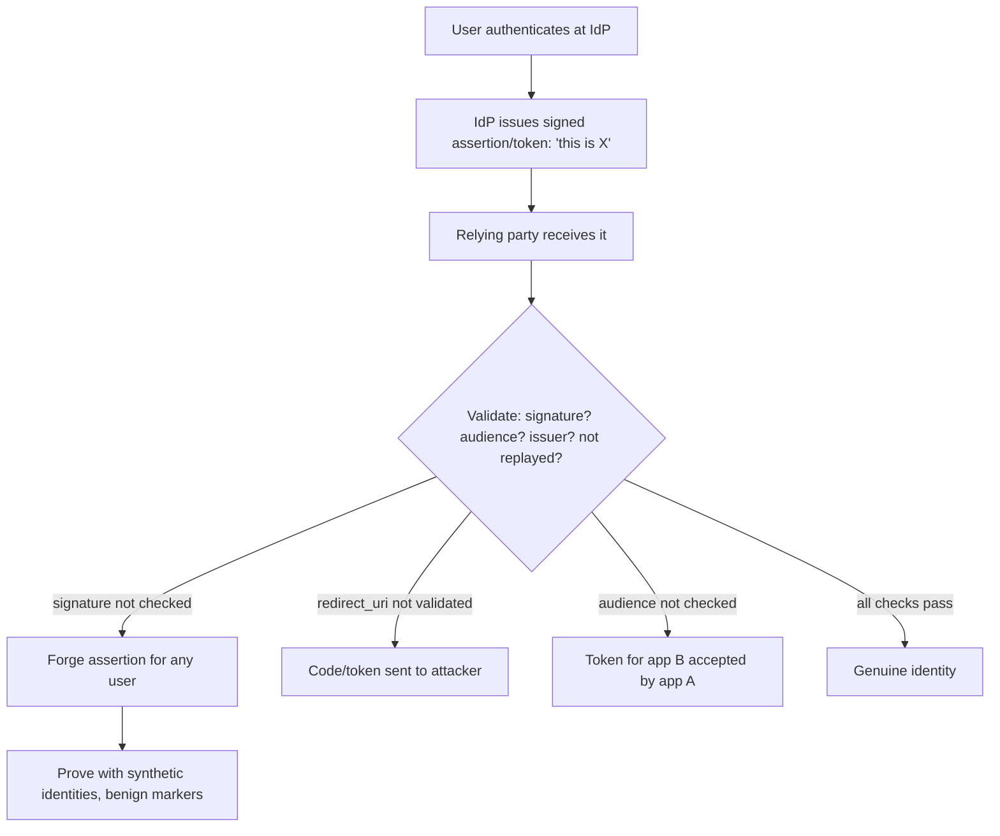

# 🔗 Federated Identity & SSO

> [!warning] Authorized simulation only
> Federated-identity testing manipulates authentication tokens and flows. Prove flaws with synthetic identities and benign markers, never by impersonating a real user. Test only in-scope applications and identity providers you are authorized to assess.

## Parent Learning Order
Web Authentication Testing -> Broken Access Control -> JWT Security Testing -> Federated Identity & SSO -> MFA, Recovery & Session Bypass Testing

## Logging In With Someone Else's Identity Provider

> *You log in to an application you have never given a password to. Who vouched for you?*
>
> Hold your answer — the section below is the response.

**Single Sign-On (SSO)** lets a user authenticate once with a trusted **identity provider (IdP)** — Google, an enterprise directory, Okta — and then access many applications (the **relying parties**) without logging in again. Two protocols dominate: **SAML** (XML-based, common in enterprise) and **OAuth 2.0 / OpenID Connect** (JSON/token-based, common on the web). Both work by the IdP issuing a signed **assertion** or **token** that says "this is user X," which the application trusts.

The security model rests entirely on that trust being *verified*: the application must confirm the assertion genuinely came from the IdP, is intended for *this* application, and has not been tampered with or replayed. Federated-identity flaws are almost always a failure of one of those checks — a signature not validated, an audience not verified, a token accepted from the wrong source. Get it wrong, and an attacker forges an identity.

> [!tip] The analogy, and where it breaks
> SSO is like a trusted passport authority: apps accept the passport (assertion) instead of re-verifying your identity themselves. The analogy breaks on forgery detection — a border officer scrutinizes a passport's security features, but a lazily-implemented relying party accepts the "passport" without checking its signature or whether it was issued *for this country*, so a home-printed forgery walks through. The whole security is in checks the app can silently skip.

**Prerequisites:** the JWT-security leaf (OAuth/OIDC tokens are often JWTs), XML/signatures (for SAML), and redirects.

## OAuth 2.0 & OIDC: Delegated Access, Common Pitfalls

OAuth 2.0 delegates *access* (an app acts on your behalf); OpenID Connect layers *authentication* on top (proving who you are, via an `id_token`). The flow redirects the user to the IdP, which returns a code/token to the app. The recurring flaws:

| Flaw | The failure |
| --- | --- |
| **`redirect_uri` manipulation** | App accepts an attacker-controlled redirect, leaking the code/token |
| **Missing `state`** | No CSRF protection on the flow — an attacker links their account to the victim |
| **Token audience not checked** | A token for app B is accepted by app A |
| **Implicit-flow token leakage** | Tokens in the URL fragment leak via referrer/history |
| **Weak `id_token` validation** | Signature, issuer, audience, or expiry not verified |

The highest-value OAuth flaw is **`redirect_uri` manipulation**: if the app does not strictly validate the redirect target against a registered allowlist, an attacker crafts a login link that sends the authorization code to *their* server, then uses it to log in as the victim.

## SAML: XML Assertions and Signature Wrapping

SAML carries a signed XML **assertion** asserting the user's identity. Its signature flaws are the classic finding:

- **Missing signature validation** — the relying party does not verify the assertion's signature at all, so an attacker forges an assertion for any user.
- **XML Signature Wrapping (XSW)** — the attacker wraps a forged assertion around a legitimately-signed one, exploiting a parser that validates the signature on one element but *reads* identity from another.
- **XXE** — SAML is XML, so it inherits XML external entity flaws (the file/parser leaf).

The unifying SAML lesson: the security is in *correctly validating the signature over the exact element whose contents are trusted*. XSW works precisely because signature-validation and data-extraction can be tricked into looking at different elements — another parser-discrepancy flaw.



## Worked Example: A Relying Party That Trusts a Claim It Never Verified

Federated identity works because the relying party trusts assertions signed by the
identity provider. Every SSO vulnerability of consequence is the relying party
trusting the *claim* while skipping the *signature check* that is supposed to earn
that trust. The specimen makes exactly that omission:

```python
assertion = json.loads(base64.b64decode(body))   # {"user": ..., "sig": ...}
user = assertion.get("user")                      # BUG: uses the claim...
return {"logged_in_as": user}                     # ...without verifying sig
```

**A legitimate assertion** logs the right user in:

```shell-session
analyst@lab:~$ echo -n '{"user":"alice","sig":"valid-idp-sig"}' | base64 | \
>   xargs -I{} curl -s -X POST -d '{}' http://127.0.0.1:8115/sso
{"logged_in_as": "alice"}
```

Nothing looks wrong, because on the happy path a real IdP produced the assertion
and the claimed user is the true one. The bug is invisible until someone lies.

**A forged assertion** carries an obviously bogus signature and a chosen identity:

```shell-session
analyst@lab:~$ echo -n '{"user":"admin","sig":"FORGED-not-from-idp"}' | base64 | \
>   xargs -I{} curl -s -X POST -d '{}' http://127.0.0.1:8115/sso
{"logged_in_as": "admin"}
```

`admin`, with a signature that reads `FORGED-not-from-idp`. The relying party
accepted it because it never asked whether the signature verified against the
IdP's public key — it read the `user` field and believed it. That is the entire
class: SAML response tampering, unsigned-assertion acceptance, and the XML
signature-wrapping attacks are all elaborations of "the RP trusted a claim it did
not authenticate."

The correctness condition is narrow and non-negotiable: verify the assertion's
signature against the IdP's key *before* reading any claim from it, and then check
that the issuer, audience and expiry are the ones you expect — a valid signature
on an assertion minted for a different service is still the wrong assertion. The
reason hand-rolled validation fails here so reliably is that the checks must all
pass and must happen in the right order, which is exactly what a vetted SAML or
OIDC library encodes and an afternoon's own code does not.

## Forging assertions without impersonating real people

- **Impersonating real users.** Forging an assertion to log in as a real person is over the line; prove with synthetic identities in a lab.
- **`redirect_uri` strictness.** A partial-match validation (`startsWith`, `contains`) is bypassable (`https://app.com.evil.com`); test exact-match enforcement, and test open-redirect chains.
- **XSW complexity.** XML Signature Wrapping requires precise crafting; a failed attempt may mean a hardened validator *or* a wrapping variant not yet tried. Confirm which.
- **Token audience.** A token that validates cryptographically may still be misused if its *audience* (intended app) isn't checked — cryptographic validity ≠ correct usage.
- **Provider vs. relying party.** The flaw is usually in the *relying party's* validation, not the IdP. Attribute correctly — "SAML is broken" is wrong if the IdP is fine and the app skips validation.

**The deliberate break:** SSO reads as delegating authentication to a stronger provider, so adopting it reads as an improvement by construction.

Delegation moves the check; it does not remove it. The relying party still has to **verify what comes back** — that the signature is valid and covers the assertion, that the audience is itself, that the issuer is the expected one, that the token has not expired, that the nonce matches the request it made. The recurring, well-documented failure is a relying party that reads claims it never verified, which turns a strong identity provider into a decorative one.

**How you'd spot it:** the finding is a claim consumed without validation, so test it directly: alter a claim and see whether the application notices. An assertion with a changed subject that still logs you in is the entire result and needs no further argument. In code, look for parsing that extracts claims before or without a verification call, and for signature checks that confirm a signature *exists* rather than that it covers the element being trusted.

## Security Implications — Detection & Defense

- **Validate everything the assertion claims:** signature (over the correct element), issuer, audience, expiry, and — for OAuth — `state` and an exact-match `redirect_uri`. Skipping any is the vulnerability.
- **Use battle-tested libraries**, not hand-rolled SAML/OAuth validation — the subtle checks (XSW resistance, exact audience) are exactly where custom code fails.
- **Prefer the authorization-code flow with PKCE** over implicit flow — it keeps tokens out of the URL and resists code interception, the modern OAuth best practice.
- **Disable XML external entities** in SAML parsing (the XXE fix) and use a validator that binds signature-validation to data-extraction (XSW resistance).
- **Detection** looks for assertions from unexpected issuers, tokens used at the wrong audience, and redirect anomalies — but the durable defense is correct validation, since a forged-but-accepted assertion looks legitimate to a poorly-configured relying party.

## Summary

You should now be able to:

- Explain the SSO trust model — IdP issues a signed assertion, apps trust it — and why validating that assertion is the whole security.
- Test OAuth `redirect_uri`/`state`/audience and SAML signature validation, and forge an assertion that an unvalidating relying party accepts.
- Explain why XML Signature Wrapping and missing audience checks are parser/usage discrepancies, why the flaw is usually in the relying party, and why vetted libraries plus code-flow-with-PKCE are the durable controls.

---
> 🔼 Up: [[Web Identity & Access Control]]
