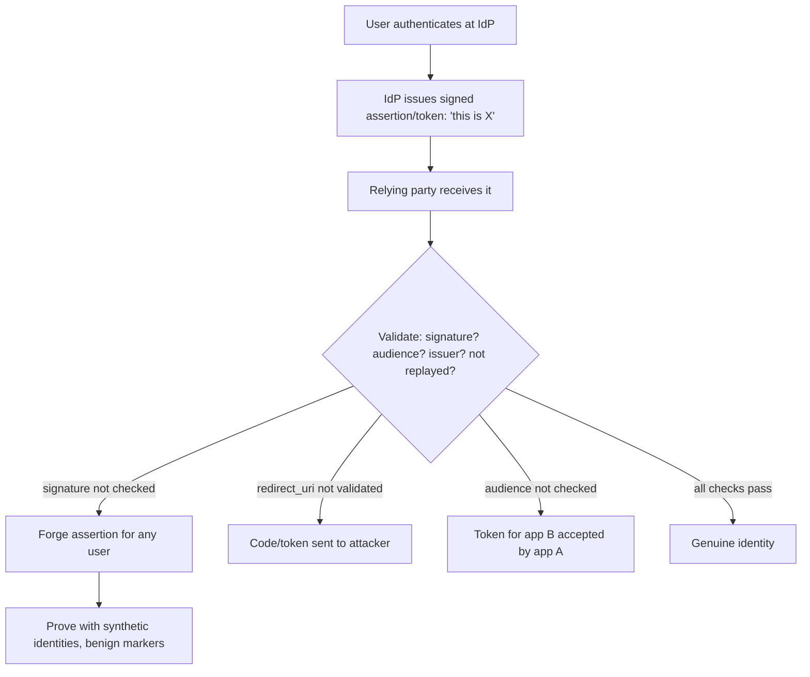

# 🔗 Federated Identity & SSO

> [!warning] Authorized simulation only
> Federated-identity testing manipulates authentication tokens and flows. Prove flaws with synthetic identities and benign markers, never by impersonating a real user. Test only in-scope applications and identity providers you are authorized to assess.

## Parent Learning Order
Web Authentication Testing -> Broken Access Control -> JWT Security Testing -> Federated Identity & SSO -> MFA, Recovery & Session Bypass Testing

## Start at Zero: Logging In With Someone Else's Identity Provider

**Single Sign-On (SSO)** lets a user authenticate once with a trusted **identity provider (IdP)** — Google, an enterprise directory, Okta — and then access many applications (the **relying parties**) without logging in again. Two protocols dominate: **SAML** (XML-based, common in enterprise) and **OAuth 2.0 / OpenID Connect** (JSON/token-based, common on the web). Both work by the IdP issuing a signed **assertion** or **token** that says "this is user X," which the application trusts.

The security model rests entirely on that trust being *verified*: the application must confirm the assertion genuinely came from the IdP, is intended for *this* application, and has not been tampered with or replayed. Federated-identity flaws are almost always a failure of one of those checks — a signature not validated, an audience not verified, a token accepted from the wrong source. Get it wrong, and an attacker forges an identity.

> [!tip] The analogy, and where it breaks
> SSO is like a trusted passport authority: apps accept the passport (assertion) instead of re-verifying your identity themselves. The analogy breaks on forgery detection — a border officer scrutinizes a passport's security features, but a lazily-implemented relying party accepts the "passport" without checking its signature or whether it was issued *for this country*, so a home-printed forgery walks through. The whole security is in checks the app can silently skip.

**Prerequisites:** the JWT-security leaf (OAuth/OIDC tokens are often JWTs), XML/signatures (for SAML), and redirects.

## OAuth 2.0 & OIDC: Delegated Access, Common Pitfalls

OAuth 2.0 delegates *access* (an app acts on your behalf); OpenID Connect layers *authentication* on top (proving who you are, via an `id_token`). The flow redirects the user to the IdP, which returns a code/token to the app. The recurring flaws:

| Flaw | The failure |
| --- | --- |
| **`redirect_uri` manipulation** | App accepts an attacker-controlled redirect, leaking the code/token |
| **Missing `state`** | No CSRF protection on the flow — an attacker links their account to the victim |
| **Token audience not checked** | A token for app B is accepted by app A |
| **Implicit-flow token leakage** | Tokens in the URL fragment leak via referrer/history |
| **Weak `id_token` validation** | Signature, issuer, audience, or expiry not verified |

The highest-value OAuth flaw is **`redirect_uri` manipulation**: if the app does not strictly validate the redirect target against a registered allowlist, an attacker crafts a login link that sends the authorization code to *their* server, then uses it to log in as the victim.

## SAML: XML Assertions and Signature Wrapping

SAML carries a signed XML **assertion** asserting the user's identity. Its signature flaws are the classic finding:

- **Missing signature validation** — the relying party does not verify the assertion's signature at all, so an attacker forges an assertion for any user.
- **XML Signature Wrapping (XSW)** — the attacker wraps a forged assertion around a legitimately-signed one, exploiting a parser that validates the signature on one element but *reads* identity from another.
- **XXE** — SAML is XML, so it inherits XML external entity flaws (the file/parser leaf).

The unifying SAML lesson: the security is in *correctly validating the signature over the exact element whose contents are trusted*. XSW works precisely because signature-validation and data-extraction can be tricked into looking at different elements — another parser-discrepancy flaw.



## Failure Modes and Interpretation

- **Impersonating real users.** Forging an assertion to log in as a real person is over the line; prove with synthetic identities in a lab.
- **`redirect_uri` strictness.** A partial-match validation (`startsWith`, `contains`) is bypassable (`https://app.com.evil.com`); test exact-match enforcement, and test open-redirect chains.
- **XSW complexity.** XML Signature Wrapping requires precise crafting; a failed attempt may mean a hardened validator *or* a wrapping variant not yet tried. Confirm which.
- **Token audience.** A token that validates cryptographically may still be misused if its *audience* (intended app) isn't checked — cryptographic validity ≠ correct usage.
- **Provider vs. relying party.** The flaw is usually in the *relying party's* validation, not the IdP. Attribute correctly — "SAML is broken" is wrong if the IdP is fine and the app skips validation.

## Security Implications — Detection & Defense

- **Validate everything the assertion claims:** signature (over the correct element), issuer, audience, expiry, and — for OAuth — `state` and an exact-match `redirect_uri`. Skipping any is the vulnerability.
- **Use battle-tested libraries**, not hand-rolled SAML/OAuth validation — the subtle checks (XSW resistance, exact audience) are exactly where custom code fails.
- **Prefer the authorization-code flow with PKCE** over implicit flow — it keeps tokens out of the URL and resists code interception, the modern OAuth best practice.
- **Disable XML external entities** in SAML parsing (the XXE fix) and use a validator that binds signature-validation to data-extraction (XSW resistance).
- **Detection** looks for assertions from unexpected issuers, tokens used at the wrong audience, and redirect anomalies — but the durable defense is correct validation, since a forged-but-accepted assertion looks legitimate to a poorly-configured relying party.

## Authorized Lab: Forge an Unsigned Assertion the App Accepts

> [!info] Runs on one Linux machine — builds a relying party that skips signature validation, then forges an identity
> Loopback, synthetic identities. Step 5 removes it.

### Step 1 — Build a relying party that trusts an assertion WITHOUT checking its signature

```bash
cat > /tmp/sso.py << 'EOF'
import http.server, json, base64
class H(http.server.BaseHTTPRequestHandler):
    def do_POST(self):
        n=int(self.headers.get("Content-Length",0)); body=self.rfile.read(n).decode()
        # assertion is base64 JSON: {"user":..., "sig":...}. The RP is supposed to verify sig.
        try:
            assertion=json.loads(base64.b64decode(body))
        except: self.send_response(400); self.end_headers(); return
        # BUG: accepts the asserted user WITHOUT validating the signature
        user=assertion.get("user")
        self.send_response(200); self.end_headers()
        self.wfile.write(json.dumps({"logged_in_as":user}).encode())
    def log_message(self,*a): pass
http.server.HTTPServer(("127.0.0.1",8115),H).serve_forever()
EOF
python3 /tmp/sso.py &>/dev/null &
sleep 1; echo "relying party up on 127.0.0.1:8115 (skips signature validation)"
```

```text
relying party up on 127.0.0.1:8115 (skips signature validation)
```

### Step 2 — Legitimate login (baseline)

```bash
python3 -c "import json,base64;print(base64.b64encode(json.dumps({'user':'alice','sig':'valid-idp-sig'}).encode()).decode())" | \
  xargs -I{} curl -s -X POST -d '{}' http://127.0.0.1:8115/sso
```

```text
{"logged_in_as": "alice"}
```

A normal assertion for alice logs her in.

### Step 3 — Forge an assertion for the admin (the finding)

```bash
# forge an assertion for 'admin' with a BOGUS signature — the RP never checks it
python3 -c "import json,base64;print(base64.b64encode(json.dumps({'user':'admin','sig':'FORGED-not-from-idp'}).encode()).decode())" | \
  xargs -I{} curl -s -X POST -d '{}' http://127.0.0.1:8115/sso
```

```text
{"logged_in_as": "admin"}
```

The forged assertion — with an obviously bogus signature — logged in as `admin`. The relying party accepted the *claimed* identity without verifying the signature came from the IdP. That is the SAML/SSO signature-validation flaw, proven with a synthetic identity. A hardened RP would reject `FORGED-not-from-idp` because the signature would not verify against the IdP's public key.

### Step 4 — State the fix

```bash
echo "Fix: verify the assertion signature against the IdP's public key BEFORE trusting any claim;"
echo "also check issuer, audience, and expiry. Use a vetted SAML/OIDC library, never hand-rolled validation."
```

```text
Fix: verify the assertion signature against the IdP's public key BEFORE trusting any claim;
also check issuer, audience, and expiry. Use a vetted SAML/OIDC library, never hand-rolled validation.
```

### Step 5 — Cleanup

```bash
kill %1 2>/dev/null; rm -f /tmp/sso.py; wait 2>/dev/null
curl -s -o /dev/null -w "rp gone: %{http_code}\n" --max-time 2 http://127.0.0.1:8115/sso 2>&1 | grep -o 'gone.*' || echo "rp gone: connection refused"
```

```text
rp gone: connection refused
```

**What you should now be able to do:** explain the SSO trust model and the checks a relying party must make, name the common OAuth (`redirect_uri`, `state`, audience) and SAML (signature, XSW) flaws, forge an unsigned assertion an unvalidating app accepts, and locate the flaw in the relying party's validation.

## Crook → Operator → Root Checkpoint

- **Crook:** Explain the SSO trust model — IdP issues a signed assertion, apps trust it — and why validating that assertion is the whole security.
- **Operator:** Test OAuth `redirect_uri`/`state`/audience and SAML signature validation, and forge an assertion that an unvalidating relying party accepts.
- **Root:** Explain why XML Signature Wrapping and missing audience checks are parser/usage discrepancies, why the flaw is usually in the relying party, and why vetted libraries plus code-flow-with-PKCE are the durable controls.

---
> 🔼 Up: [[Web Identity & Access Control]]
