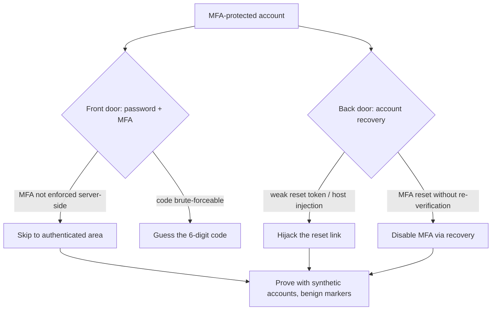

# 📱 MFA, Recovery & Session Bypass Testing

> [!warning] Authorized simulation only
> These tests probe the last line of account defense. Use synthetic accounts, throttle to avoid locking real users, and prove bypasses with benign markers. Test only in-scope applications.

## Parent Learning Order
Web Authentication Testing -> Broken Access Control -> JWT Security Testing -> Federated Identity & SSO -> MFA, Recovery & Session Bypass Testing

## Start at Zero: The Second Factor and Its Escape Hatches

**Multi-Factor Authentication (MFA)** requires a second proof beyond the password — a code from an app, an SMS, a hardware key — so that a stolen password alone is not enough. It is the single most effective control against credential attacks. But MFA is only as strong as its *implementation and its bypasses*: the account-recovery flow that resets it, the session handling around it, and the ways it can be skipped. Attackers who cannot beat the password-plus-MFA front door look for the *side doors* — and there are usually several.

This note covers the three ways MFA-protected accounts fall: **bypassing MFA directly**, **abusing account recovery** (the "forgot password" flow that often has *weaker* protection than the login it resets), and **session flaws** that make MFA moot after the fact.

> [!tip] The analogy, and where it breaks
> MFA is a deadbolt added to a door that already has a lock. The analogy breaks because the *back door* (account recovery) often has only a flimsy latch — an attacker who can't pick the deadbolt just resets it through the "I lost my key" process, which frequently verifies identity far more weakly than the front door it bypasses. The strongest front door is worthless if the recovery process is weak.

**Prerequisites:** the authentication leaf (login and sessions), and MFA concepts.

## Direct MFA Bypass

MFA can be bypassed when it is bolted on rather than enforced throughout:

- **Missing enforcement on some endpoints** — MFA guards login but an API or a "remember me" path skips it.
- **Skippable step** — the flow lets you proceed to the authenticated area without completing the MFA step (a forced-browsing / state flaw).
- **Brute-forcing the code** — a 6-digit code has a million possibilities; without rate limiting, it is guessable.
- **MFA-fatigue / push-bombing** — spamming push approvals until the victim accidentally accepts (a social/technical hybrid).
- **Response manipulation** — changing a `"mfa_required": true` response to `false` in flows that trust the client.

The classic finding is **the second factor not being enforced server-side**: the app checks the password, sets a "half-authenticated" state, asks for the code — but the authenticated resources are reachable by skipping directly to them, because the server treated password-success as good enough.

## Account Recovery: The Weak Back Door

Account recovery (password reset, MFA reset) is a parallel authentication path, and it is frequently *weaker* than login:

- **Weak reset tokens** — predictable or non-expiring reset links.
- **Host-header injection** — the reset link's domain is built from an attacker-controllable `Host` header, sending the victim's reset link to the attacker (links to the HTTP Host-header trust issue).
- **Knowledge-based questions** — "mother's maiden name" is often OSINT-discoverable.
- **MFA reset without re-verification** — recovery disables MFA without strongly proving identity, defeating the whole control.
- **Account enumeration in reset** — the reset flow reveals which accounts exist (the enumeration flaw again).

Recovery is where many "MFA-protected" accounts actually fall, because the effort goes into the login while the reset flow is an afterthought.



## Failure Modes and Interpretation

- **Locking out real users.** Code brute-force and recovery-flow testing can lock accounts. Synthetic accounts, throttling, coordination.
- **MFA present ≠ MFA enforced.** The finding is often that MFA *exists* but is skippable — test whether authenticated resources are reachable without completing it, don't assume the presence of an MFA prompt means protection.
- **Recovery is the real target.** Testing only the login and declaring "MFA protects this" misses the recovery back door, which is where the account often falls. Test recovery as rigorously as login.
- **Host-header reset.** A reset link built from the `Host` header lets an attacker receive a victim's reset — test whether the reset domain is attacker-influenceable.
- **Client-trusted MFA state.** A `mfa_required: false` the client can flip is a bypass; test whether MFA state is enforced server-side.

## Security Implications — Detection & Defense

- **Enforce MFA server-side, on every authenticated path** — never let a client-side flag or a skipped step reach authenticated resources. The half-authenticated state must gate everything until MFA completes.
- **Harden recovery to match login:** strong, expiring, single-use reset tokens; a `Host`-header-independent reset domain; strong identity proof before resetting MFA; and no account enumeration.
- **Rate-limit the MFA code** and prefer phishing-resistant factors (hardware keys / passkeys) over SMS, which is vulnerable to SIM-swap and interception.
- **Number-matching / context in push MFA** defeats push-bombing by requiring the user to actively match a number, not just tap "approve."
- **Detection**: repeated MFA-code attempts, recovery-flow abuse, and MFA-reset events are high-value signals — an account whose MFA was just reset then logged in from a new device is the takeover signature.

## Authorized Lab: Bypass MFA That Isn't Enforced Server-Side

> [!info] Runs on one Linux machine — builds an app where MFA is prompted but not enforced on the protected resource
> Loopback, synthetic account. Step 5 removes it.

### Step 1 — Build an app with a skippable MFA step

```bash
cat > /tmp/mfa.py << 'EOF'
import http.server, urllib.parse
# state: after password, user is "half-authenticated"; MFA should gate /dashboard
half_auth=set()
class H(http.server.BaseHTTPRequestHandler):
    def do_POST(self):
        n=int(self.headers.get("Content-Length",0)); q=urllib.parse.parse_qs(self.rfile.read(n).decode())
        if self.path=="/login" and q.get("u",[""])[0]=="alice" and q.get("p",[""])[0]=="S3cret!":
            half_auth.add("alice")
            self.send_response(200); self.end_headers(); self.wfile.write(b'{"mfa_required":true}')
        else:
            self.send_response(401); self.end_headers()
    def do_GET(self):
        # BUG: /dashboard checks only half-auth (password), NOT that MFA was completed
        if self.path=="/dashboard":
            if "alice" in half_auth:
                self.send_response(200); self.end_headers(); self.wfile.write(b'{"data":"CANARY-DASHBOARD"}')
            else:
                self.send_response(401); self.end_headers()
    def log_message(self,*a): pass
http.server.HTTPServer(("127.0.0.1",8118),H).serve_forever()
EOF
python3 /tmp/mfa.py &>/dev/null &
sleep 1; echo "app up (alice, MFA prompted after password)"
```

```text
app up (alice, MFA prompted after password)
```

### Step 2 — Log in with the password; MFA is requested

```bash
curl -s -X POST -d 'u=alice&p=S3cret!' http://127.0.0.1:8118/login
```

```text
{"mfa_required":true}
```

The password succeeded and the app says MFA is required — the front door appears protected.

### Step 3 — Skip MFA and go straight to the protected resource (the finding)

```bash
# without completing MFA, request the dashboard directly
curl -s http://127.0.0.1:8118/dashboard
```

```text
{"data":"CANARY-DASHBOARD"}
```

The dashboard returned its data **without MFA being completed** — the server treated password-success as sufficient and never enforced the second factor on the protected resource. MFA was prompted but not *enforced*: a bypass, proven by reaching the canary data with no code.

### Step 4 — State the fix

```bash
echo "Fix: the half-authenticated state must gate ALL authenticated resources until MFA is verified server-side."
echo "Also test the RECOVERY flow — a weak MFA-reset is the other common bypass."
```

```text
Fix: the half-authenticated state must gate ALL authenticated resources until MFA is verified server-side.
Also test the RECOVERY flow — a weak MFA-reset is the other common bypass.
```

### Step 5 — Cleanup

```bash
kill %1 2>/dev/null; rm -f /tmp/mfa.py; wait 2>/dev/null
curl -s -o /dev/null -w "app gone: %{http_code}\n" --max-time 2 http://127.0.0.1:8118/dashboard 2>&1 | grep -o 'gone.*' || echo "app gone: connection refused"
```

```text
app gone: connection refused
```

**What you should now be able to do:** distinguish MFA present from MFA enforced, bypass a skippable MFA step to reach protected data, recognize account recovery as the weak back door, and name the server-side-enforcement and recovery-hardening fixes.

## Crook → Operator → Root Checkpoint

- **Crook:** Explain what MFA protects against, and why account recovery is often the weak back door around it.
- **Operator:** Bypass a skippable MFA step, test recovery for weak tokens and host-header injection, and prove a bypass with a synthetic account.
- **Root:** Explain why MFA must be enforced server-side on every path, why recovery must be hardened to match login, and why phishing-resistant factors and number-matching defeat the strongest MFA attacks.

---
> 🔼 Up: [[Web Identity & Access Control]]
