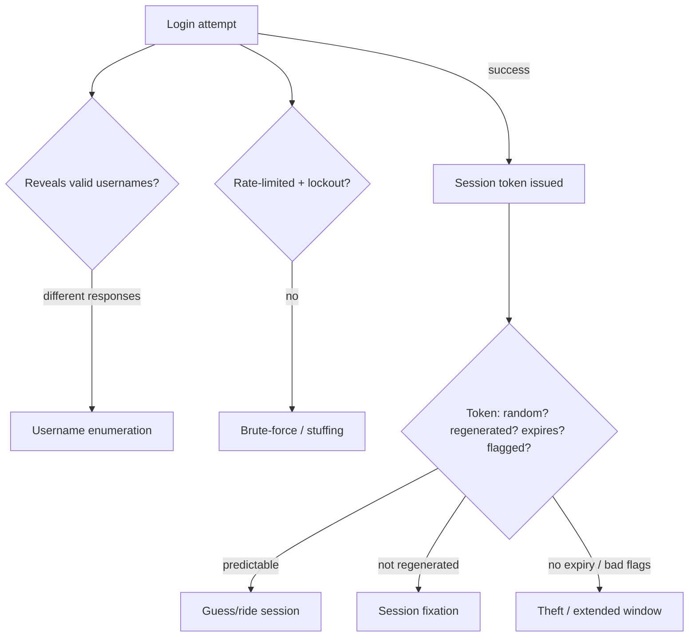

# 🔐 Web Authentication Testing

> [!warning] Authorized simulation only
> Authentication testing probes login, session, and account flows. Throttle to avoid locking out real users, test with synthetic accounts, and prove flaws with benign markers. Test only in-scope applications.

## Parent Learning Order
Web Authentication Testing -> Broken Access Control -> JWT Security Testing -> Federated Identity & SSO -> MFA, Recovery & Session Bypass Testing

## Start at Zero: Proving Who You Are, and Staying Proven

**Authentication** is how an application establishes who you are; **session management** is how it *remembers* that across the many stateless HTTP requests that follow. Both are attack surfaces, and this note covers the foundation the rest of the identity cluster builds on: how login and sessions work, and the flaws in each. Because a broken authentication flaw often means *complete account takeover*, this is among the highest-impact web testing.

The two phases:

- **Login** — verifying a credential (usually a password). Flaws: weak credentials, credential stuffing, username enumeration, brute-force without lockout.
- **Session** — the token (usually a cookie) proving you already logged in. Flaws: predictable tokens, tokens that don't expire, tokens not invalidated on logout, tokens leaked or fixated.

> [!tip] The analogy, and where it breaks
> Authentication is the ID check at a club door; the session token is the wristband you get so you don't re-show ID all night. The analogy breaks on wristband forgery: a club wristband is hard to copy, but a predictable or non-expiring session token is trivially guessed, stolen, or reused — and unlike a wristband, one leaked token can be used from anywhere in the world simultaneously.

**Prerequisites:** HTTP, cookies, and the statelessness concept.

## Login Attacks

The login form is constantly attacked, and testing checks the defenses:

- **Username enumeration** — does the app reveal whether a username exists? Different responses for "wrong password" vs. "no such user" (in the message, status code, or *timing*) let an attacker build a valid-username list. The fix is identical responses regardless.
- **Brute-force / credential stuffing** — without rate limiting and lockout, an attacker tries many passwords (brute-force) or breached username/password pairs (stuffing). Testing checks whether limits exist and are effective.
- **Weak credential policy** — does the app permit `password123`? Weak policies make guessing trivial.
- **Password spraying** — one common password across many users (the remote-access leaf's technique), defeating per-account lockout.

```bash
# username enumeration: do the responses differ for valid vs invalid users? (your own lab)
echo "valid user, wrong pass -> $(curl -s -X POST -d 'u=alice&p=wrong' http://127.0.0.1:8116/login)"
echo "invalid user           -> $(curl -s -X POST -d 'u=nobody&p=wrong' http://127.0.0.1:8116/login)"
```

```text
valid user, wrong pass -> Incorrect password
invalid user           -> No such user
```

The two messages differ — "Incorrect password" reveals `alice` exists, "No such user" reveals `nobody` doesn't. That difference is username enumeration, letting an attacker confirm valid accounts before spraying. Identical responses ("Invalid credentials") for both is the fix.

## Session Attacks

Once logged in, the session token is the prize:

- **Predictable tokens** — a sequential or weakly-random session ID can be guessed, letting an attacker ride a valid session. Tokens must be long and cryptographically random.
- **Session fixation** — the app accepts a session ID *set before login* and keeps it after; an attacker fixes a known ID on the victim, waits for them to log in, then uses it. The fix: regenerate the session ID on login.
- **Missing expiry / invalidation** — a token that never expires, or survives logout, extends the attack window. Logout must invalidate server-side.
- **Insecure cookie flags** — missing `HttpOnly` (script can steal it), `Secure` (sent over HTTP), `SameSite` (CSRF) — the cookie hardening from the HTTP fundamentals leaf.



## Failure Modes and Interpretation

- **Locking out real users.** Brute-force and spray testing can lock legitimate accounts (DoS). Use synthetic accounts, throttle, and coordinate.
- **Timing-based enumeration.** Even identical messages can leak via *timing* (a valid user's password is hashed, an invalid one short-circuits). Test response timing, not just content.
- **Session token in the URL.** A token in a URL leaks via referrer, history, and logs — check where the token lives, not just its randomness.
- **Logout that only clears the cookie.** Client-side logout that doesn't invalidate the token server-side means a captured token still works. Test whether the token is dead after logout.
- **Proving with real accounts.** Session hijacking must be demonstrated between two synthetic sessions, never against a real user's session.

## Security Implications — Detection & Defense

- **Identical responses and timing** for valid/invalid usernames defeat enumeration — the app must not reveal which accounts exist.
- **Rate limiting, lockout, and MFA** defeat brute-force, stuffing, and spraying — MFA in particular (the next leaves) makes a correct password insufficient.
- **Cryptographically random session tokens, regenerated on login, expiring on timeout, and invalidated on logout** — the session hygiene that closes fixation, prediction, and reuse.
- **Secure cookie flags** (`HttpOnly`, `Secure`, `SameSite`) limit token theft and CSRF — a one-header hardening.
- **Detection is behavioral:** failed-login bursts (brute-force), one-password-many-users (spraying), impossible-travel logins, and concurrent sessions from distant locations are the signals — the identity-provider protections that make credential attacks detectable even when individually valid.

## Authorized Lab: Find Username Enumeration and Session Weakness

> [!info] Runs on one Linux machine — builds a login app with enumeration and a predictable session
> Loopback, synthetic accounts. Step 5 removes it.

### Step 1 — Build a login app with two flaws

```bash
cat > /tmp/auth.py << 'EOF'
import http.server, urllib.parse
users={"alice":"S3cret!","bob":"Winter2026"}
counter=[1000]   # PREDICTABLE session ids (the flaw)
class H(http.server.BaseHTTPRequestHandler):
    def do_POST(self):
        n=int(self.headers.get("Content-Length",0)); q=urllib.parse.parse_qs(self.rfile.read(n).decode())
        u=q.get("u",[""])[0]; p=q.get("p",[""])[0]
        # FLAW 1: different messages for valid vs invalid users
        if u not in users:
            self.send_response(401); self.end_headers(); self.wfile.write(b"No such user"); return
        if users[u]!=p:
            self.send_response(401); self.end_headers(); self.wfile.write(b"Incorrect password"); return
        # FLAW 2: sequential/predictable session id
        counter[0]+=1; sid=counter[0]
        self.send_response(200); self.send_header("Set-Cookie",f"session={sid}"); self.end_headers()
        self.wfile.write(f"logged in, session={sid}".encode())
    def log_message(self,*a): pass
http.server.HTTPServer(("127.0.0.1",8116),H).serve_forever()
EOF
python3 /tmp/auth.py &>/dev/null &
sleep 1; echo "login app up (alice, bob)"
```

```text
login app up (alice, bob)
```

### Step 2 — Username enumeration (the first finding)

```bash
echo "alice/wrong  -> $(curl -s -X POST -d 'u=alice&p=x' http://127.0.0.1:8116/login)"
echo "ghost/wrong  -> $(curl -s -X POST -d 'u=ghost&p=x' http://127.0.0.1:8116/login)"
```

```text
alice/wrong  -> Incorrect password
ghost/wrong  -> No such user
```

The differing messages confirm `alice` exists and `ghost` doesn't — username enumeration. An attacker now knows which accounts to spray.

### Step 3 — Predictable session tokens (the second finding)

```bash
curl -s -D - -X POST -d 'u=alice&p=S3cret!' http://127.0.0.1:8116/login | grep -i set-cookie
curl -s -D - -X POST -d 'u=bob&p=Winter2026' http://127.0.0.1:8116/login | grep -i set-cookie
```

```text
Set-Cookie: session=1001
Set-Cookie: session=1002
```

Sequential session IDs (`1001`, `1002`) — an attacker who logs in as `1005` can guess `1004`, `1003`, etc. belong to other users and ride their sessions. Predictable tokens are a session-hijacking flaw.

### Step 4 — State the fixes

```bash
echo "Fix 1: identical response ('Invalid credentials') for both bad-user and bad-password — and equal timing."
echo "Fix 2: cryptographically random session IDs (e.g. 128-bit), regenerated on login, expiring, HttpOnly+Secure+SameSite."
```

```text
Fix 1: identical response ('Invalid credentials') for both bad-user and bad-password — and equal timing.
Fix 2: cryptographically random session IDs (e.g. 128-bit), regenerated on login, expiring, HttpOnly+Secure+SameSite.
```

### Step 5 — Cleanup

```bash
kill %1 2>/dev/null; rm -f /tmp/auth.py; wait 2>/dev/null
curl -s -o /dev/null -w "app gone: %{http_code}\n" --max-time 2 http://127.0.0.1:8116/login 2>&1 | grep -o 'gone.*' || echo "app gone: connection refused"
```

```text
app gone: connection refused
```

**What you should now be able to do:** test login for username enumeration (content and timing) and brute-force resistance, test sessions for predictability/fixation/expiry, prove both with synthetic accounts, and name the identical-response and random-token fixes.

## Crook → Operator → Root Checkpoint

- **Crook:** Explain the two phases (login and session), and why a session token is the prize after login.
- **Operator:** Test username enumeration by content and timing, test session tokens for predictability and fixation, and prove hijacking between synthetic sessions.
- **Root:** Explain why identical responses/timing, random regenerated expiring tokens, and MFA are the layered defenses, and how credential attacks surface as behavioral anomalies to a defender.

---
> 🔼 Up: [[Web Identity & Access Control]]
