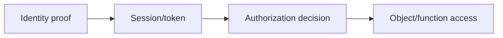

# Web Identity & Access Control

## 🗺️ Zero-to-Mastery Learning Path

1. [[Web Authentication Testing]]
2. [[Broken Access Control]]
3. [[JWT Security Testing]]
4. [[Federated Identity & SSO]]
5. [[MFA, Recovery & Session Bypass Testing]]

---
> 🔼 Up: [[Web Application Penetration Testing]]
