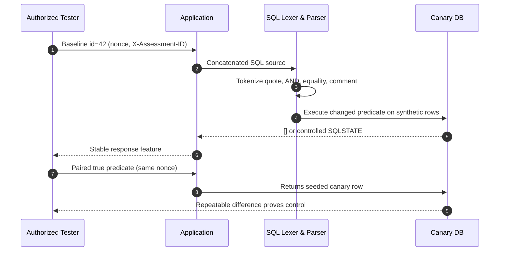

# SQL Injection

> [!warning] Authorized validation only
> Run the lab below only against the local synthetic database you build here. The techniques prove parser confusion with canary values; they do not authorize extraction, destructive statements, persistence, or access to any production data.

## Parent Learning Order
SQL Injection -> NoSQL Injection -> ORM Injection -> Operating System Command Injection -> Server-Side Template Injection -> LDAP Injection -> XPath Injection -> CRLF Injection -> SSI Injection

## The boundary between grammar and data

SQL injection is a failure to preserve the boundary between **SQL grammar** and **application data**. A database never executes a string directly. Its frontend decodes the client character set, tokenizes keywords, identifiers, operators, literals, and comments, parses those tokens into an abstract syntax tree (AST), resolves names and types, and only then executes. When an application builds query text by *concatenating an untrusted value*, that value enters the lexer **before the AST exists**. A quote can close a literal, an operator can add a predicate, and a comment token can delete the developer's intended suffix.

```text
source = "SELECT id,name FROM products WHERE id='" + input + "' AND tenant_id=?"
```

For `input = 42` the predicate is `AND(EQUAL(id,"42"), EQUAL(tenant_id,$1))`. For `input = 42' AND 1=2-- ` the parser instead receives a closed string, a second Boolean expression, and a comment — the AST changed before binding. This is why "the value contains only digits" or "we escaped one quote" are unreliable defences: the real question is whether untrusted bytes can *become syntax* after every decoding stage.

**Prepared statements** fix value-context injection because the SQL text is parsed first and placeholders become typed value nodes; the bound value is never re-lexed as query text. Parameters cannot represent table names, columns, sort direction, or operators, so dynamic identifiers need a fixed allow-map (`sort=name -> products.name`), never concatenation.

**The deliberate break:** SQL injection is caused by special characters, so escaping the special characters fixes it. That is the intuition almost everyone arrives at, and it is why escaping libraries keep being written and keep failing.

The cause is not the quote mark. The cause is that the query was **assembled as a string**, so the boundary between grammar and data is decided at parse time by the database rather than at build time by you. Escaping tries to patch that after the fact, and it breaks in every context where quoting is not the rule: a numeric parameter needs no quotes at all, a table or column name cannot be parameterised or quoted the same way, a `LIKE` clause has its own metacharacters, and second-order injection stores a payload that is escaped on the way *in* and concatenated on the way *out*. Parameterisation fixes the class because it never asks the question — the query structure is sent separately from the values, so no value can become grammar.

**This is the Parser Differential pattern** — one of the named patterns in the project's **Pattern Glossary**, and the one you will meet most often.

**The Twin — compare this with HTTP Request Smuggling.** They share nothing on the surface: one is a quote mark in a form field, the other is two headers in an HTTP request, and they are taught in different branches. Look at where the two readers diverge in each. In SQL injection the *application* thinks it is handling data and the *database parser* reads grammar. In smuggling the *front-end proxy* thinks the body ended and the *back-end server* thinks it continues. Both are one component validating and a different component acting on its own reading of the same bytes. Once you can see that, you will find the shape in file paths, XML entities and JSON operators too — which is exactly where the next four notes go.

**How you'd spot it:** a parameter whose value changes the *shape* of the response — the number of rows, the ordering, the presence of an error — rather than only its content. Shape changes mean the input reached the query structure, not just the data.

## The Subtypes as One Root Cause

Every observable form is the same defect seen through a different channel:

| Subtype | Oracle it creates | When you reach for it |
|---|---|---|
| **Error-based** | Engine returns a lexer/type/conversion diagnostic | Verbose errors leak to the client |
| **UNION** | Second result set merged into the first | Output is reflected and column count/types line up |
| **Boolean-blind** | One-bit true/false from a stable response feature | No output, no errors, but behaviour differs |
| **Time-blind** | Conditional delay (`pg_sleep`, `SLEEP`, `WAITFOR`) | Output *and* errors hidden |
| **Stacked** | A second full statement runs | Driver + DB allow multiple statements |
| **Out-of-band** | DB-initiated DNS/HTTP resolves a marker | No in-band oracle; egress allowed (needs explicit approval) |

Dialect details decide what works: MySQL accepts `#` and `-- ` comments and `SLEEP`; PostgreSQL uses `--` and `pg_sleep`; SQL Server uses `WAITFOR DELAY`; Oracle references `DUAL`; **SQLite has no sleep primitive** and stores its schema in `sqlite_master`. Always record the product and driver version in a finding — an "equivalent" payload produces a different AST in another dialect.



The **paired requests** are the proof. One malformed response can be an ordinary bug; a repeatable true/false relationship demonstrates that input controls SQL semantics. Vary only the predicate; hold headers, nonce discipline, and sample count constant.

## Remediation & Evidence

Fix at the value boundary: **parameterized statements everywhere**, fixed allow-maps for identifiers, least-privilege DB accounts, generic client errors (keep detail in restricted telemetry), and regression tests asserting that malicious strings stay literal data. A WAF (OWASP CRS `942xxx`) is a compensating control, not root-cause closure. An evidence package names the baseline, true/false controls, reconstructed query, dialect and driver, request IDs, and the precise stop point — distinguishing **demonstrated behaviour** from **plausible escalation**.

## Summary

You should now be able to:

- Why does `admin' -- ` log you in, and why can't a parameterized query be tricked the same way?
- Given a blind endpoint with no errors and no reflected output, which subtype do you choose, and what makes your result *proof* rather than a coincidence?
- Step 4's UNION needed exactly three columns. Explain how you'd determine the column count on a real target without seeing the source, and why a type mismatch in one column still leaks information.

---
> 🔼 Up: [[Web Injection Testing]]
